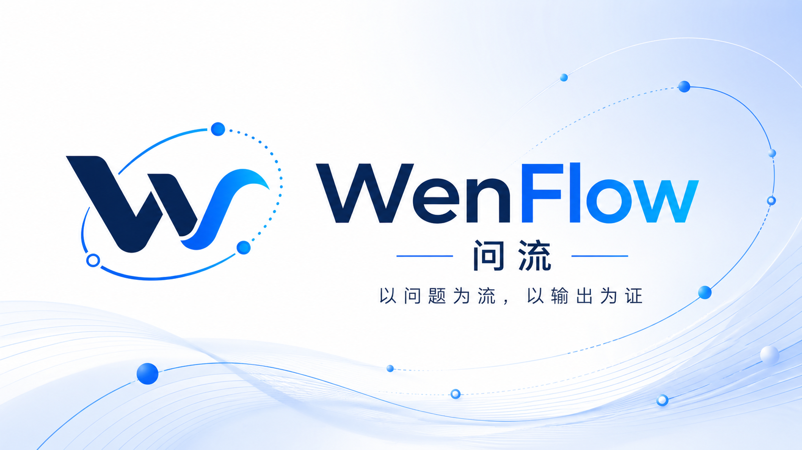
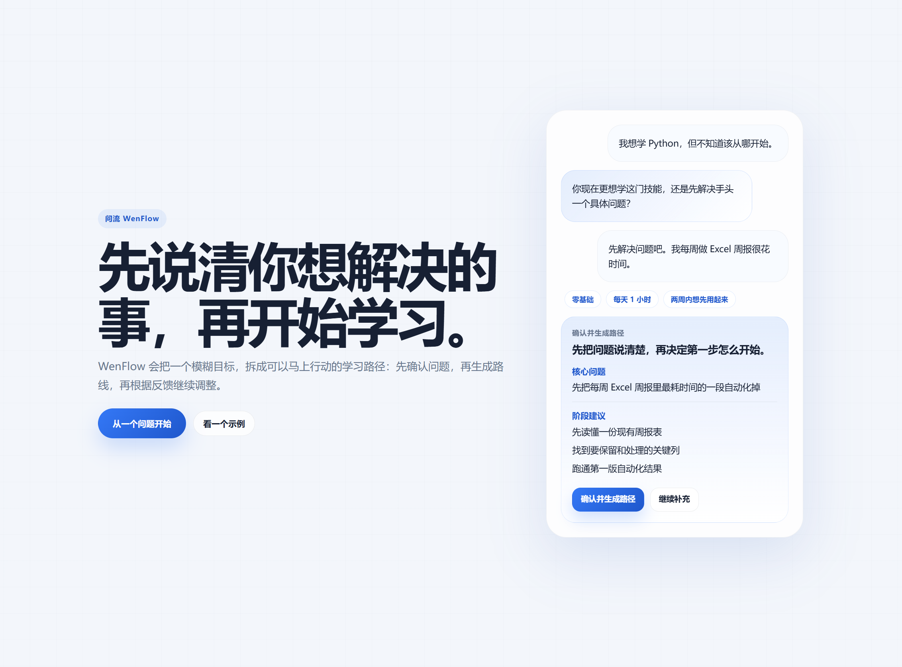
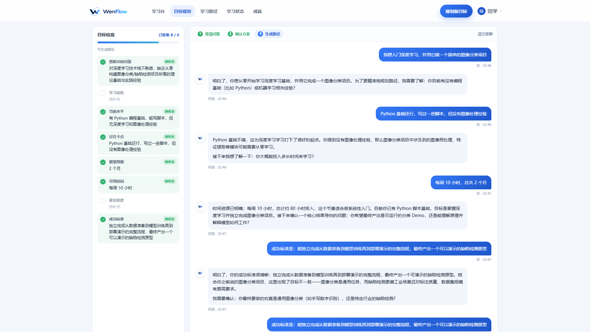
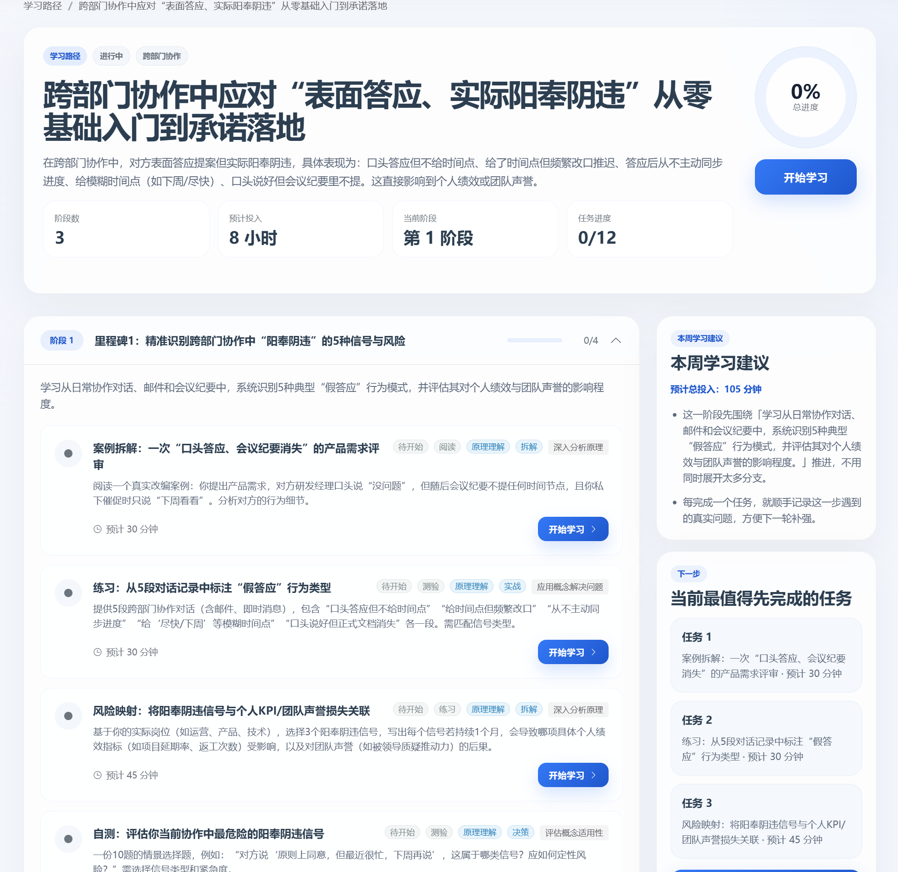
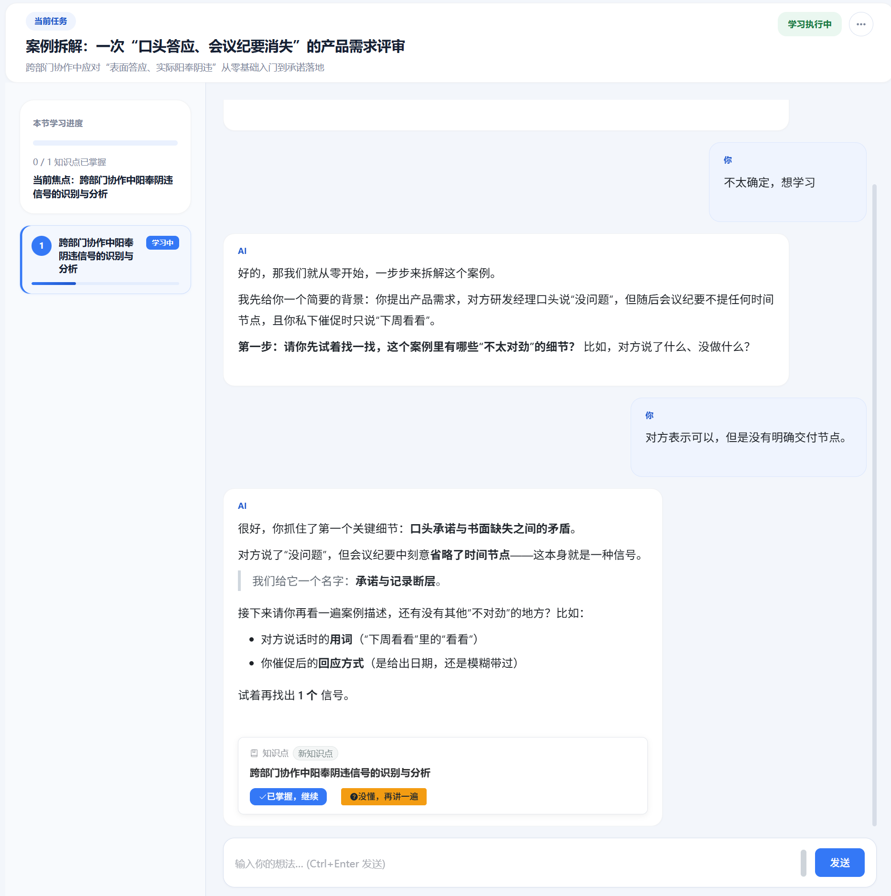
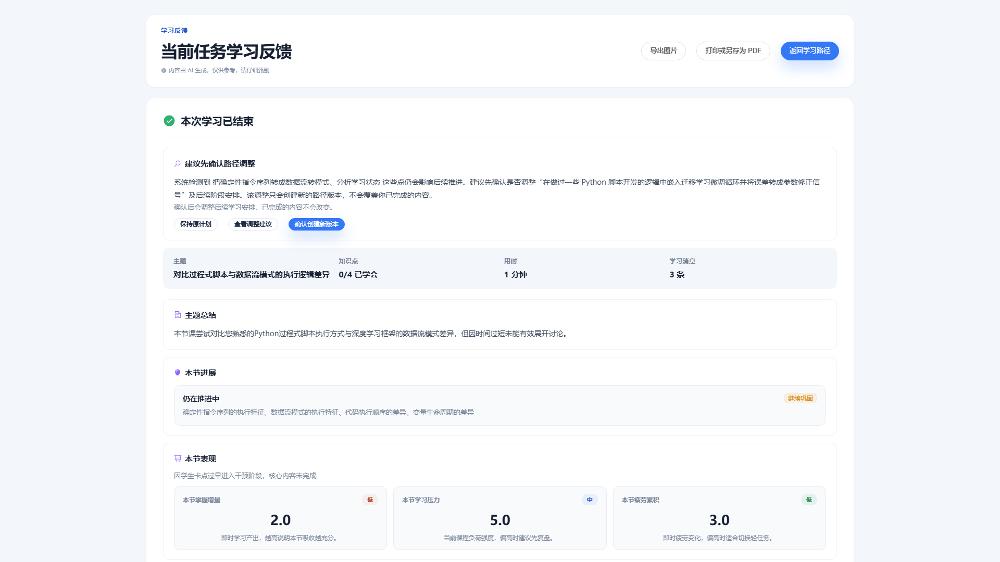
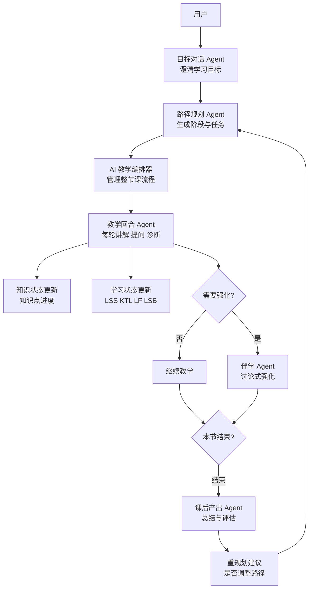

# WenFlow



> ⚠️ **当前主要开发版本**: [develop](https://github.com/wenflow-org/wenflow/tree/develop) 分支 | main 分支为稳定版

**从真实问题出发的 AI 学习路径原型**

> 问流：不是先找课，而是先把真正的问题说清楚。

[English Version](README_EN.md) | 中文版

🌐 **Demo 站点**: https://wenflow.org

> 仅作 Demo 演示，不提供正式服务。

[](LICENSE)
[](https://nodejs.org)
[](https://vuejs.org)

---

## 为什么存在？

学习卡住，常常不是因为不努力。  
而是目标太大、资料太多、第一步不清楚。

很多学习产品从“给你内容”开始：课程、资料、题目、路径。  
WenFlow 想从另一个地方开始：先帮你说清真正想解决的事。

它会把一个模糊目标，拆成可以马上行动的学习路径：先澄清问题，再生成路线，再通过对话、输出和反馈持续调整。

当 AI 已经能快速给出大量答案，真正更值得训练的，不只是记住内容，而是：

- 定义问题
- 看见结构
- 判断取舍
- 与 AI 协作
- 在反馈中持续修正

**答案会越来越多，问题本身会越来越重要。**

---

## 核心特性

### 产品流程预览

这 5 张图按“从真实问题出发，到进入完整学习闭环”的顺序展示 WenFlow 的核心体验。

| 从一个问题开始 |
|:---:|
|  |

| 澄清真实目标 | 生成学习路径 |
|:---:|:---:|
|  |  |

| 进入回合式学习 | 学习闭环总览 |
|:---:|:---:|
|  |  |

### 从问题到路径
- **问题澄清**：通过 5-8 轮自然对话，补齐场景、基础、时间和限制
- **路径生成**：把模糊目标拆成阶段、任务和今天能开始的第一步
- **回合式学习**：AI 提问、用户回答、即时反馈，并根据理解情况继续调整

### 学习状态追踪
借鉴运动科学中的负荷与恢复思路，持续追踪学习状态，而不只记录是否完成任务：

| 指标 | 含义 | 用途 |
|------|------|------|
| LSS | 学习压力评分 | 基于任务难度、时长、认知负荷 |
| KTL | 知识掌握度 | 长期积累，42天衰减因子 0.95 |
| LF | 学习疲劳度 | 短期累计，7天衰减因子 0.70 |
| LSB | 学习状态平衡 | KTL - LF，预警过度学习 |

### 平台 Agent 架构（简版）



- 先澄清目标，再把目标拆成可执行学习路径
- 教学阶段按回合推进，边教边判断理解程度
- 学生卡住时触发伴学强化，不直接放弃当前任务
- 课后自动产出总结与评估，并给出是否重规划建议

---

## 技术栈

| 层级 | 技术 |
|------|------|
| **前端** | Vue 3 + TypeScript + Vite 5 + Element Plus + Pinia |
| **后端** | Node.js + Express + TypeScript + Prisma |
| **数据库（当前）** | SQLite |
| **AI 接入** | OpenAI 兼容模型网关（默认 DeepSeek） |
| **Agent 编排** | EduClaw Gateway + Orchestrators + Event Bus |
| **部署** | PowerShell 启动脚本 + 可选 Nginx（测试部署） |

---

## 项目状态

WenFlow 目前仍处于**原始开发阶段**，是一个验证教学概念的实验性原型。

它不是要把旧的学习流程简单加速，而是尝试验证另一条路径：如果学习从真实问题开始，再由 AI 帮助澄清目标、生成路径、组织反馈，会不会更适合 AI 时代的学习方式？

我们希望借它持续探索 5 类能力的训练方式：**问题定义能力、系统思维、判断力、AI 协作力、创造力**。

---

## 快速开始

### 环境要求
- Node.js >= 18

### 推荐顺序（首次使用）

```bash
# 1) 初始化 backend/.env（JWT_SECRET、AI 配置、初始管理员）
npm run env:setup

# 2) 按需选择启动方式
./start-dev.ps1
```

说明：建议首次使用先完成环境初始化，再选择启动脚本。若 `backend/.env` 缺失或 `JWT_SECRET` 不合格，启动脚本也会自动拉起初始化流程。

### 本机开发

```bash
# PowerShell
./start-dev.ps1
```

说明：脚本会自动检查并安装依赖、初始化 Prisma（`prisma generate` + `prisma db push`）、必要时引导创建或补全 `backend/.env`。
如需跳过 Prisma 初始化可使用：`./start-dev.ps1 -SkipPrisma`。

### 局域网开发模式

```bash
# 自动获取局域网 IP 并启动
./start-lan.ps1

# 或使用 npm 脚本
npm run dev:lan

# 手动指定 IP
./start-lan.ps1 -LanIP 192.168.31.26
```

说明：自动将局域网 IP 加入 `CORS_ORIGIN`，适合多设备调试前台页面；不会改变管理员登录仅限本机访问的限制。

### 一键测试部署（本机 Nginx，HTTP）

```bash
# 依赖本机已安装 nginx（并已加入 PATH）
./start-dev.ps1 -UseNginx

# 或使用 npm 脚本
npm run dev:nginx

# 指定域名（不填默认 localhost）
./start-dev.ps1 -UseNginx -Domain test.example.com

# nginx 不在 PATH 时，指定可执行文件路径
./start-dev.ps1 -UseNginx -NginxExePath "C:\nginx\nginx.exe"
```

说明：`-UseNginx` 模式会自动执行 `npm run build`（前端）并生成运行时配置到 `runtime/nginx/wenflow.nginx.conf`，同时会先停止系统 nginx 进程避免端口冲突。

### 环境配置辅助命令

```bash
# 交互式初始化 backend/.env
npm run env:setup

# 快速打开 backend/.env 手动编辑
npm run env:edit
```

说明：`env:setup` 不再单独询问域名；Nginx 模式下域名由 `-Domain`（优先）或 `backend/.env` 中的 `FRONTEND_URL` 推断。

### 前端 API 环境变量

- 默认情况下，前端通过相对路径 `/api` 访问后端，由 Vite 代理或 Nginx 转发。
- 管理端配置主要读取 `frontend/.env` 中的 `VITE_API_BASE_URL`。
- 普通用户端在非开发模式下兼容读取 `VITE_API_URL`；如果没有特殊部署需求，保持默认 `/api` 即可。

如需更细粒度的部署或非脚本方式启动，可参考 [DEPLOYMENT.md](DEPLOYMENT.md)。

### 访问地址

**Demo 站点**: https://wenflow.org

**本地开发**
- 前端: http://localhost:5173
- 后端: http://localhost:3001
- 管理后台: http://localhost:5173/admin

说明：当前管理员登录接口默认仅允许本机访问；局域网设备或普通反向代理环境下即使能打开管理页，也会被后端拒绝登录。

---

## 管理员账户

首次启动时，系统会读取 `backend/.env` 中的以下字段自动创建初始管理员：

```env
INIT_ADMIN_NAME=admin
INIT_ADMIN_PASSWORD=YourStrongPassword123
```

如果数据库里已经存在管理员，系统会自动跳过创建。

建议：首次登录管理端后立即修改密码；对外部署时请使用强密码。

注意：管理员登录接口当前仅允许 `localhost` / `127.0.0.1` / `::1` 访问，适合本机管理，不适合直接暴露给局域网或公网管理员登录。

详见 [ADMIN_SETUP.md](ADMIN_SETUP.md)

### 反向代理常见坑

- `CORS_ORIGIN` 建议不要写尾部 `/`（如 `https://demo.example.com`，不要写成 `https://demo.example.com/`）。
- 使用 Nginx/Cloudflare 等反向代理时，建议配置 `TRUST_PROXY=1`。
- 如果遇到“请求来源不被允许”，先检查浏览器 `Origin` 与 `CORS_ORIGIN` 是否匹配。

---

## 教育理论基础

基于 6 大教育理论：

1. **认知负荷理论** - 避免信息过载
2. **自我导向学习** - 用户自主决定
3. **Dreyfus 五阶段模型** - 动态评估用户阶段
4. **最近发展区 + 支架** - 难度略高于当前水平
5. **形成性评估** - 即时反馈
6. **刻意练习** - 针对弱点突破

---

## License

本项目采用 [MIT License](LICENSE) 开源协议。

Copyright (c) 2026 wenflow-org

---

## 致谢

感谢 [Linux.do](https://linux.do/) 佬友们的一切分享。

---

*当 AI 能解答所有标准问题，提出好问题的人，将定义未来。*
