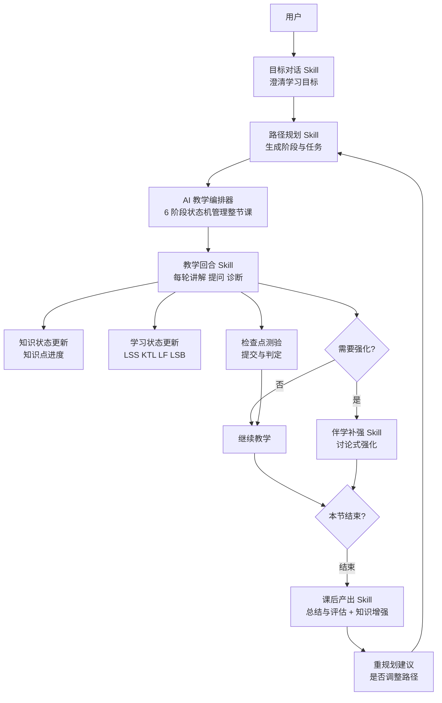

# WenFlow


> ⚠️ **当前主要开发版本**: [develop](https://github.com/wenflow-org/wenflow/tree/develop) 分支 | main 分支为稳定版

**从真实问题出发的 AI 学习路径原型**

> 问流：不是先找课，而是先把真正的问题说清楚。

[English Version](README_EN.md) | 中文版

🌐 **Demo 站点**: https://wenflow.org

> 仅作 Demo 演示，不提供正式服务。
> ⚠️ **注意**: Demo 站点会定期清理所有账号和数据，请勿用于存放重要信息。

[](LICENSE)
[](https://nodejs.org)
[](https://vuejs.org)

---

## 为什么存在？

学习卡住，常常不是因为不努力。  
而是目标太大、资料太多、第一步不清楚。

很多学习产品从“给你内容”开始：课程、资料、题目、路径。  
WenFlow 想从另一个地方开始：先帮你说清真正想解决的事。

它会把一个模糊目标，拆成可以马上行动的学习路径：先澄清问题，再生成路线，再通过对话、输出和反馈持续调整。

当 AI 已经能快速给出大量答案，真正更值得训练的，不只是记住内容，而是：

- 定义问题
- 看见结构
- 判断取舍
- 与 AI 协作
- 在反馈中持续修正

**答案会越来越多，问题本身会越来越重要。**

---

## 核心特性

### 产品流程预览

这 5 张图按“从真实问题出发，到进入完整学习闭环”的顺序展示 WenFlow 的核心体验。

| 从一个问题开始 |
|:---:|
|  |

| 澄清真实目标 | 生成学习路径 |
|:---:|:---:|
|  |  |

| 进入回合式学习 | 学习闭环总览 |
|:---:|:---:|
|  |  |

### 从问题到路径
- **问题澄清**：通过多轮自然对话，补齐场景、基础、时间和限制
- **路径生成**：把模糊目标拆成阶段、任务和今天能开始的第一步
- **回合式学习**：AI 提问、用户回答、即时反馈，并根据理解情况继续调整

### 学习状态追踪
借鉴运动科学中的负荷与恢复思路，持续追踪学习状态，而不只记录是否完成任务：

| 指标 | 含义 | 用途 |
|------|------|------|
| LSS | 学习压力评分 | 基于任务难度、时长、认知负荷，EWMA 平滑 |
| KTL | 知识训练负荷（Knowledge Training Load） | 长期积累，42天衰减因子 0.95 |
| LF | 学习疲劳度 | 短期累计，7天衰减因子 0.70 |
| LSB | 学习状态平衡 | KTL - LF，预警过度学习 |

### 平台 Agent / Skill 编排（简版）



- 当前顶层 Agent 更偏编排器；真正持有 prompt 并直接调用 LLM 的主要是 Skills。
- 先澄清目标，再把目标拆成可执行学习路径
- 教学阶段按回合推进，边教边判断理解程度（opening → teaching → intervention → checkpoint → wrapup）
- 学生卡住时触发伴学强化，不直接放弃当前任务
- 课后自动产出总结与评估，并给出是否重规划建议（自动调整默认关闭，以建议形式给出）

### 虚拟学习者实验室（Virtual Learner Lab）

用"虚拟学习者"账号沿**真实生产链路**模拟真实用户，用于验证平台功能：

- **黑盒模拟**：按普通用户 API 驱动 goal → path → learn 全流程，配裁判（referee）与角色保真审计（actor-auditor）
- **Quick Learn**：选定虚拟账号的任务，自动跑完一节课并产出 Propagation Report，状态持久化

### 管理端

`/admin` 提供 16+ 功能页面：平台总览、用户/学习者中心、教学会话、目标对话、虚拟学习者、Skill 目录与 Prompt 设计台、Agent 拓扑（Topology）、编排结构（Orchestrator）、执行日志、Trace 瀑布、模型与接入、核心文件同步工作台等。

### Prompt 工程体系（Prompt Lab v4，File-as-Truth）

- **真源**：`prompts/core/*.yaml`（业务逻辑唯一人工编辑入口，进 git）
- **编译产物**：`prompts/skill.*.md`（确定性编译生成，模型唯一读取文本）
- **发布链路**：编辑 core.yaml → compile（守门三查）→ publish（写回 md + DB ACTIVE）→ rollback（可回滚）
- **数据库**：`agent_prompts` 只是运行时镜像，文件为准、DB 为镜像

---

## 技术栈

| 层级 | 技术 |
|------|------|
| **前端** | Vue 3 + TypeScript + Vite 6 + Element Plus + Pinia |
| **后端** | Node.js + Express + TypeScript + Prisma |
| **数据库（当前）** | SQLite（主库 36 表 + system 库 16 表，双库架构） |
| **AI 接入** | OpenAI 兼容模型网关（默认 DeepSeek：deepseek-v4-flash / v4-pro / r1），支持 SSE 流式、重试预算、thinking mode 控制 |
| **Agent / Skill 编排** | EduClaw Gateway + Agent（7 个官方 Agent）/ Skill 编排层 + Coordinators + Event Bus（outbox 持久化事件） |
| **模型配置分层** | 环境变量 → 平台默认 → Agent/Skill 级 → 用户自定义 API / 模型覆盖 |
| **虚拟实验** | Virtual Learner Lab（黑盒模拟 + Quick Learn） |
| **可观测** | Agent/Skill 调用日志、Trace 瀑布、LLM 执行明细 |
| **安全** | JWT + CSRF + 登录限流 + Secret AES-256-GCM 静态加密 + 敏感存储权限审计 |
| **部署** | PowerShell 启动脚本 + 可选 Nginx（测试部署）+ Docker（Linux/macOS） |

---

## 项目状态

WenFlow 目前仍处于**原始开发阶段**，是一个验证教学概念的实验性原型。

它不是要把旧的学习流程简单加速，而是尝试验证另一条路径：如果学习从真实问题开始，再由 AI 帮助澄清目标、生成路径、组织反馈，会不会更适合 AI 时代的学习方式？

我们希望借它持续探索 5 类能力的训练方式：**问题定义能力、系统思维、判断力、AI 协作力、创造力**。

---

## 快速开始

### 环境要求
- Node.js >= 20.17.0
- 推荐 Windows + PowerShell 5.1+；根目录启动脚本当前未适配 Linux/macOS

安全与 Secret 管理见 [`SECURITY.md`](./SECURITY.md)。提交前运行 `npm run security:scan`。

运行状态：`/health` 和 `/livez` 表示进程存活，`/readyz` 才表示双库和核心运行态可接收流量。

### 推荐顺序（首次使用）

```bash
# 1) 初始化 backend/.env（JWT_SECRET、AI 配置、初始管理员）
npm run env:setup

# 2) 按需选择启动方式
./start-dev.ps1
```

说明：建议首次使用先完成环境初始化，再选择启动脚本。若 `backend/.env` 缺失或 `JWT_SECRET` 不合格，启动脚本也会自动拉起初始化流程。
启动后端时，系统会自动把核心 prompts（File-as-Truth：`prompts/core/*.yaml` 为真源，编译产物 `prompts/skill.*.md` 同步到数据库 ACTIVE 版本）；这样别人从 GitHub 拉下项目后，默认运行版本会和仓库中的 prompt 真相源保持一致。

### 本机开发

```bash
# PowerShell
./start-dev.ps1
```

说明：脚本会自动检查并安装依赖、生成双 Prisma Client、对主库和 System DB 分别执行 `prisma migrate deploy`、必要时引导创建或补全 `backend/.env`，并在启动前自动执行一次 core prompts 同步。
如需跳过 Prisma 初始化可使用：`./start-dev.ps1 -SkipPrisma`。注意：该选项也会跳过启动前的 core prompts 同步，仅适用于数据库和 prompts 已经准备好的环境。

### 局域网开发模式

```bash
# 自动获取局域网 IP 并启动
./start-lan.ps1

# 或使用 npm 脚本
npm run dev:lan

# 手动指定 IP
./start-lan.ps1 -LanIP 192.168.31.26
```

说明：自动将局域网 IP 加入 `CORS_ORIGIN`，适合多设备调试前台页面；不会改变管理员登录的 `ADMIN_ACCESS_MODE` 访问限制。

### 一键测试部署（本机 Nginx，HTTP）

```bash
# 依赖本机已安装 nginx（并已加入 PATH）
./start-dev.ps1 -UseNginx

# 或使用 npm 脚本
npm run dev:nginx

# 指定域名（不填默认 localhost）
./start-dev.ps1 -UseNginx -Domain test.example.com

# nginx 不在 PATH 时，指定可执行文件路径
./start-dev.ps1 -UseNginx -NginxExePath "C:\nginx\nginx.exe"
```

说明：`-UseNginx` 模式会自动执行 `npm run build`（前端）并生成运行时配置到 `runtime/nginx/wenflow.nginx.conf`；启动前会校验 80 端口可用，若系统 nginx 或其他进程已占用 80 端口，需要先手动停止。

### Docker 部署（Linux/macOS）

```bash
# 一键启动（交互式补齐 backend/.env，也支持环境变量非交互传入）
./docker-start.sh

# 数据库备份（一次性 operations 服务，只读挂载数据卷）
docker compose -f docker-compose.operations.yml run --rm backup
```

说明：`docker-compose.yml` 提供 migrate / backend / nginx 三个服务，默认只发布 Nginx（80），不发布后端 `3001`；后端强制 `ADMIN_ACCESS_MODE=private`。详见 [DEPLOYMENT.md](DEPLOYMENT.md)。

### 质量检查（本地 CI 同款）

```bash
# 依次执行：secret 扫描 → Prisma 双 schema 校验 → 空库迁移回放 → 后端 typecheck → 后端测试 → 前后端构建
npm run check
```

说明：GitHub Actions（`.github/workflows/quality-check.yml`）在 push main/master 与 PR 时会执行相同检查（另加 Git 历史 secret 扫描）。

### 环境配置辅助命令

```bash
# 交互式初始化 backend/.env
npm run env:setup

# 快速打开 backend/.env 手动编辑
npm run env:edit
```

说明：`env:setup` 不再单独询问域名；Nginx 模式下域名由 `-Domain`（优先）或 `backend/.env` 中的 `FRONTEND_URL` 推断。

### Prompt 初始化与维护（File-as-Truth）

核心 prompts 采用两级模型：**真源**是 `prompts/core/*.yaml`（唯一人工编辑入口，进 git），**编译产物**是 `prompts/skill.*.md`（模型唯一读取文本），数据库 `agent_prompts` 只是运行时镜像。编辑 → 编译 → 发布链路（含守门检查与回滚）见管理端「Prompt 设计台」，机制详见 [`doc/SKILL_PROTOCOL_V4.md`](doc/SKILL_PROTOCOL_V4.md)。

```bash
# 把 prompts/core/*.yaml 全部确定性编译，重新生成 prompts/skill.*.md（不写数据库）
cd backend
npm run prompts:compile-all

# 把编译产物同步到数据库 ACTIVE 版本（启动时也会自动执行）
npm run prompts:sync-core

# 升级后补齐新增的 prompt 节点，不覆盖已有 ACTIVE 配置
npm run prompts:backfill-core

# 校验与对账
npm run prompts:lint
npm run prompts:core:check
```

说明：`prompts:sync-core` 会以仓库编译产物为准，同步核心 prompts 到数据库 ACTIVE 版本；若仓库版本与数据库 ACTIVE 不一致，会自动创建新版本并切换到 ACTIVE（旧版归档）。`prompts:backfill-core` 只补缺失节点，不覆盖已有 ACTIVE 配置。若直接在 `backend/` 下运行 `npm run dev`，后端启动时也会自动执行一次 core prompts 同步。更多说明见 [`prompts/_README.md`](prompts/_README.md)。

### 本地 SQLite 路径约定

当前仓库默认使用两个 SQLite 库：

- `DATABASE_URL=file:./dev.db`
- `SYSTEM_DATABASE_URL=file:../system.db`

相对 URL 按 Schema 目录解析。请勿继续使用旧的 `file:./prisma/*.db`，也不要把 System URL 改为 `file:./system.db`。已有环境升级前先确认真实权威数据库并备份，可运行 `npm run prisma:baseline:audit` 做只读检查。

### 前端 API 环境变量

- 默认情况下，前端通过相对路径 `/api` 访问后端，由 Vite 代理或 Nginx 转发。
- 管理端配置主要读取 `frontend/.env` 中的 `VITE_API_BASE_URL`。
- 普通用户端在非开发模式下兼容读取 `VITE_API_URL`；如果没有特殊部署需求，保持默认 `/api` 即可。

如需更细粒度的部署或非脚本方式启动，可参考 [DEPLOYMENT.md](DEPLOYMENT.md)。

架构设计、Skill 协议、Prompt 管理与虚拟学习者链路等设计文档见 [`doc/README.md`](doc/README.md)（设计文档索引）。

### 访问地址

**Demo 站点**: https://wenflow.org

**本地开发**
- 前端: http://localhost:5173
- 后端: http://localhost:3001
- 管理后台: http://localhost:5173/admin

说明：管理员登录默认 `ADMIN_ACCESS_MODE=private`（仅本机 + 局域网），也可设为 `loopback`（仅本机）或 `any`（不限来源），并支持 `ADMIN_ALLOWED_IPS` 精确放行（不推荐直接暴露公网管理登录）。

---

## 管理员账户

首次启动时，系统会读取 `backend/.env` 中的以下字段自动创建初始管理员：

```env
INIT_ADMIN_NAME=admin
INIT_ADMIN_PASSWORD=YourStrongPassword123
```

如果数据库里已经存在管理员，系统会自动跳过创建。

建议：首次登录管理端后立即修改密码；对外部署时请使用强密码。

注意：管理员登录默认 `ADMIN_ACCESS_MODE=private`，仅允许本机与局域网（RFC1918）来源访问；可设为 `loopback`（仅本机）或 `any`（不限制来源），并用 `ADMIN_ALLOWED_IPS` 精确放行指定客户端 IP。访问模式策略可在管理端「模型与接入」页面热生效，环境变量仅作默认值。如确有公网远程管理需求，请配合 VPN 或精确 IP 白名单，并自行承担安全加固责任。详见 [ADMIN_LOGIN_GUIDE.md](ADMIN_LOGIN_GUIDE.md) 与 [ADMIN_SETUP.md](ADMIN_SETUP.md)

### 反向代理常见坑

- `CORS_ORIGIN` 建议不要写尾部 `/`（如 `https://demo.example.com`，不要写成 `https://demo.example.com/`）。
- 使用反向代理时，将 `TRUST_PROXY` 配置为直接连接后端的代理 IP/CIDR；生产禁止使用 `true`。
- 不要公开可绕过代理直连的后端端口。Docker Compose 默认只发布 Nginx，不发布后端 `3001`。
- 如果遇到“请求来源不被允许”，先检查浏览器 `Origin` 与 `CORS_ORIGIN` 是否匹配。

---

## 教育理论基础

基于 6 大教育理论：

1. **认知负荷理论** - 避免信息过载
2. **自我导向学习** - 用户自主决定
3. **Dreyfus 五阶段模型** - 动态评估用户阶段
4. **最近发展区 + 支架** - 难度略高于当前水平
5. **形成性评估** - 即时反馈
6. **刻意练习** - 针对弱点突破

---

## License

本项目采用 [MIT License](LICENSE) 开源协议。

Copyright (c) 2026 wenflow-org

---

## 致谢

感谢 [Linux.do](https://linux.do/) 佬友们的一切分享。

---

*当 AI 能解答所有标准问题，提出好问题的人，将定义未来。*
