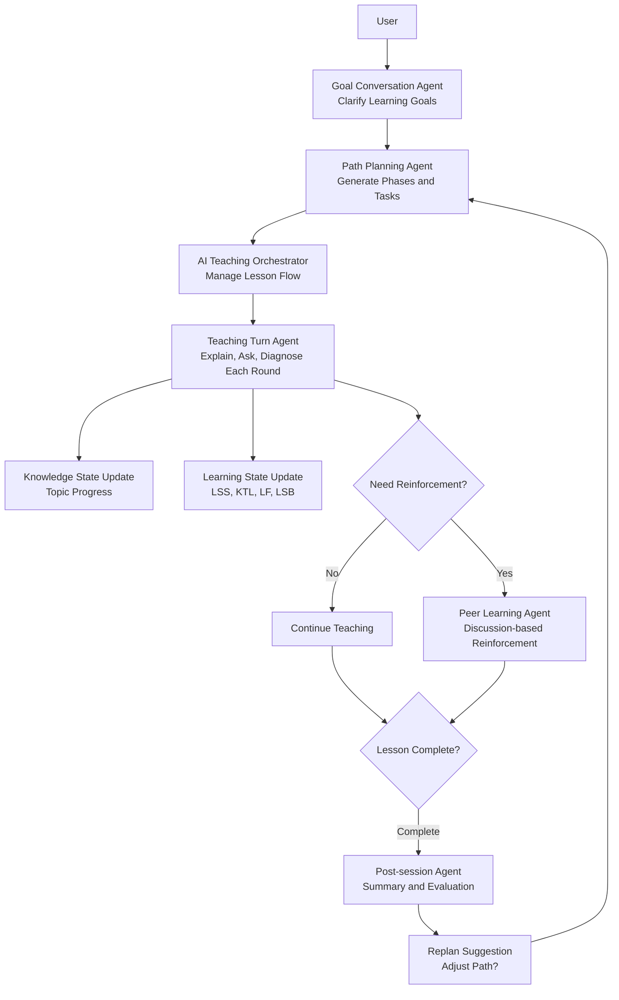

# WenFlow


**An Intelligent Learning Platform for Navigating Uncertainty**

> WenFlow - In the AI era, learning to ask questions is more important than finding answers

English Version | [中文版](README.md)

🌐 **Website**: https://wenflow.org

> Demo only, not for production use.

**Test Account**: `test`
**Test Password**: `test1234`

[](LICENSE)
[](https://nodejs.org)
[](https://vuejs.org)

---

## Why WenFlow?

When AI can answer all standard questions, **those who ask good questions will define the future.**

Traditional education teaches tools—how to write loops, how to spell words, what the standard answers are.  
WenFlow teaches thinking—seeing connections, recognizing patterns, systemic thinking, defining problems.

**Tools become obsolete, thinking endures.**

---

## Core Features

### Interface Preview

| Home | Learning Path | Teaching Dialog |
|:---:|:---:|:---:|
|  |  |  |

| Status Tracking | Feedback |
|:---:|:---:|
|  |  |

### Conversational Learning
- **Goal Collection**: 5-8 rounds of natural dialogue to clarify what you really want to learn
- **Path Generation**: Vague goals → actionable tasks with dynamic difficulty adjustment
- **Interactive Learning**: Round-based mode, AI asks → user answers → instant feedback

### Learning State Tracking
Based on sports science quantification models, scientifically track learning effectiveness:

| Metric | Meaning | Usage |
|------|------|------|
| LSS | Learning Stress Score | Based on task difficulty, duration, cognitive load |
| KTL | Knowledge Acquisition Level | Long-term accumulation, 42-day decay factor 0.95 |
| LF | Learning Fatigue | Short-term accumulation, 7-day decay factor 0.70 |
| LSB | Learning State Balance | KTL - LF, warns against over-learning |

### Platform Agent Architecture (Simplified)



- First clarify goals, then break them into executable learning paths
- Teaching progresses in rounds, continuously assessing understanding
- Trigger peer reinforcement when student struggles, never abandon current task
- Automatically generate summary and evaluation after each session, with replan suggestions

---

## Tech Stack

| Layer | Technology |
|------|------|
| **Frontend** | Vue 3 + TypeScript + Vite 5 + Element Plus + Pinia |
| **Backend** | Node.js + Express + TypeScript + Prisma |
| **Database** | SQLite |
| **AI Integration** | OpenAI-compatible model gateway (default: DeepSeek) |
| **Agent Orchestration** | EduClaw Gateway + Orchestrators + Event Bus |
| **Deployment** | PowerShell scripts + optional Nginx |

---

## Project Status

This project is in **early development stage**, an experimental product for validating educational concepts.

There are many AI tools teaching you how to code or use software, but few teach you: **What kind of thinking is truly needed in the AI era?**

WenFlow attempts to answer this question. We don't pursue "improving learning efficiency"—that's industrial-era thinking. We pursue developing **problem definition, systems thinking, judgment, AI collaboration, and creativity** needed in the AI era.

This project is a validation: What happens if we shift education focus from "tool skills" to "thinking patterns"?

---

## Quick Start

### Requirements
- Node.js >= 18

### One-click Start (Development)

```bash
# PowerShell
./start-dev.ps1
```

Note: The script automatically checks and installs dependencies, initializes Prisma (`prisma generate` + `prisma db push`), and guides creation of `backend/.env` if needed.  
To skip Prisma initialization: `./start-dev.ps1 -SkipPrisma`

### Test Deployment with Nginx (HTTP)

```bash
# Requires nginx installed and in PATH
./start-dev.ps1 -UseNginx

# Or via npm script
npm run dev:nginx

# Specify domain (defaults to localhost)
./start-dev.ps1 -UseNginx -Domain test.example.com

# If nginx not in PATH, specify executable path
./start-dev.ps1 -UseNginx -NginxExePath "C:\nginx\nginx.exe"
```

Note: `-UseNginx` mode runs `npm run build` (frontend) and generates runtime config to `runtime/nginx/wenflow.nginx.conf`, stopping system nginx process first to avoid port conflicts.

### First-time Environment Setup (Recommended)

```bash
# Interactive initialization of backend/.env (JWT_SECRET, AI config, initial admin)
npm run env:setup

# Or quickly open backend/.env for manual editing
npm run env:edit
```

### Manual Start

```powershell
# Backend (PowerShell)
cd backend
npm install
Copy-Item .env.example .env
npx prisma generate
npx prisma db push
npm run dev

# Frontend (PowerShell)
cd frontend
npm install
Copy-Item .env.example .env
npm run dev
```

```bash
# Backend (Linux/macOS)
cd backend
npm install
cp .env.example .env
npx prisma generate
npx prisma db push
npm run dev

# Frontend (Linux/macOS)
cd frontend
npm install
cp .env.example .env
npm run dev
```

### Access URLs

**Production**: https://wenflow.org

**Development**
- Frontend: http://localhost:5173
- Backend: http://localhost:3001
- Admin Panel: http://localhost:5173/admin

---

## Admin Account

On first startup, the system reads these fields from `backend/.env` to auto-create initial admin:

```env
INIT_ADMIN_NAME=admin
INIT_ADMIN_PASSWORD=YourStrongPassword123
```

If admin already exists in database, creation is skipped.

Recommendation: Change password immediately after first login. Use strong passwords in production.

See [ADMIN_SETUP.md](ADMIN_SETUP.md) for details.

### Reverse Proxy Common Issues

- Don't add trailing `/` to `CORS_ORIGIN` (use `https://wenflow.org`, not `https://wenflow.org/`)
- When using Nginx/Cloudflare, set `TRUST_PROXY=1`
- If "origin not allowed" error occurs, check browser `Origin` matches `CORS_ORIGIN`

---

## Educational Theory Foundation

Based on 6 major educational theories:

1. **Cognitive Load Theory** - Avoid information overload
2. **Self-directed Learning** - User autonomy
3. **Dreyfus Five-stage Model** - Dynamic stage assessment
4. **Zone of Proximal Development + Scaffolding** - Slightly above current level
5. **Formative Assessment** - Immediate feedback
6. **Deliberate Practice** - Targeted weakness improvement

---

## License

This project uses [MIT License](LICENSE).

Copyright (c) 2026 wenflow-org

---

## Acknowledgments

Thanks to all [Linux.do](https://linux.do/) members for their sharing.

---

*When AI can answer all standard questions, those who ask good questions will define the future.*