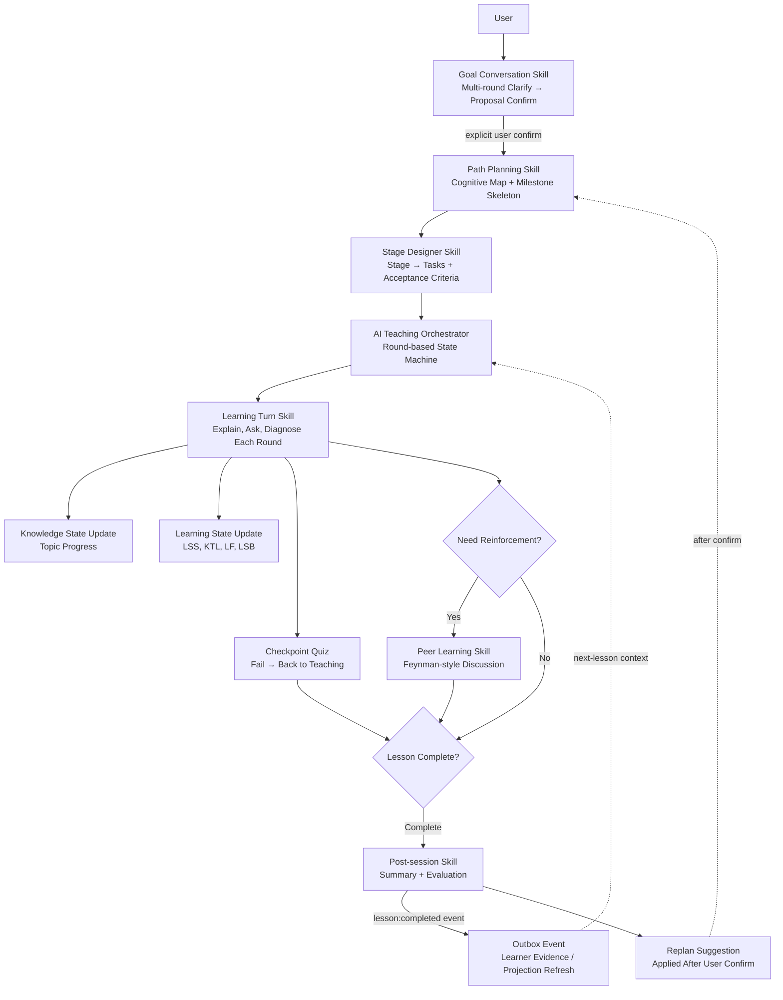

# WenFlow


> ⚠️ **Current Main Development**: [develop](https://github.com/wenflow-org/wenflow/tree/develop) branch | main is stable

**An AI learning-path prototype that starts from real problems**

> WenFlow: don't start by finding courses; start by clarifying the real problem.

English Version | [中文版](README.md)

🌐 **Demo Site**: https://wenflow.org

> Demo only, not for production use.
> ⚠️ **Notice**: All accounts and data on the demo site are periodically purged. Do not store important information.

[](LICENSE)
[](https://nodejs.org)
[](https://vuejs.org)

---

## Why WenFlow?

Learning often gets stuck not because you are not trying hard enough, but because the goal is too broad, the resources are overwhelming, and the first step is unclear.

Many learning products start by giving you content: courses, materials, exercises, and predefined paths.  
WenFlow starts somewhere else: helping you clarify what you are really trying to solve.

It turns a vague goal into an actionable learning path: clarify the problem, generate a route, then keep adjusting through dialogue, output, and feedback.

As AI gets better at producing answers, the more valuable capabilities are no longer just remembering content, but:

- **problem definition**: turning a vague goal into an explorable question
- **systems thinking**: seeing the structure between knowledge, context, and action
- **judgment**: deciding what is worth believing amid information overload
- **AI collaboration**: treating AI as a partner for questioning, feedback, and reasoning
- **creativity**: making new connections between what you already know

**Answers will keep getting cheaper. Problems will matter more.**

---

## Core Features

### Product Flow Preview

These six screenshots show WenFlow's core experience, from a real problem to a complete learning loop.

| ① Start from a Real Problem |
|:---:|
|  |
| Say what you're trying to solve first, instead of hunting for courses |

| ② Clarify the Real Goal | ③ Generate a Learning Path |
|:---:|:---:|
|  |  |
| The AI keeps asking until the goal is clear | A vague goal becomes phases, tasks, and a first step you can do today |

| ④ Enter Round-based Learning | ⑤ Learning Loop Overview |
|:---:|:---:|
|  |  |
| The AI teaches, you answer, feedback is instant | A post-session summary and evaluation show you what to learn next |

| ⑥ Learning State Tracking |
|:---:|
|  |
| LSS / KTL / LF / LSB tracked continuously, and it tells you when to rest |

### From Problem to Path
- **Problem Clarification**: multi-round dialogue until the goal is clear
- **Path Generation**: a vague goal becomes phases, tasks, and a first step you can start today
- **Round-based Learning**: the AI teaches, you answer, feedback is instant, and the path keeps adjusting to your understanding

### Learning State Tracking
Inspired by load-and-recovery ideas from sports science, WenFlow tracks learning state rather than only whether a task was completed:

| Metric | Meaning | Usage |
|------|------|------|
| LSS | Learning Stress Score | Based on task difficulty, duration, cognitive load, EWMA-smoothed |
| KTL | Knowledge Training Load | Long-term accumulation, daily decay factor 0.95 (half-life ≈ 13.5 days) |
| LF | Learning Fatigue | Short-term accumulation, daily decay factor 0.70 (half-life ≈ 1.9 days) |
| LSB | Learning State Balance | KTL - LF, warns against over-learning |

### Platform Agent Architecture (Simplified)



- Top-level agents are orchestration-oriented; the Skills actually hold the prompts and call the LLM.
- Clarify the goal first, then break it into a path. Generation starts only after you confirm (an AI-reported "ready" doesn't count).
- Teaching progresses opening → teaching ⇄ intervention → ready_to_close → wrapup; checkpoints only appear inside rounds; session mode is always tutor.
- When the student gets stuck (help keywords, several low-understanding rounds), peer reinforcement kicks in — the current task is never abandoned.
- Each session ends with a summary, evaluation, and replan suggestions. Paths are never changed automatically; a new version is created only after you confirm.
- After a lesson, events are persisted and the learner profile is updated; the next lesson starts with that context.

### Virtual Learner Lab

Virtual learner accounts exercise the product the way a real user would, to validate the platform:

- **Black-box simulation**: walks through goal → path → learning like a normal user, with a referee and actor-fidelity audit checking the results
- **Quick Learn**: picks a virtual account's task, auto-completes a lesson, and produces a propagation report

### Admin Console

The admin panel lives at `/admin` with 18 scene pages (grouped by the sidebar), all backed by real APIs (demo data only when nothing is available):

- **Overview**: platform overview — is today healthy, which model fails the most, what needs investigation
- **Learners**: people & learners (accounts / learning state tabs) — learning state, risk and fatigue, with manual snapshot recompute; learning sessions (teaching sessions / goal conversations / learning paths tabs); virtual learners
- **Skill Management**: orchestration structure (stage lanes + topology stats), Skill runtime (success rate, failing nodes, idle and average-latency monitoring), Skill design page (secondary page: protocol editing, compile, gate checks, publish, rollback, version diff, trial runs — including one-click rerun of the last real call), Prompt evaluation, health center
- **Operations**: ops hub (todo workbench), achievements, feedback center, notifications & announcements (announce / in-app tabs)
- **Configuration**: models & access (routing / connectivity / network boundary / retry & timeout), add-ons, session security, system tools (ops tools + data export)
- **Observability**: execution logs (logs / trace waterfall / cost analysis tabs, with retry timelines, auto-refresh, export), audit logs

> Note: the topology view has been merged into the "Orchestration Structure" page; the trace waterfall and token cost analysis are now tabs inside "Execution Logs"; batch experiments have been merged into "Virtual Learners". The authoritative scene list is `frontend/src/views/admin-redesign/manifest.ts`.

### Prompt Engineering (Prompt Lab v4, File-as-Truth)

- **Source of truth**: `prompts/core/*.yaml` (the only manual edit entry, committed to git)
- **Compiled artifacts**: `prompts/skill.*.md` (generated deterministically; models read this text only)
- **Publish chain**: edit core.yaml → compile (gate checks) → publish (write md + DB ACTIVE) → rollback
- **Database**: `agent_prompts` is only a runtime mirror; files are the truth, DB is the mirror

---

## Tech Stack

| Layer | Technology |
|------|------|
| **Frontend** | Vue 3 + TypeScript + Vite 6 + Element Plus + Pinia |
| **Backend** | Node.js + Express + TypeScript + Prisma |
| **Database** | SQLite (main DB with 44 tables + system DB with 14 tables, dual-database architecture) |
| **AI Integration** | OpenAI-compatible model gateway (default: DeepSeek deepseek-v4-flash / v4-pro / r1), SSE streaming, retry budget, thinking-mode control |
| **Agent Coordination** | EduClaw Gateway + 5 top-level Agents (goal/path/teaching/profile/simulation) / Skill orchestration (prompts/core source → compiled artifacts → DB mirror) + Coordinators + Durable Outbox event chain |
| **Model Config Layers** | Env vars → platform defaults → Agent/Skill level → user-defined API / model overrides |
| **Virtual Experiment** | Virtual Learner Lab (black-box simulation + Quick Learn) |
| **Observability** | Agent/Skill call logs, trace waterfall, LLM execution details |
| **Security** | JWT + CSRF + login rate limiting + Secret AES-256-GCM encryption + sensitive-storage permission audits |
| **Deployment** | PowerShell scripts + optional Nginx (test deployment) + Docker (Linux/macOS) |

---

## Project Status

WenFlow is still in an **early development stage**, serving as an experimental prototype for validating a different learning approach.

Instead of simply accelerating old learning workflows, it explores another path: what if learning starts from a real problem, and AI helps clarify goals, shape the path, and organize feedback along the way?

The project is meant to keep exploring how to cultivate five capabilities that matter in the AI era: **problem definition, systems thinking, judgment, AI collaboration, and creativity**.

---

## Quick Start

### Requirements
- Node.js >= 20.17.0

### Recommended Order (First Run)

See [`SECURITY.md`](./SECURITY.md) for credential and backup handling. Run `npm run security:scan` before publishing changes.

Runtime status: `/health` and `/livez` report process liveness; `/readyz` verifies both databases and the core runtime state.

```bash
# 1) Initialize backend/.env (JWT_SECRET, AI config, initial admin)
npm run env:setup

# 2) Choose a startup mode as needed
./start-dev.ps1
```

Note: For first-time use, it is recommended to finish environment setup before choosing a startup script. If `backend/.env` is missing or `JWT_SECRET` is invalid, the startup scripts will also launch the setup flow automatically.
When the backend starts, core prompts are synced from the repo into the database automatically; a fresh GitHub checkout just works, no manual import needed.

### Local Development

```bash
# PowerShell
./start-dev.ps1
```

Note: The script installs dependencies, generates both Prisma clients, runs migrations for the main and System databases, guides environment setup if needed, and syncs core prompts once before startup.
To skip Prisma initialization: `./start-dev.ps1 -SkipPrisma`  
Important: this flag also skips the startup prompt sync, so it should only be used when both the database schema and prompt records are already ready.

### LAN Development Mode

```bash
# Auto-detect LAN IP and start
./start-lan.ps1

# Or use npm script
npm run dev:lan

# Manually specify IP
./start-lan.ps1 -LanIP 192.168.31.26
```

Note: This mode automatically adds the LAN IP to `CORS_ORIGIN`, which is useful for multi-device frontend testing. It does not change the `ADMIN_ACCESS_MODE` restriction on admin login.

### Test Deployment with Nginx (HTTP)

```bash
# Requires nginx installed and in PATH
./start-dev.ps1 -UseNginx

# Or via npm script
npm run dev:nginx

# Specify domain (defaults to localhost)
./start-dev.ps1 -UseNginx -Domain test.example.com

# If nginx not in PATH, specify executable path
./start-dev.ps1 -UseNginx -NginxExePath "C:\nginx\nginx.exe"
```

Note: `-UseNginx` mode runs `npm run build` (frontend) and generates runtime config to `runtime/nginx/wenflow.nginx.conf`; it validates port 80 availability first, and the system nginx (or any other process holding port 80) must be stopped manually.

### Docker Deployment (Linux/macOS)

```bash
# One-shot start (interactively fills backend/.env; env vars can also be passed non-interactively)
./docker-start.sh

# Database backup (one-off operations service, read-only volume mount)
docker compose -f docker-compose.operations.yml run --rm backup
```

Note: `docker-compose.yml` provides three services (migrate / backend / nginx) and publishes only Nginx (80) by default, never the backend port `3001`; the backend enforces `ADMIN_ACCESS_MODE=private`. See [DEPLOYMENT.md](DEPLOYMENT.md) for details.

### Quality Check (same as CI)

```bash
# Runs: secret scan → Prisma schema validation → clean-replay migrations → backend typecheck → LLM call contract check → migrate deploy → prompts gates → lint → backend/frontend tests → backend + frontend builds
npm run check
```

Note: GitHub Actions (`.github/workflows/quality-check.yml`) runs the same checks on push to main/master/develop and on PRs (plus a git-history secret scan).

### First-time Environment Setup (Recommended)

```bash
# Interactive initialization of backend/.env
npm run env:setup

# Or quickly open backend/.env for manual editing
npm run env:edit
```

Note: `env:setup` no longer asks for a domain separately. In Nginx mode, the domain is inferred from `-Domain` first, then from `FRONTEND_URL` in `backend/.env`.

### Prompt Bootstrap and Maintenance (File-as-Truth)

Core prompts use a two-level model: **the source of truth** is `prompts/core/*.yaml` (the only manual edit entry, committed to git), **compiled artifacts** are `prompts/skill.*.md` (the only text models read), and the `agent_prompts` table is just a runtime mirror. The edit → compile → publish chain (with gate checks and rollback) lives in the admin "Prompt Design" workbench; see [`doc/SKILL_PROTOCOL_V4.md`](doc/SKILL_PROTOCOL_V4.md) for the mechanism.

```bash
# Deterministically compile all prompts/core/*.yaml, regenerating prompts/skill.*.md (no DB writes)
cd backend
npm run prompts:compile-all

# Sync compiled artifacts into database ACTIVE versions (also runs automatically at startup)
npm run prompts:sync-core

# Backfill newly introduced prompt nodes without overriding existing ACTIVE prompts
npm run prompts:backfill-core

# Lint and parity checks
npm run prompts:lint
npm run prompts:core:check
```

Note: `prompts:sync-core` aligns the database ACTIVE versions with the compiled repo artifacts, creating and switching to a new version when they differ (the old one is archived). `prompts:backfill-core` only fills missing nodes and never overwrites existing ACTIVE prompts. If you run `npm run dev` directly inside `backend/`, the same sync also runs during startup. See [`prompts/_README.md`](prompts/_README.md) for more.

### Local SQLite Path Rule

- For local SQLite development, use: `DATABASE_URL=file:./dev.db`
- For the System database, use: `SYSTEM_DATABASE_URL=file:../system.db`
- Do not use the old `file:./prisma/*.db` values. Relative SQLite URLs are resolved from each schema directory.
- Before upgrading an existing environment, identify and back up the authoritative database files, then run `npm run prisma:baseline:audit` in read-only mode.

### Frontend API Environment Variables

- By default, the frontend calls the backend through the relative `/api` path, forwarded by Vite proxy or Nginx.
- The admin panel primarily reads `VITE_API_BASE_URL` from `frontend/.env`.
- The main user-facing app always uses `/api` in dev mode; outside dev mode `VITE_API_BASE_URL` takes priority, with `VITE_API_URL` kept only as a legacy fallback. If you do not have a custom deployment need, keeping `/api` is the safest default.

For more fine-grained deployment steps or non-script startup, see [DEPLOYMENT.md](DEPLOYMENT.md).

Architecture design, Skill protocol, prompt management, and virtual-learner-chain docs are indexed in [`doc/README.md`](doc/README.md).

### Access URLs

**Demo Site**: https://wenflow.org

**Local Development**
- Frontend: http://localhost:5173
- Backend: http://localhost:3001
- Admin Panel: http://localhost:5173/admin

Note: Admin login defaults to `ADMIN_ACCESS_MODE=private` (localhost + LAN only), and can be set to `loopback` (localhost only) or `any` (no source restriction), with `ADMIN_ALLOWED_IPS` for precise IP allowlisting (exposing admin login directly to the public internet is not recommended).

---

## Admin Account

On first startup, the system reads these fields from `backend/.env` to auto-create initial admin:

```env
INIT_ADMIN_NAME=admin
INIT_ADMIN_PASSWORD=YourStrongPassword123
```

If admin already exists in database, creation is skipped.

Recommendation: Change password immediately after first login. Use strong passwords for externally accessible deployments.

Important: Admin login defaults to `ADMIN_ACCESS_MODE=private`, allowing only localhost and LAN (RFC1918) sources. Set `loopback` for localhost-only or `any` to remove the source restriction, and use `ADMIN_ALLOWED_IPS` to allowlist specific client IPs. The policy can be applied at runtime from the admin "Models & Access" page; the env var is only the default. For public remote administration, use a VPN or precise IP allowlist, and take responsibility for the added security risk. See [ADMIN_LOGIN_GUIDE.md](ADMIN_LOGIN_GUIDE.md) for details.

See [ADMIN_SETUP.md](ADMIN_SETUP.md) for details.

### Reverse Proxy Common Issues

- Don't add trailing `/` to `CORS_ORIGIN` (use `https://demo.example.com`, not `https://demo.example.com/`)
- Set `TRUST_PROXY` to the IP/CIDR of the proxy that directly connects to the backend; production rejects `true`
- Do not publish a backend port that bypasses the trusted proxy. Docker Compose exposes only Nginx to the host
- If "origin not allowed" error occurs, check browser `Origin` matches `CORS_ORIGIN`

---

## Educational Theory Foundation

The design is grounded in these theories, each backed by concrete implementation:

1. **Cognitive Load Theory** - per-round knowledge-point caps, response-format budgets, automatic context compression
2. **Self-directed Learning** - you state the goal and confirm the plan; pacing is yours
3. **Zone of Proximal Development + Scaffolding** - difficulty adjusts to understanding; prerequisite gaps are backfilled first
4. **Formative Assessment** - per-round understanding diagnosis plus checkpoint quizzes; instant feedback, retry on failure
5. **Deliberate + Retrieval Practice** - mastery means explaining it yourself; post-session retrieval self-tests carry into the next lesson
6. **Feynman Technique (Self-explanation)** - explain it in your own words to someone else; if you can't, learn it again
7. **Anderson's Taxonomy** - six cognitive levels from remember to create, applied across labeling, teaching, and completion checks

For the full theoretical foundation (literature with DOI/arXiv links, WenFlow implementation index, and gap list), see [doc/EDUCATIONAL_THEORY_MAP.md](doc/EDUCATIONAL_THEORY_MAP.md).

---

## License

This project uses [MIT License](LICENSE).

Copyright (c) 2026 wenflow-org

---

## Acknowledgments

Thanks to all [Linux.do](https://linux.do/) members for their sharing.

---

*When AI can answer all standard questions, those who ask good questions will define the future.*
