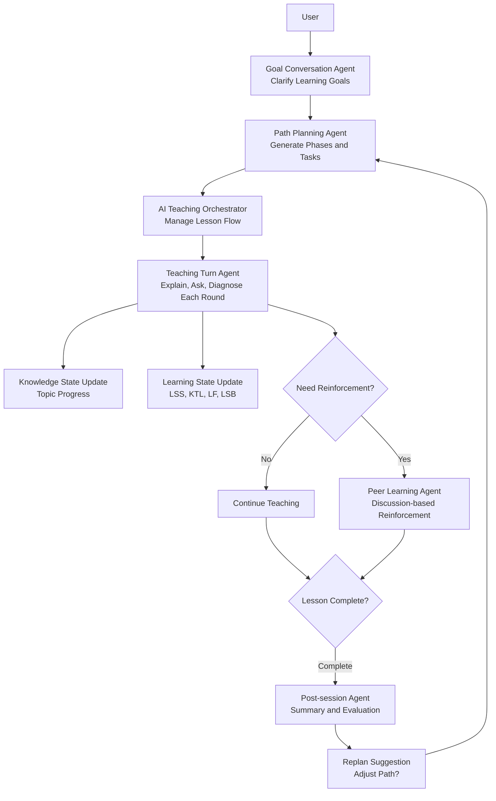

# WenFlow


> ⚠️ **Current Main Development**: [develop](https://github.com/wenflow-org/wenflow/tree/develop) branch | main is stable

**An AI learning-path prototype that starts from real problems**

> WenFlow: don't start by finding courses; start by clarifying the real problem.

English Version | [中文版](README.md)

🌐 **Demo Site**: https://wenflow.org

> Demo only, not for production use.

[](LICENSE)
[](https://nodejs.org)
[](https://vuejs.org)

---

## Why WenFlow?

Learning often gets stuck not because you are not trying hard enough, but because the goal is too broad, the resources are overwhelming, and the first step is unclear.

Many learning products start by giving you content: courses, materials, exercises, and predefined paths.  
WenFlow starts somewhere else: helping you clarify what you are really trying to solve.

It turns a vague goal into an actionable learning path: clarify the problem, generate a route, then keep adjusting through dialogue, output, and feedback.

As AI gets better at producing answers, the more valuable capabilities are no longer just remembering content, but:

- defining problems
- seeing structure
- making judgments
- collaborating with AI
- continuously adjusting through feedback

**Answers will keep getting cheaper. Problems will matter more.**

---

## Core Features

### Product Flow Preview

These five screenshots show WenFlow's core experience, from a real problem to a complete learning loop.

| Start from a Real Problem |
|:---:|
|  |

| Clarify the Real Goal | Generate a Learning Path |
|:---:|:---:|
|  |  |

| Enter Round-based Learning | Learning Loop Overview |
|:---:|:---:|
|  |  |

### From Problem to Path
- **Problem Clarification**: use 5-8 rounds of natural dialogue to surface context, prior knowledge, time, and constraints
- **Path Generation**: turn a vague goal into phases, tasks, and a first step you can start today
- **Round-based Learning**: AI asks, the user responds, feedback is immediate, and the path keeps adjusting with understanding

### Learning State Tracking
Inspired by load-and-recovery ideas from sports science, WenFlow tracks learning state rather than only whether a task was completed:

| Metric | Meaning | Usage |
|------|------|------|
| LSS | Learning Stress Score | Based on task difficulty, duration, cognitive load |
| KTL | Knowledge Acquisition Level | Long-term accumulation, 42-day decay factor 0.95 |
| LF | Learning Fatigue | Short-term accumulation, 7-day decay factor 0.70 |
| LSB | Learning State Balance | KTL - LF, warns against over-learning |

### Platform Agent Architecture (Simplified)



- First clarify goals, then break them into executable learning paths
- Teaching progresses in rounds, continuously assessing understanding
- Trigger peer reinforcement when student struggles, never abandon current task
- Automatically generate summary and evaluation after each session, with replan suggestions

---

## Tech Stack

| Layer | Technology |
|------|------|
| **Frontend** | Vue 3 + TypeScript + Vite 5 + Element Plus + Pinia |
| **Backend** | Node.js + Express + TypeScript + Prisma |
| **Database** | SQLite |
| **AI Integration** | OpenAI-compatible model gateway (default: DeepSeek) |
| **Agent Orchestration** | EduClaw Gateway + Orchestrators + Event Bus |
| **Deployment** | PowerShell scripts + optional Nginx |

---

## Project Status

WenFlow is still in an **early development stage**, serving as an experimental prototype for validating a different learning approach.

Instead of simply accelerating old learning workflows, it explores another path: what if learning starts from a real problem, and AI helps clarify goals, shape the path, and organize feedback along the way?

The project is meant to keep exploring how to cultivate five capabilities that matter in the AI era: **problem definition, systems thinking, judgment, AI collaboration, and creativity**.

---

## Quick Start

### Requirements
- Node.js >= 18

### Recommended Order (First Run)

```bash
# 1) Initialize backend/.env (JWT_SECRET, AI config, initial admin)
npm run env:setup

# 2) Choose a startup mode as needed
./start-dev.ps1
```

Note: For first-time use, it is recommended to finish environment setup before choosing a startup script. If `backend/.env` is missing or `JWT_SECRET` is invalid, the startup scripts will also launch the setup flow automatically.

### Local Development

```bash
# PowerShell
./start-dev.ps1
```

Note: The script automatically checks and installs dependencies, initializes Prisma (`prisma generate` + `prisma db push`), and guides creation or completion of `backend/.env` if needed.  
To skip Prisma initialization: `./start-dev.ps1 -SkipPrisma`

### LAN Development Mode

```bash
# Auto-detect LAN IP and start
./start-lan.ps1

# Or use npm script
npm run dev:lan

# Manually specify IP
./start-lan.ps1 -LanIP 192.168.31.26
```

Note: This mode automatically adds the LAN IP to `CORS_ORIGIN`, which is useful for multi-device frontend testing. It does not change the localhost-only restriction on admin login.

### Test Deployment with Nginx (HTTP)

```bash
# Requires nginx installed and in PATH
./start-dev.ps1 -UseNginx

# Or via npm script
npm run dev:nginx

# Specify domain (defaults to localhost)
./start-dev.ps1 -UseNginx -Domain test.example.com

# If nginx not in PATH, specify executable path
./start-dev.ps1 -UseNginx -NginxExePath "C:\nginx\nginx.exe"
```

Note: `-UseNginx` mode runs `npm run build` (frontend) and generates runtime config to `runtime/nginx/wenflow.nginx.conf`, stopping system nginx process first to avoid port conflicts.

### First-time Environment Setup (Recommended)

```bash
# Interactive initialization of backend/.env
npm run env:setup

# Or quickly open backend/.env for manual editing
npm run env:edit
```

Note: `env:setup` no longer asks for a domain separately. In Nginx mode, the domain is inferred from `-Domain` first, then from `FRONTEND_URL` in `backend/.env`.

### Frontend API Environment Variables

- By default, the frontend calls the backend through the relative `/api` path, forwarded by Vite proxy or Nginx.
- The admin panel primarily reads `VITE_API_BASE_URL` from `frontend/.env`.
- The main user-facing app also supports `VITE_API_URL` outside development mode; if you do not have a custom deployment need, keeping `/api` is the safest default.

For more fine-grained deployment steps or non-script startup, see [DEPLOYMENT.md](DEPLOYMENT.md).

### Access URLs

**Demo Site**: https://wenflow.org

**Local Development**
- Frontend: http://localhost:5173
- Backend: http://localhost:3001
- Admin Panel: http://localhost:5173/admin

Note: The admin login endpoint currently allows localhost access only. LAN devices or standard reverse-proxy access can still open the admin page, but the backend will reject login attempts.

---

## Admin Account

On first startup, the system reads these fields from `backend/.env` to auto-create initial admin:

```env
INIT_ADMIN_NAME=admin
INIT_ADMIN_PASSWORD=YourStrongPassword123
```

If admin already exists in database, creation is skipped.

Recommendation: Change password immediately after first login. Use strong passwords for externally accessible deployments.

Important: The admin login endpoint currently only allows `localhost` / `127.0.0.1` / `::1`, which is suitable for local administration but not for direct LAN or public admin logins.

See [ADMIN_SETUP.md](ADMIN_SETUP.md) for details.

### Reverse Proxy Common Issues

- Don't add trailing `/` to `CORS_ORIGIN` (use `https://demo.example.com`, not `https://demo.example.com/`)
- When using Nginx/Cloudflare, set `TRUST_PROXY=1`
- If "origin not allowed" error occurs, check browser `Origin` matches `CORS_ORIGIN`

---

## Educational Theory Foundation

Based on 6 major educational theories:

1. **Cognitive Load Theory** - Avoid information overload
2. **Self-directed Learning** - User autonomy
3. **Dreyfus Five-stage Model** - Dynamic stage assessment
4. **Zone of Proximal Development + Scaffolding** - Slightly above current level
5. **Formative Assessment** - Immediate feedback
6. **Deliberate Practice** - Targeted weakness improvement

---

## License

This project uses [MIT License](LICENSE).

Copyright (c) 2026 wenflow-org

---

## Acknowledgments

Thanks to all [Linux.do](https://linux.do/) members for their sharing.

---

*When AI can answer all standard questions, those who ask good questions will define the future.*
