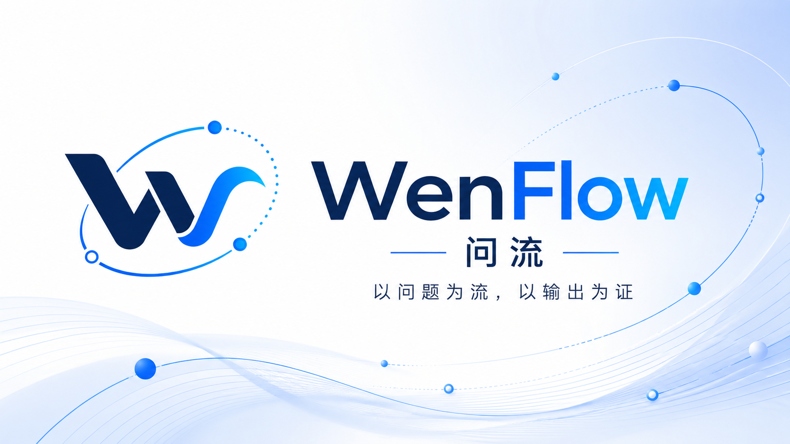
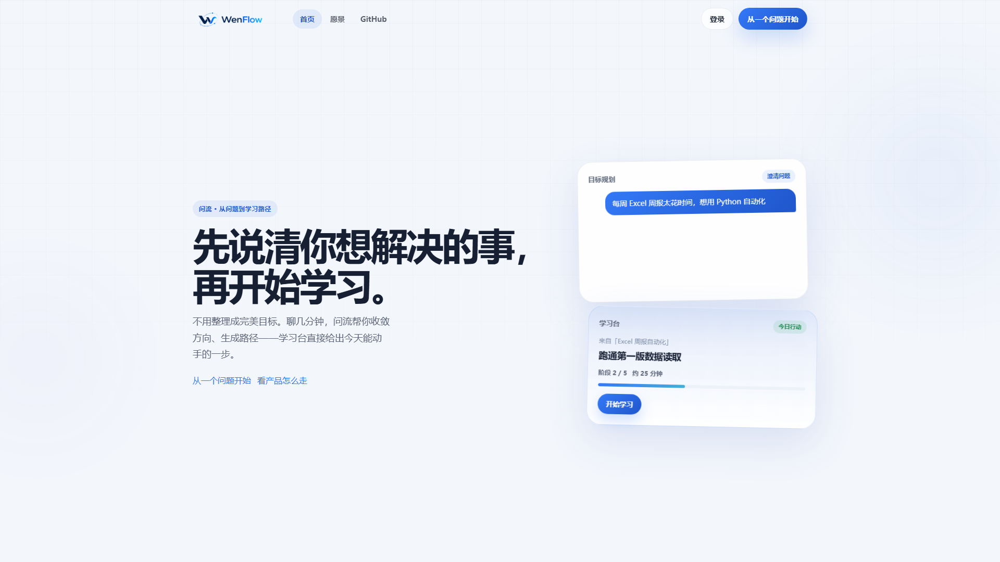
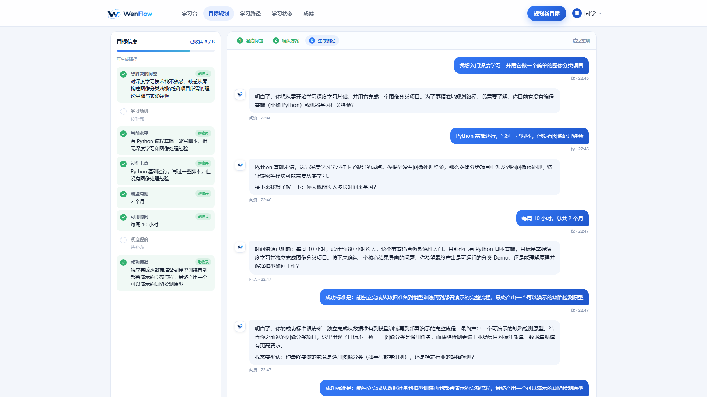
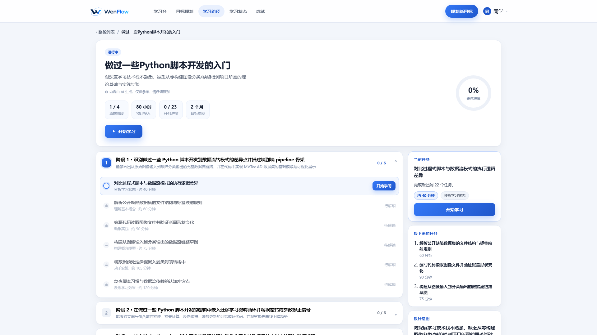
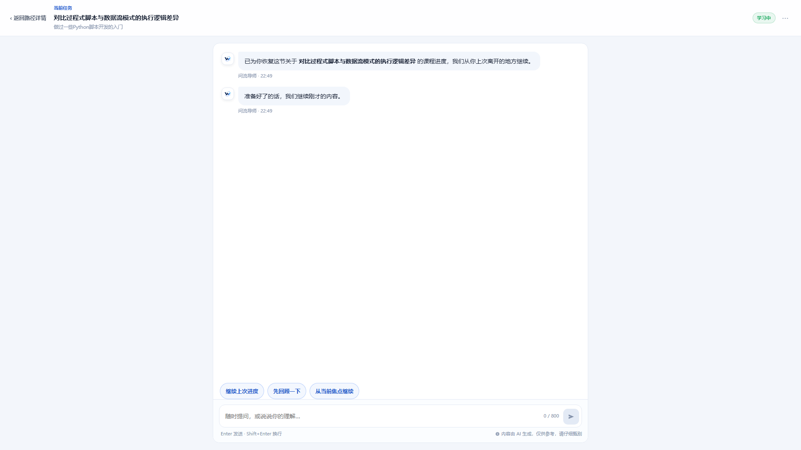
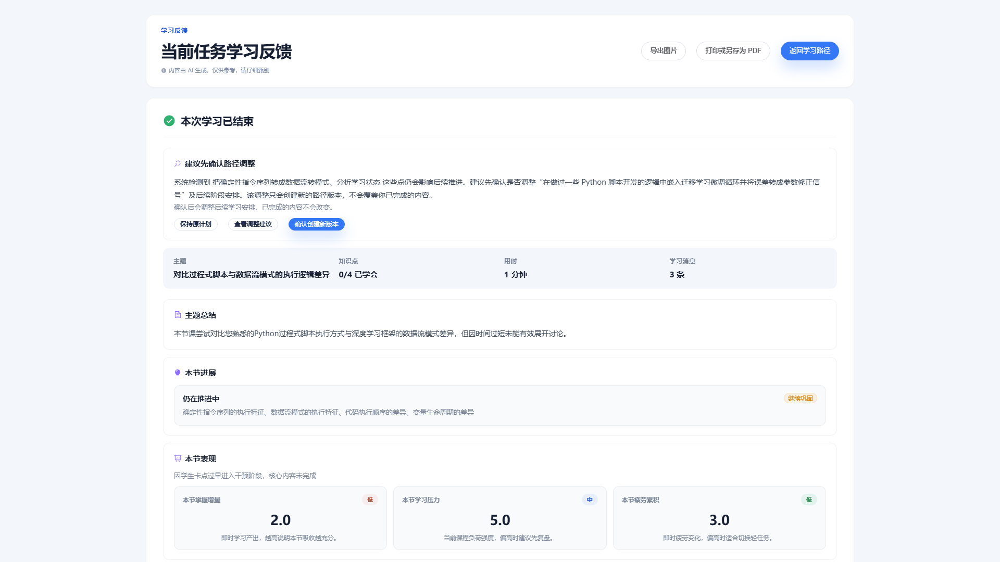
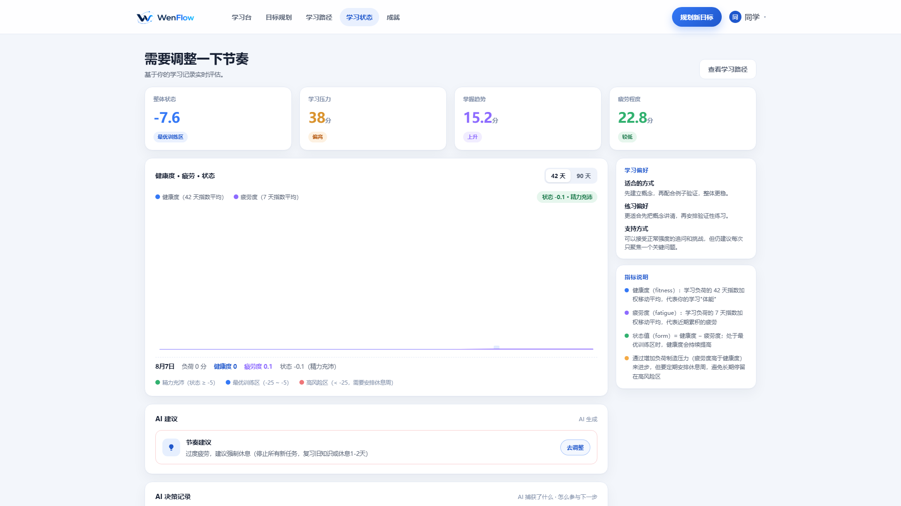
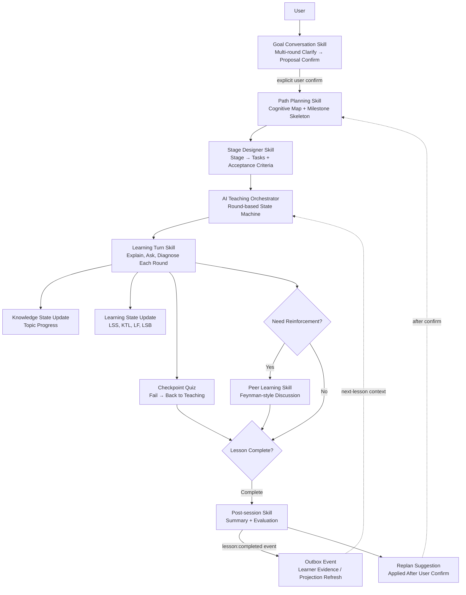

# WenFlow



> ⚠️ **Current Main Development**: [develop](https://github.com/wenflow-org/wenflow/tree/develop) branch | main is stable

**An AI learning-path prototype that starts from real problems**

> Core idea: learning begins with clarifying the real problem, not with choosing a course.

English Version | [中文版](README.md)

🌐 **Demo Site**: https://wenflow.org

> Demo only, not for production use.
> ⚠️ **Notice**: All accounts and data on the demo site are periodically purged. Do not store important information.

[](LICENSE)
[](https://nodejs.org)
[](https://vuejs.org)

📋 **[Changelog](CHANGELOG.md)** · Monthly feature updates

---

## Why WenFlow?

Many learning difficulties stem not from a lack of effort, but from goals that are too broad, an overload of materials, and an unclear first step.

Most learning products start by supplying content: courses, materials, exercises, and predefined paths. WenFlow takes a different approach — it first helps learners clarify the problem they actually need to solve, then generates an actionable learning path from it, refined continuously through dialogue, output, and feedback.

As AI becomes increasingly capable of producing answers, the skills worth cultivating are no longer limited to memorizing content, but:

- **problem definition**: turning a vague goal into an explorable question
- **systems thinking**: understanding the structural relationships between knowledge, context, and action
- **judgment**: discerning what is worth trusting amid information overload
- **AI collaboration**: treating AI as a partner for questioning, feedback, and reasoning
- **creativity**: making new connections between existing knowledge

**Answers will become increasingly abundant; the quality of the questions will matter more.**

---

## Core Features

### Product Flow Preview

These six screenshots show WenFlow's core experience, from a real problem to a complete learning loop.

| ① Start from a Real Problem |
|:---:|
|  |
| Learners state their problem first, rather than choosing a course |

| ② Clarify the Real Goal | ③ Generate a Learning Path |
|:---:|:---:|
|  |  |
| The AI clarifies the real goal through multi-round questioning | A vague goal becomes phases, tasks, and an actionable first step |

| ④ Enter Round-based Learning | ⑤ Learning Loop Overview |
|:---:|:---:|
|  |  |
| The AI teaches, the learner answers, and feedback is immediate; teaching adapts dynamically | A post-session summary and evaluation provide guidance on what to learn next |

| ⑥ Learning State Tracking |
|:---:|
|  |
| LSS / KTL / LF / LSB tracked continuously, with rest prompts when fatigue is detected |

### From Problem to Path
- **Problem Clarification**: multi-round natural dialogue to clarify the learning goal
- **Path Generation**: a vague goal becomes phases, tasks, and an actionable first step
- **Round-based Learning**: the AI teaches, the learner answers, feedback is immediate, and teaching adapts to the learner's understanding

### Learning State Tracking
Inspired by load-and-recovery ideas from sports science, WenFlow tracks learning state rather than only whether a task was completed:

| Metric | Meaning | Usage |
|------|------|------|
| LSS | Learning Stress Score | Composite of task difficulty, duration, cognitive load, efficiency and completion rate |
| KTL | Knowledge Training Load | Long-term accumulation, daily decay factor 0.95 (half-life ≈ 13.5 days) |
| LF | Learning Fatigue | Short-term accumulation, daily decay factor 0.70 (half-life ≈ 1.9 days) |
| LSB | Learning State Balance | KTL - LF, warns against over-learning |

### Platform Agent Architecture (Simplified)


```mermaid
flowchart TD
    U[User] --> G1[Goal Conversation Skill\nMulti-round Clarify → Proposal Confirm]
    G1 -- explicit user confirm --> P1[Path Planning Skill\nCognitive Map + Milestone Skeleton]
    P1 --> P2[Stage Designer Skill\nStage → Tasks + Acceptance Criteria]
    P2 --> T0[AI Teaching Orchestrator\nRound-based State Machine]

    T0 --> T1[Learning Turn Skill\nExplain, Ask, Diagnose Each Round]
    T1 --> K1[Knowledge State Update\nTopic Progress]
    T1 --> S1[Learning State Update\nLSS, KTL, LF, LSB]
    T1 --> C1[Checkpoint Quiz\nFail → Back to Teaching]

    T1 --> D{Need Reinforcement?}
    D -- Yes --> PEER[Peer Learning Skill\nFeynman-style Discussion]
    D -- No --> NEXT{Lesson Complete?}
    C1 --> NEXT
    PEER --> NEXT

    NEXT -- Complete --> W1[Post-session Skill\nSummary + Evaluation]
    W1 -- lesson:completed event --> E1[Outbox Event\nLearner Evidence / Projection Refresh]
    W1 --> R1[Replan Suggestion\nApplied After User Confirm]
    E1 -. next-lesson context .-> T0
    R1 -. after confirm .-> P1
```

- Top-level agents are orchestration-oriented; the Skills hold the prompts and call the LLM.
- The goal is clarified first, then broken into a path. Path generation starts only after explicit user confirmation.
- Teaching progresses opening → teaching ⇄ intervention → ready_to_close; the checkpoint is a **within-round** quiz control object (with answer keys and code adjudication), not a stage value; lesson closing is expressed by ready_to_close; session mode is always tutor.
- When a learner shows signs of getting stuck (help keywords, several consecutive low-understanding rounds), peer reinforcement is triggered — the current task is never abandoned.
- Each session ends with a summary, evaluation, and replan suggestions. Paths are never changed automatically; a new version is created only after user confirmation.
- After a lesson, events are persisted and the learner profile is updated; the next lesson starts with that context.

### Virtual Learner Lab

Virtual learner accounts exercise the product the way a real user would, to validate the platform:

- **Black-box simulation**: walks through goal → path → learning from a normal user's perspective, with a referee and actor-fidelity audit checking the results
- **Quick Learn**: selects a task from a virtual account, auto-completes a lesson, and produces a propagation report

### Learner App

The learner app and the admin console are separate: landing `/` and `/vision`, login `/login`, register `/register`; after login you enter the V2 shell (`frontend/src/views/v2/*.vue`).

The top bar / bottom bar navigation has five entries (`frontend/src/views/v2/V2Nav.vue:117`):

| Page | Path | Description |
|------|------|------|
| Dashboard | `/dashboard` | Today's actions, path progress, learning streak |
| Goal Planning | `/goal-conversation` | Multi-round dialogue to clarify the real goal |
| Learning Paths | `/learning-paths` | Path list and progress |
| Knowledge Map | `/knowledge-map` | Knowledge aggregation across all paths (current path only inside a lesson) |
| Learning State | `/learning-state` | LSS / KTL / LF / LSB with fatigue reminders |

Core learning flow: register / login → `/onboarding` guide → `/goal-conversation` to clarify the goal → path generated only after explicit user confirmation → `/learning-paths` list → `/learning-path/:id` path detail → `/learn/:taskId` round-based learning → `/learn/:taskId/evaluation/:sessionId` post-session evaluation.

The personal center lives under `/user/*`: account (`/user/account`), settings with API access (`/user/settings`), agent call logs (`/user/agent-logs`), achievements (`/user/achievements`), learning history (`/user/learning-history`). Legacy `/v2/*` URLs all redirect to the canonical paths above (`frontend/src/router/index.ts:165`).

### Admin Console

The admin panel lives at `/admin` with 18 scene pages across 7 sidebar groups, all backed by real APIs (demo mode has been removed; always live):

- **Overview**: platform overview — current system health, the model with the highest failure rate, and items requiring investigation
- **Teaching**: people & learners, learning state (risk and fatigue, with manual snapshot recompute), teaching sessions, goal conversations, learning paths, memory & review
- **Virtual Learners**: virtual learners (runtime state: concurrency quota / global rate limit / instance log / batch creation, single-step testing), learner card library (structured role-card import/export)
- **Skill**: orchestration map (stage lanes + field data journey / logic diagram + call usage), skills & prompts (skill runtime + model routing; prompt evaluation as an in-host tab; skill design secondary page with protocol editing, compile, gate checks, publish, rollback, trial runs)
- **Observability**: execution logs (logs / trace dual tab, with retry timeline, auto-refresh, export), cost analysis, audit logs
- **System**: health center, models & access (routing / connectivity / network boundary / retry & timeout), system tools (ops tools + data export + session security)
- **Operations**: operations hub (todo workbench / feedback / achievements / announcements / in-app notifications)

> Note: the field data journey (logic diagram) has been merged into the "Orchestration Map" page; "Prompt Evaluation" is now a tab inside the "Skills & Prompts" host page (2026-10-04; the old URL `/admin/prompt-eval` redirects to `/admin/skills?tab=prompt-eval`); cost analysis has been split back into its own page (2026-09-29); the "Batch Experiments" scene has been retired (runtime merged into "Virtual Learners", asset input moved to the "Learner Card Library"; old URL redirects to `/admin/virtual-learners`). The authoritative scene list is `frontend/src/views/admin-redesign/manifest.ts`.

### Prompt Engineering (Prompt Lab v4, File-as-Truth)

- **Source of truth**: `prompts/core/*.yaml` (the only manual edit entry, committed to git)
- **Compiled artifacts**: `prompts/skill.*.md` (generated deterministically; models read this text only)
- **Publish chain**: edit core.yaml → compile (gate checks) → publish (write md + DB ACTIVE) → rollback
- **Database**: `agent_prompts` is only a runtime mirror; files are the truth, DB is the mirror

---

## Tech Stack

| Layer | Technology |
|------|------|
| **Frontend** | Vue 3 + TypeScript + Vite 6 + Element Plus + Pinia |
| **Backend** | Node.js + Express + TypeScript + Prisma |
| **Database** | SQLite (main DB with 51 tables + system DB with 14 tables, dual-database architecture) |
| **AI Integration** | OpenAI-compatible model gateway (defaults: chat = deepseek-v4-flash, reasoning = deepseek-v4-pro), SSE streaming, retry budget, thinking-mode control |
| **Agent / Skill Orchestration** | EduClaw Gateway + 5 top-level Agents (goal/path/teaching/profile/simulation, no prompt orchestrator) / Skill execution layer (prompts/core source → compiled artifacts → DB mirror) + Coordinators + Durable Outbox event chain |
| **Model Config Layers** | Env vars → platform defaults → Agent/Skill level → user-defined API / model overrides |
| **Virtual Experiment** | Virtual Learner Lab (black-box simulation + Quick Learn) |
| **Observability** | Agent/Skill call logs, trace waterfall, LLM execution details |
| **Security** | JWT + CSRF + login rate limiting + Secret AES-256-GCM encryption + sensitive-storage permission audits |
| **Deployment** | Cross-platform start script (`npm run dev`: Windows `start-dev.ps1` / Linux·macOS `start-dev.sh`) + optional Nginx + Docker (recommended for Linux/macOS) |

---

## Project Structure

```text
backend/            Node.js + Express + TypeScript backend (18 module directories)
  src/
    agents/         top-level Agents (incl. learner-model-agent / simulation-agent)
    skills/         Skill implementations (prompt source of truth lives in prompts/, not hardcoded here)
    coordinators/   business-flow orchestration (goal / path / ai-teaching / learner / simulation / requirement)
    gateway/        model gateway (OpenAI-compatible)
    routes/         HTTP routes (user-facing / admin)
    services/       domain services and data access
    virtual-lab/    virtual learner lab
    events/         persisted events and outbox
    scripts/        official tools: gates / read-only audits / probes / backfills / ops
  prisma/           main DB schema and migrations; system/ is the System DB
frontend/           Vue 3 + TypeScript + Vite 6 frontend
  src/
    views/v2/       learner app pages
    views/admin-redesign/  admin pages and scene manifest.ts
    components/mk/  admin shared primitives (MkKpi / MkRowList / MkDistBand / MkBuckets …)
    styles/         design tokens and mk-primitives.css
    api/ · stores/ · router/ · composables/
prompts/            File-as-Truth prompts: core/*.yaml source → skill.*.md compiled artifacts
scripts/            repo-root scripts (virtual-learner batches / inspections / demo / gates), indexed in doc/DEV_SCRIPTS.md
virtual-learners/   prebuilt virtual-learner corpus presets.yaml (File-as-Truth)
doc/                design-doc index doc/README.md (process material lives in gitignored doc/local/)
.github/workflows/  CI gates quality-check.yml
```

### Data and Storage

Two SQLite databases are currently in use; relative URLs resolve from each schema directory:

| DB | Schema | Env var | Default path | Tables |
|----|--------|----------|----------|------|
| Main DB | `backend/prisma/schema.prisma` | `DATABASE_URL` | `file:./dev.db` | 51 |
| System DB | `backend/prisma/system/schema.prisma` | `SYSTEM_DATABASE_URL` | `file:../system.db` | 14 |

Both databases have their own migrations directory (`backend/prisma/migrations`, `backend/prisma/system/migrations`); the startup scripts and CI both run migrate deploy.

- Migrations & validation: `npm run prisma:migrate:verify-clean` (clean-DB migration replay), `npm run prisma:baseline:audit` (read-only baseline audit), `npm --prefix backend run prisma:migrate:deploy:all`
- Backup & maintenance: `npm run database:backup:create` / `database:backup:verify` / `database:vacuum:status` / `database:vacuum` (builds the backend first)
- Prompt runtime mirror: the `agent_prompts` table is only a mirror of `prompts/core/*.yaml`; files are the truth

---

## Project Status

WenFlow is still in an **early development stage**, serving as an experimental prototype for validating a different learning approach.

The project is not a simple acceleration of existing learning workflows; it explores an alternative path — starting from real problems, with AI helping to clarify goals, shape the path, and organize feedback — to determine whether this approach is better suited to the AI era.

The project will continue to explore how to cultivate five capabilities that matter in the AI era: **problem definition, systems thinking, judgment, AI collaboration, and creativity**.

---

## Quick Start

### Requirements
- Node.js >= 20.17.0
- Windows + PowerShell 5.1+ or Linux/macOS + bash; `npm run dev` selects `start-dev.ps1` / `start-dev.sh` by platform.
- On Linux/macOS without a local toolchain setup, Docker is recommended: `./docker-start.sh`.

### Recommended Order (First Run)

See [`SECURITY.md`](./SECURITY.md) for credential and backup handling. Run `npm run security:scan` before publishing changes.

Runtime status: `/health` and `/livez` report process liveness; `/readyz` verifies both databases and the core runtime state.

Self-check: when the environment won't start or behaves oddly, run `npm run doctor` first (cross-platform, read-only, seconds) —
it checks Node / deps / .env / dual DB / CORS / ports and services one by one with fix guidance; `--deep` adds the prompts three-way parity audit.

```bash
# 1) Initialize backend/.env (JWT_SECRET, AI config, initial admin)
npm run env:setup        # Windows PowerShell; on Linux/macOS: cp backend/.env.example backend/.env, then edit

# 2) Start (cross-platform: Windows -> start-dev.ps1, Linux/macOS -> start-dev.sh)
npm run dev
```

Note: For first-time use, it is recommended to finish environment setup before choosing a startup script. If `backend/.env` is missing or `JWT_SECRET` is invalid, the startup scripts will also launch the setup flow automatically.
When the backend starts, core prompts are synced from the repo into the database automatically; a fresh clone runs directly, with no manual prompt import required.

### Local Development

```bash
npm run dev              # cross-platform: Windows -> start-dev.ps1, Linux/macOS -> start-dev.sh

# Or explicitly
npm run dev:win          # Windows PowerShell
npm run dev:unix         # Linux/macOS bash
```

Note: The script installs dependencies, generates both Prisma clients, runs migrations for the main and System databases, guides environment setup if needed, and syncs core prompts once before startup.
To skip Prisma initialization: `./start-dev.ps1 -SkipPrisma` (PowerShell) or `./start-dev.sh --skip-prisma` (bash).
Important: this flag also skips the startup prompt sync, so it should only be used when both the database schema and prompt records are already ready.

### LAN Development Mode

```bash
# Auto-detect LAN IP and start
./start-lan.ps1

# Or use npm script
npm run dev:lan

# Manually specify IP
./start-lan.ps1 -LanIP 192.168.31.26
```

Note: This mode automatically adds the LAN IP to `CORS_ORIGIN`, which is useful for multi-device frontend testing. It does not change the `ADMIN_ACCESS_MODE` restriction on admin login.

### Test Deployment with Nginx (HTTP)

```bash
# Requires nginx installed and in PATH
./start-dev.ps1 -UseNginx

# Or via npm script
npm run dev:nginx

# Specify domain (defaults to localhost)
./start-dev.ps1 -UseNginx -Domain test.example.com

# If nginx not in PATH, specify executable path
./start-dev.ps1 -UseNginx -NginxExePath "C:\nginx\nginx.exe"
```

Note: `-UseNginx` mode runs `npm run build` (frontend) and generates runtime config to `runtime/nginx/wenflow.nginx.conf`; it validates port 80 availability first, and the system nginx (or any other process holding port 80) must be stopped manually.

### Docker Deployment (Linux/macOS)

```bash
# One-shot start (interactively fills backend/.env; env vars can also be passed non-interactively)
./docker-start.sh

# Database backup (one-off operations service, read-only volume mount; requires WENFLOW_BACKUP_HOST_DIR to be set to the backup output directory)
docker compose -f docker-compose.operations.yml run --rm backup
```

Note: `docker-compose.yml` provides three services (migrate / backend / nginx) and publishes only Nginx (80) by default, never the backend port `3001`; the backend enforces `ADMIN_ACCESS_MODE=private`. See [DEPLOYMENT.md](DEPLOYMENT.md) for details.

### Quality Check (same as CI)

`npm run check` chains three stages that map one-to-one to the three parallel CI jobs, reproducible locally step by step:

```bash
# Quality job: secret scan (working tree) → Prisma dual-schema validation → clean-replay migrations →
#   backend typecheck → frontend typecheck → LLM call contract → constants provenance → dual-DB migrate deploy →
#   field-route seeding → prompts gates (lint / snapshot / drift / contract / core hash parity) → design-system guard →
#   route-data boundary → doc dead links → lint
npm run check:quality

# Tests job: backend + frontend tests (with coverage)
npm run check:test

# Build job: backend + frontend builds
npm run check:build

# All three in sequence (equivalent to CI)
npm run check
```

Note: GitHub Actions (`.github/workflows/quality-check.yml`) runs the three stages on push to main/master/develop and on PRs, with the Quality job additionally running a git-history secret scan. CI uses Node 20; Node >= 20.17.0 is required locally. When CI fails, `npm run ci:status` reviews the failed jobs / steps / error lines of the latest run.

### First-time Environment Setup (Recommended)

```bash
# Interactive initialization of backend/.env
npm run env:setup

# Or quickly open backend/.env for manual editing
npm run env:edit
```

Note: `env:setup` no longer asks for a domain separately. In Nginx mode, the domain is inferred from `-Domain` first, then from `FRONTEND_URL` in `backend/.env`.

### Prompt Bootstrap and Maintenance (File-as-Truth)

Core prompts use a two-level model: **the source of truth** is `prompts/core/*.yaml` (the only manual edit entry, committed to git), **compiled artifacts** are `prompts/skill.*.md` (the only text models read), and the `agent_prompts` table is just a runtime mirror. The edit → compile → publish chain (with gate checks and rollback) lives in the admin "Prompt Design" workbench; see [`doc/SKILL_PROTOCOL_V4.md`](doc/SKILL_PROTOCOL_V4.md) for the mechanism.

```bash
# Deterministically compile all prompts/core/*.yaml, regenerating prompts/skill.*.md (no DB writes)
cd backend
npm run prompts:compile-all

# Sync compiled artifacts into database ACTIVE versions (also runs automatically at startup)
npm run prompts:sync-core

# Backfill newly introduced prompt nodes without overriding existing ACTIVE prompts
npm run prompts:backfill-core

# Lint and parity checks
npm run prompts:lint
npm run prompts:core:check
```

Note: `prompts:sync-core` aligns the database ACTIVE versions with the compiled repo artifacts, creating and switching to a new version when they differ (the old one is archived). `prompts:backfill-core` only fills missing nodes and never overwrites existing ACTIVE prompts. If you run `npm run dev` directly inside `backend/`, the same sync also runs during startup. See [`prompts/_README.md`](prompts/_README.md) for more.

### Local SQLite Path Rule

- For local SQLite development, use: `DATABASE_URL=file:./dev.db`
- For the System database, use: `SYSTEM_DATABASE_URL=file:../system.db`
- Do not use the old `file:./prisma/*.db` values. Relative SQLite URLs are resolved from each schema directory.
- Before upgrading an existing environment, identify and back up the authoritative database files, then run `npm run prisma:baseline:audit` in read-only mode.

### Frontend API Environment Variables

- By default, the frontend calls the backend through the relative `/api` path, forwarded by Vite proxy or Nginx.
- The admin panel primarily reads `VITE_API_BASE_URL` from `frontend/.env`.
- The main user-facing app always uses `/api` in dev mode; outside dev mode `VITE_API_BASE_URL` takes priority, with `VITE_API_URL` kept only as a legacy fallback. Unless a custom deployment is required, the default `/api` is recommended.

For more fine-grained deployment steps or non-script startup, see [DEPLOYMENT.md](DEPLOYMENT.md).

Architecture design, Skill protocol, prompt management, and virtual-learner-chain docs are indexed in [`doc/README.md`](doc/README.md).

### Access URLs

**Demo Site**: https://wenflow.org

**Local Development**
- Frontend: http://localhost:5173
- Backend: http://localhost:3001
- Admin Panel: http://localhost:5173/admin

Note: Admin login defaults to `ADMIN_ACCESS_MODE=private` (localhost + LAN only), and can be set to `loopback` (localhost only) or `any` (no source restriction), with `ADMIN_ALLOWED_IPS` for precise IP allowlisting (exposing admin login directly to the public internet is not recommended).

---

## Common Scripts and Tools

The most-used `npm run` commands (full plain-text list in the root `package.json` and [`doc/DEV_SCRIPTS.md`](doc/DEV_SCRIPTS.md)):

| Category | Command | Description |
|------|------|------|
| Start | `npm run dev` / `dev:win` / `dev:unix` | Cross-platform / Windows / Linux·macOS start |
| Start | `npm run dev:lan` / `dev:nginx` | LAN debugging / local Nginx test deployment |
| Self-check | `npm run doctor` | Read-only check of Node / deps / .env / dual DB / CORS / ports; `-- --deep` adds prompts parity |
| Gates | `npm run check` | `check:quality` + `check:test` + `check:build` (see above) |
| Tests | `npm run test` / `test:coverage` | Backend Jest (CI uses `--runInBand`) / with coverage; frontend tests via `npm --prefix frontend run test` (or `npm run check:test` for both sides) |
| Types | `npm run typecheck:backend` / `check:frontend-types` | Backend / frontend typecheck |
| Style | `npm run lint` | Backend + frontend ESLint |
| Design system | `npm run design:check` | Admin design-system guard (tokens / primitive usage / visual layers) |
| Security | `npm run security:scan` / `permissions:audit` / `secrets:audit` | Secret scan / sensitive-storage permission audit / secret migration audit (audits are read-only; the corresponding `permissions:repair` and `secrets:migrate` write to the DB) |
| Database | `npm run database:backup:create` / `database:vacuum` | Backup / vacuum (builds the backend first) |
| Prompts | `cd backend && npm run prompts:compile-all` / `prompts:sync-core` / `prompts:lint` | Compile / sync ACTIVE / validate (see "Prompt Bootstrap and Maintenance" above) |
| Ops | `npm run ci:status` | Review the latest CI run's failed jobs / steps / error lines (read-only) |

For the virtual-learner batch pipeline (create accounts / run batches / read results / rescue), see [`doc/DEV_SCRIPTS.md`](doc/DEV_SCRIPTS.md) §2.

---

## Admin Account

On first startup, the system reads these fields from `backend/.env` to auto-create initial admin:

```env
INIT_ADMIN_NAME=admin
INIT_ADMIN_PASSWORD=CHANGE_ME_before_deploy
```

If admin already exists in database, creation is skipped.

Recommendation: Change password immediately after first login. Use strong passwords for externally accessible deployments.

Important: Admin login defaults to `ADMIN_ACCESS_MODE=private`, allowing only localhost and LAN (RFC1918) sources. Set `loopback` for localhost-only or `any` to remove the source restriction, and use `ADMIN_ALLOWED_IPS` to allowlist specific client IPs. The policy can be applied at runtime from the admin "Models & Access" page; the env var is only the default. For public remote administration, use a VPN or precise IP allowlist, and take responsibility for the added security risk. See [admin-guide.md](admin-guide.md) for details.

### Reverse Proxy Common Issues

- Do not add a trailing `/` to `CORS_ORIGIN` (use `https://demo.example.com`, not `https://demo.example.com/`)
- Set `TRUST_PROXY` to the IP/CIDR of the proxy that directly connects to the backend; production rejects `true`
- Do not publish a backend port that bypasses the trusted proxy. Docker Compose exposes only Nginx to the host
- If "origin not allowed" error occurs, check browser `Origin` matches `CORS_ORIGIN`

---

## Educational Theory Foundation

The design is grounded in these theories, each backed by concrete implementation (the full 16-theory map with literature DOI/arXiv links and implementation index is in [doc/EDUCATIONAL_THEORY_MAP.md](doc/EDUCATIONAL_THEORY_MAP.md)):

1. **Cognitive Load Theory** - per-round knowledge-point caps, response-format budgets, automatic context compression
2. **Self-directed Learning** - the goal is stated and the plan confirmed by the learner; the pace is learner-controlled
3. **Zone of Proximal Development + Scaffolding** - difficulty adjusts to understanding; prerequisite gaps are backfilled first
4. **Formative Assessment** - per-round understanding diagnosis plus checkpoint quizzes; immediate feedback, retry on failure
5. **Deliberate + Retrieval Practice** - mastery is demonstrated by explaining a point independently; post-session retrieval self-tests carry into the next lesson
6. **Spacing Effect + Review Loop** - multi-day increasing intervals (SM-2 style) with an automatic review-lesson loop for long-term retention
7. **Feynman Technique (Self-explanation)** - explaining in one's own words to verify understanding; relearn when unable to articulate clearly
8. **ICAP Framework** - learning activities classified by cognitive engagement (Interactive > Constructive > Active > Passive); stage tasks follow a non-decreasing ICAP level
9. **Productive Failure** - a two-phase approach of independent trial first, then comparison and integration, using failure as a learning signal
10. **Predictive Calibration Methodology** - teaching confidence is falsifiable: predictions logged, outcomes written back, hit-rate statistics drive tuning
11. **Anderson's Taxonomy** - six cognitive levels from remember to create, applied across labeling, teaching, and completion checks

---

## Documentation and Collaboration

The repository doc registry is [`doc/README.md`](doc/README.md) — entries are classified as "living specs / design records / historical snapshots"; new docs must also enter the doc allowlist, the registry, and carry a status header. Common entries:

- **Dev scripts manual**: [`doc/DEV_SCRIPTS.md`](doc/DEV_SCRIPTS.md) (roles and naming conventions of the three script directories, the virtual-learner batch pipeline, reusable tools index)
- **Agent / Skill**: [`doc/AGENT_SKILL_MANUAL.md`](doc/AGENT_SKILL_MANUAL.md) (why), [`doc/SKILL_PROTOCOL_V4.md`](doc/SKILL_PROTOCOL_V4.md) (protocol SSOT), [`doc/SKILL_DEVELOPMENT_GUIDE.md`](doc/SKILL_DEVELOPMENT_GUIDE.md) (creating / adapting Skills)
- **Architecture & models**: [`doc/MODEL_GATEWAY_DESIGN.md`](doc/MODEL_GATEWAY_DESIGN.md), [`doc/LEARNER_MODEL_ARCHITECTURE.md`](doc/LEARNER_MODEL_ARCHITECTURE.md)
- **Educational theory mapping**: [`doc/EDUCATIONAL_THEORY_MAP.md`](doc/EDUCATIONAL_THEORY_MAP.md)
- **Deployment / security / admin**: [`DEPLOYMENT.md`](DEPLOYMENT.md), [`SECURITY.md`](SECURITY.md), [`admin-guide.md`](admin-guide.md)
- **Contributing**: [`CONTRIBUTING.md`](CONTRIBUTING.md) (branch model `develop` → `main`, gates and collaboration)
- **For AI coding sessions**: [`CLAUDE.md`](CLAUDE.md) (repo working conventions: doc governance, shared worktree discipline)
- **Changelog**: [`CHANGELOG.md`](CHANGELOG.md)

> `doc/local/` holds design drafts, investigation snapshots and other process material; it is gitignored and not committed; only current, valid documents live in the repo.

---

## License

This project uses [MIT License](LICENSE).

Copyright (c) 2026 wenflow-org

---

## Acknowledgments

Gratitude to the [Linux.do](https://linux.do/) community for their ongoing support and sharing.

---

*When AI can answer all standard questions, those who ask good questions will define the future.*
