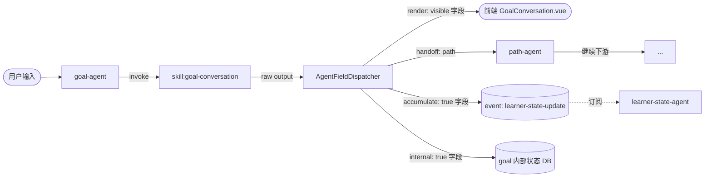

# Agent I/O 设计 V3：Agent 中心的字段路由模型

> 状态：**生效中（Active）**
> 起草日期：2026-06-18
> 适用版本：WenFlow 平台后端 / 前端管理台
> 取代：`doc/archive/AGENT_IO_DESIGN.md`（v1.1）、`doc/archive/AGENT_IO_DESIGN_V2.md`、`doc/archive/contracts/GOAL_CONVERSATION_FIELDS.md`、`doc/archive/GOAL_CONVERSATION_LAYERING_NOTE.md`、`doc/archive/STRUCTURED_CONVERSATION_PATTERN.md`
> 受众：平台开发者、运营管理员、新接手 V3 体系的工程师
> **落地注记（2026-08，配置式值流转）**：本设计的字段调度引擎（AgentFieldDispatcher）已激活接线——
> - `field_definitions.pathInRawOutput` 列已落地（goal 阶段 28 字段 + teaching 回合 5 通道已登记），作为值抽取的物理路径；
> - 运行时装配器已启用：`assembleGoalHandoff`（goal→path 交付）、`assembleTeachingTurnChannels`（回合输入通道）、`buildNormalizedInputV1`（handoff 优先 + visibleSummary 回退），均经 golden 等价验证；
> - 与 v4 协议合并演进：字段契约以 `prompts/core/*.yaml` 为 SSOT（v4 §2），本设计的三表（field_definitions / agent_contracts / agent_field_routings）承载路由与值流转声明；
> - 治理：`prompts:check-handoff --strict`（inputs↔handoff 双向对账）、`detectFieldRoutingDrift`（声明 vs DB 漂移启动 warn）、`validateFieldRoutingSeedSemantics`（handoff 白名单/组合语义启动 fail-fast）、P3 字段声明驱动输出校验（默认全量启用，排除名单见 SKILL_PROTOCOL_V4 §5.5 注记）。
> 差异提醒：实现中 agentId 统一为 canonical（`skill:` 前缀，经 `getCanonicalAgentId` 归一）；原设计的 `agent_contracts.ownInputs/downstreamAgents` 等列未实现（以 v4 inputs 声明 + routings.handoff 表达）。

---

## 1. 设计动机与背景

### 1.1 当前问题（基于考古发现）

2026-06 系统性调研三件事，揭示 V2 设计语言并未真正落地：

1. **字段调度散落 5 处硬编码**：要在 goal 阶段加 1 个字段（如 `preferredLanguage`），实测需要改 8-15 处代码（prompt / TS 类型 / mergeUnderstanding / sanitizeUnderstanding / buildCollected / VisibleSummary 类型 + 构造 / path orchestrator 反向映射 / NormalizedPathInputV1 / path-scene-framing / path-agent definition / path-agent prompt / data-contract 文档）。
2. **可见性分层未实现**：V2 文档设想的"四类可见性（Public / Private / Hidden Accumulated / Derived Presentation）"在代码中**不存在归一化层**。`composers/` 目录下没有 `agent-output-envelope.ts` 或 `normalize.ts`，`parseGoalConversationResponse` 直接 spread 透传整个 `understanding` 对象。
3. **"Hidden 字段"靠三层软约束生效**：实际机制是 ① Prompt 提示 LLM 不要塞进 reply 文本 + ② 后端 envelope 不主动暴露但全字段透传 + ③ 前端开发者约定不读 ── 没有任何代码层强约束。

### 1.2 早期 v1/v2 文档的设想与未落地原因

**v1（2026-04）核心理念**：平台外壳协议（`success/userVisible/internal/renderHints/schemaVersion`），让多 agent 输出统一。
**v2（2026-05）核心理念**：四层 I/O（Input / Raw / Normalized / Envelope）+ 四类字段可见性。

**未落地原因（推断）**：
- v2 把"字段可见性"当作字段本身的属性，但**实际代码里同一个字段在不同消费侧（用户视图 / 路径阶段 / 测试模式）有不同可见性**——所属属性是错位的。
- v2 的 normalize 层缺乏明确"由谁实施"的归属，结果各 agent 的 `parse*Response` 函数继承了 normalize 责任，但每个 agent 实现风格不同。
- v2 没有把"字段如何流到下游"纳入设计——这部分在代码里是各 service 文件硬编码字面量赋值。

### 1.3 V3 的核心理念

**一句话**：
> **平台内部由 Agent 协调器驱动能力节点（Skill）来实现一组范围功能；每个字段的"路由策略"（透出前端 / 交给下游 / 仅内部 / 累积画像）由所属 Agent 决定，admin 在网页上编辑。**

V3 的关键转变：

| V2（旧） | V3（新） |
|---|---|
| 字段可见性是字段自己的属性 | **字段的路由策略是 Agent 对它的标签** |
| Agent / Skill 概念混用 | **统一为 Skill**（"Agent" 仅作历史名称） |
| 字段调度散落代码 | **AgentFieldDispatcher 统一调度** |
| Prompt 是手写文本 | **Prompt 是路由策略 + slot 模板渲染产物** |
| 加字段改 8-15 处代码 | **加软字段在 admin 网页上 1 分钟搞定** |

V3 的设计目的：让"加一个字段、改一个字段、删一个字段、调整字段流向"都是**安全可控的 admin 操作**，而不需要改代码。

---

## 2. 核心模型

### 2.1 三层概念：Field / Skill / Agent

```
┌─────────────────────────────────────────────────────────────────┐
│                                                                  │
│  Agent（协调器）                                                 │
│  ────────────────────────────────                            │
│  职责：驱动一组 Skill，实现一组范围功能                            │
│  契约：自身输入字段 + 自身输出字段 + 下辖 Skill 的字段路由策略       │
│  例子：goal-agent / path-agent                                   │
│  数量：4 个主阶段 + 子 Agent                                      │
│                                                                  │
│  ┌────────────────────────────────────────┐                     │
│  │ Skill（能力节点）                        │                     │
│  │ ────────────────────                    │                     │
│  │ 职责：实现单一原子能力（对话/规划/解析）   │                     │
│  │ 契约：输入 schema + 输出字段集合           │                     │
│  │ 例子：skill:goal-conversation             │                     │
│  │       skill:path-scene-framing            │                     │
│  │       skill:adaptive-guidance-copy        │                     │
│  │ 数量：约 20+ 个                            │                     │
│  │                                            │                     │
│  │ ┌────────────────────┐                    │                     │
│  │ │ Field（字段）        │                    │                     │
│  │ │ ────────────         │                    │                     │
│  │ │ 职责：原子数据单元    │                    │                     │
│  │ │ 契约：id / 类型 / 路径│                    │                     │
│  │ │ 例子：real_problem    │                    │                     │
│  │ │       background_     │                    │                     │
│  │ │       experience      │                    │                     │
│  │ └────────────────────┘                    │                     │
│  └────────────────────────────────────────┘                     │
└─────────────────────────────────────────────────────────────────┘
```

### 2.2 命名约定（agent → skill 统一）

V3 内部统一术语：

- ❌ "Orchestrator"（旧称，已迁移为 Agent）
- ✅ "Skill"（能力节点，平台内部基本单元）
- ✅ "Agent"（协调器，驱动若干 Skills）

**重要**：

- V3 文档 + 新代码全用 `skill`
- 旧代码（如 `backend/src/agents/`、`agent_prompts` 表、`agentId` 字段）保留兼容期
- Phase 1 范围内**不做大批量 rename**——降低重构风险
- 待 V3 模型稳定后启动独立"全量 agent → skill 改名"任务（参见 §13 命名迁移路线图）

### 2.3 Agent 中心：字段路由策略归 Agent 所有

**关键设计**：字段路由策略不是字段自己的属性，而是**Agent 对字段的标签**。

例：字段 `real_problem` 由 `skill:goal-conversation` 产出，但它的路由策略由 `goal-agent` 决定：

```yaml
goal-agent:
  skill:goal-conversation:
    real_problem:
      render: visible          # 给 GoalConversation.vue 显示
      handoff: [path-agent]   # 交给 path 阶段
      internal: false
      accumulate: false
      promptRole: hard-required
```

同一字段如果出现在不同 Agent，可以有不同路由（虽然 V3 MVP 范围内一个字段属于一个 Agent，但模型已为多重归属预留）。

### 2.4 Goal 阶段示例图解



字段流动完全由 `AgentFieldDispatcher` 按 routing 策略分发，不再有 `goal-path-visible-summary.ts` / `buildNormalizedGoalInput` / 等硬编码映射。

---

## 3. 数据模型

### 3.1 field_definitions（字段身份，code 拥有）

```prisma
model field_definitions {
  id              String   @id              // 例: "real_problem"
  ownerSkill      String                    // 例: "skill:goal-conversation"
  valueType       String                    // string | string[] | number | object | enum
  enumOptions     String?                   // JSON array (仅 enum 用)
  pathInRawOutput String?                   // 例: "goalConversation.understanding.real_problem"
  displayName     String                    // 例: "真实问题"
  description     String?                   // 例: "用户真正卡住的事，含场景+阻碍+影响"
  source          String   @default("code") // code | admin
  managedByCode   Boolean  @default(true)
  schemaVersion   Int      @default(1)
  createdBy       String?
  createdAt       DateTime @default(now())
  updatedAt       DateTime @updatedAt

  @@index([ownerSkill])
  @@index([source])
}
```

### 3.2 agent_contracts（Agent 自身契约，code 拥有）

```prisma
model agent_contracts {
  agentId         String   @id              // 例: "goal-agent"
  displayName     String                    // 例: "Goal 阶段 Agent"
  description     String?
  ownInputs       String                    // JSON: FieldRef[]
  ownOutputs      String                    // JSON: FieldRef[]
  downstreamAgents String?                  // JSON: ["path-agent", "learner-state-agent"]
  managedSkills   String                    // JSON: ["skill:goal-conversation"]
  source          String   @default("code")
  managedByCode   Boolean  @default(true)
  schemaVersion   Int      @default(1)
  createdAt       DateTime @default(now())
  updatedAt       DateTime @updatedAt
}
```

`FieldRef` 类型（JSON 结构）：

```ts
interface FieldRef {
  fieldId: string;          // "real_problem"
  source: string;           // "skill:goal-conversation" | "user-input" | "upstream:goal-agent"
  required: boolean;
  description?: string;
}
```

### 3.3 agent_field_routings（字段路由策略，admin 编辑）

**这是 admin 主操作的表**：

```prisma
model agent_field_routings {
  id              String   @id              // 自动生成
  agentId         String                    // "goal-agent"
  skillId         String                    // "skill:goal-conversation"
  fieldId         String                    // "real_problem"

  // 四个路由属性
  render          String                    // "visible" | "hidden"
  handoff         String   @default("[]")   // JSON: ["path-agent"]
  internal        Boolean  @default(false)
  accumulate      Boolean  @default(false)

  // Prompt 注入
  promptRole      String                    // hard-required | soft-info | hidden-inference | public-reply | proposal-output | derived-presentation | control-signal
  injectInExampleTemplate Boolean @default(true)
  injectInGuidance        Boolean @default(true)
  guidanceText            String?            // 给 LLM 的收集指导语
  requiredForProposing    Boolean @default(false)

  // 锁机制
  lock            String   @default("structure-locked") // system-locked | structure-locked | fully-editable
  bindings        String?                    // JSON: {frontendComponents, backendCode, downstreamStages}
  editableProps   String?                    // JSON: ["guidanceText", "description"] 或 ["*"]

  // 校验
  validators      String?                    // JSON: {minLength, maxLength, pattern, ...}

  // 元
  source          String   @default("code")
  version         Int      @default(1)
  createdBy       String?
  createdAt       DateTime @default(now())
  updatedAt       DateTime @updatedAt

  @@unique([agentId, skillId, fieldId, version])
  @@index([agentId])
  @@index([skillId])
  @@index([promptRole])
}
```

### 3.4 skill_prompts（已存在 agent_prompts 改名）

**Phase 1 范围内不改 schema 名**——保留 `agent_prompts` 表名，但 V3 文档中称为 "skill prompts"。这是降低风险的取舍。

`agentId` 字段值约定：
- 旧 agent：直接用 agent 名（如 `"goal-conversation-agent"`）
- 新 skill：用 `"skill:<name>"` 前缀（如 `"skill:goal-conversation"`、`"skill:path-scene-framing"`，已是现状）
- V3 落地后逐步把旧 agent 也加 `skill:` 前缀

### 3.5 node_config_changes（审计）

```prisma
model node_config_changes {
  id           String   @id
  nodeKind     String                       // agent | skill | field-routing | field-definition | prompt | model-config | params
  nodeId       String                       // 对应的 id
  configType   String                       // create | update | publish | archive | rollback
  beforeJson   String?                      // 改动前的快照
  afterJson    String?                      // 改动后的快照
  diffSummary  String?                      // 短文本：例如 "render: visible → hidden"
  actor        String                       // adminId
  reason       String?
  createdAt    DateTime @default(now())

  @@index([nodeKind, nodeId])
  @@index([createdAt])
}
```

### 3.6 锁机制（system-locked / structure-locked / fully-editable）

```
┌──────────────────────────────────────────────────────────────────┐
│ 三级锁（lock 字段值）                                              │
├──────────────────────────────────────────────────────────────────┤
│                                                                   │
│  🔒 system-locked                                                 │
│   ├ 含义: 该字段被前端代码硬绑定（如进度条、确认面板）              │
│   ├ 标记: bindings.frontendComponents 非空                        │
│   ├ admin 能改的子项: guidanceText / description / validators     │
│   ├ admin 不能改: id / fieldId / pathInRawOutput / valueType /    │
│   │              promptRole / render / handoff / internal /       │
│   │              accumulate                                        │
│   └ 删除: 禁止                                                    │
│                                                                   │
│  🔐 structure-locked                                              │
│   ├ 含义: 该字段被后端代码硬绑定（如 hasThinProposalPayload 校验） │
│   ├ 标记: bindings.backendCode 非空                               │
│   ├ admin 能改的子项: guidanceText / description / validators /   │
│   │                  promptRole / injectInExampleTemplate         │
│   ├ admin 不能改: id / fieldId / pathInRawOutput / valueType      │
│   └ 删除: 禁止                                                    │
│                                                                   │
│  🟢 fully-editable                                                │
│   ├ 含义: admin 完全自由编辑 / source 通常为 "admin"               │
│   ├ admin 能改: 所有字段                                          │
│   └ 删除: 允许（含级联检查下游引用）                               │
│                                                                   │
└──────────────────────────────────────────────────────────────────┘
```

### 3.7 与现有 schema 的兼容策略

V3 schema 增量在 **system database**（`backend/prisma/system.prisma`），不动 **业务 database**（`backend/prisma/schema.prisma`）。

新增表：`field_definitions` / `agent_contracts` / `agent_field_routings` / `node_config_changes`

复用表（不改）：`agent_prompts`（V3 称为 skill prompts，agentId 接受 `skill:` 前缀）、`agent_model_configs`、`skill_model_configs`、`agent_definitions`

弃用表（保留兼容期不删）：`agent_lab_configs`（被 `agent_field_routings` 取代）

---

## 4. 字段路由模型详解

### 4.1 路由四属性：render / handoff / internal / accumulate

| 属性 | 类型 | 默认 | 含义 |
|---|---|---|---|
| `render` | enum: visible / hidden | visible | 是否透出给前端渲染 |
| `handoff` | string[] | [] | 交给哪些下游 Agent |
| `internal` | boolean | false | 仅本 Agent 内部使用（不进 envelope）|
| `accumulate` | boolean | false | 累积到 learner profile（触发 learner-state-update 事件）|

四个属性可同时为 true（不互斥）。例：

```yaml
real_problem:
  render: visible          # 前端展示
  handoff: [path]          # path 阶段消费
  internal: false
  accumulate: false

background_experience:
  render: hidden           # 前端不展示（hidden accumulated）
  handoff: [path]          # path 阶段仍消费
  internal: false
  accumulate: true         # 累积到 learner profile

state.confidence:
  render: hidden           # control signal 不展示
  handoff: []              # 不传下游
  internal: true           # 仅 goal agent 消费
  accumulate: false
```

### 4.2 promptRole 7 类

| 角色 | 中文 | 默认 lock | 含义 |
|---|---|---|---|
| `hard-required` | 🔴 硬必需 | system-locked | 进 proposing 必须收齐 |
| `soft-info` | 🟡 软信息 | fully-editable | 鼓励但不卡门槛 |
| `hidden-inference` | 🌑 隐藏推断 | structure-locked | LLM 静默推断，不展示给用户 |
| `public-reply` | 🔵 用户回复 | system-locked | reply 文本类，直接展示 |
| `proposal-output` | 🟢 提案产出 | structure-locked | proposing 阶段产物（confirmedProposal.*）|
| `derived-presentation` | 🟣 派生展示 | structure-locked | quickReplies / nextQuestions |
| `control-signal` | 🔧 控制位 | system-locked | state.stage / confidence / done |

### 4.3 visibility 与 promptRole 关系（visibilityPreset 模板）

V3 不把 visibility 作为独立维度（避免 V2 的混乱），而是把"4 类可见性"作为 **预设套餐**：

```ts
const VISIBILITY_PRESETS = {
  'public-reply': {
    promptRole: 'public-reply',
    routing: { render: 'visible', handoff: [], internal: false, accumulate: false }
  },
  'private': {
    promptRole: 'soft-info',
    routing: { render: 'visible', handoff: ['<下游>'], internal: false, accumulate: false }
  },
  'hidden-accumulated': {
    promptRole: 'hidden-inference',
    routing: { render: 'hidden', handoff: ['<下游>'], internal: false, accumulate: true }
  },
  'derived-presentation': {
    promptRole: 'derived-presentation',
    routing: { render: 'visible', handoff: [], internal: false, accumulate: false }
  },
  'control-signal': {
    promptRole: 'control-signal',
    routing: { render: 'hidden', handoff: [], internal: true, accumulate: false }
  },
};
```

新建字段时 admin 选 preset → 自动填好 promptRole + routing；后续可微调。

### 4.4 双 hidden 字段案例（background_experience / learning_signal 现状解释 + V3 落地方式）

**现状（考古发现）**：

```
prompt 文本里告诉 LLM "hidden 字段" → LLM 不塞进 reply
后端 envelope 全字段透传 → 字段抵达前端
前端 GoalConversation.vue 不读这两个字段 → 用户看不到
路径阶段 goal-path-visible-summary.ts 反而主动读取 → 路径阶段消费
```

**V3 落地**：

```yaml
# agent_field_routings 表
goal-agent / skill:goal-conversation / background_experience:
  render: hidden
  handoff: [path-agent, learner-state-agent]
  internal: false
  accumulate: true
  promptRole: hidden-inference
  guidanceText: "压缩记录与目标直接相关的背景经验，不要展示给用户"
  visibilityPreset: hidden-accumulated
```

→ AgentFieldDispatcher 自动按 routing 处理：
- `render: hidden` → 不写入 envelope.userVisible 段
- `handoff: [path]` → 调 path-agent 时塞进 input
- `accumulate: true` → emit `learner-state-update` 事件

不再需要 `goal-path-visible-summary.ts` 硬编码读取。

---

## 5. 字段调度引擎（AgentFieldDispatcher）

### 5.1 调用流程

```
Skill 输出 raw JSON
   ↓
按 field_definitions.pathInRawOutput 抽取每个字段值
   ↓
查询 agent_field_routings 获取每个字段的 routing
   ↓
按 routing 分发到 4 个目的地：
   ├─ render: visible  →  envelope.userVisible / envelope.internal.ext
   ├─ handoff: [...]    →  下游 Agent 调用时的 input
   ├─ internal: true    →  本 Agent 内部状态 DB
   └─ accumulate: true  →  emit 事件触发 learner-state 更新
```

### 5.2 与现有 envelope / event-bus 集成

V3 不替换现有 envelope（`backend/src/routes/goal-conversation.ts:8-44 envelopeGoalConversation`），而是**让 envelope 由 dispatcher 生成**：

```ts
// 改造后的 routes/goal-conversation.ts
import { dispatcher } from '@/agents/dispatcher';

const envelope = await dispatcher.dispatch({
  agentId: 'goal-agent',
  skillOutputs: { 'skill:goal-conversation': rawOutput },
  context
});
```

dispatcher 内部：
- 生成 `envelope.userVisible` ← `render: visible` 的 reply 字段
- 生成 `envelope.internal.ext.goalConversation` ← `render: visible` + `internal: false` 的字段
- 调用 `eventBus.emit('learner-state-update', ...)` ← `accumulate: true` 字段
- 缓存 `handoff: [path]` 字段，等待 path-agent 调用时取用

### 5.3 替换 goal-path-visible-summary.ts 硬编码

`backend/src/services/learning/goal-path-visible-summary.ts:107-179` 的 `buildGoalPathVisibleSummary` 由 dispatcher 替代：

```ts
// 旧
const visibleSummary = buildGoalPathVisibleSummary({ understanding, confirmedProposal, collected });

// 新
const visibleSummary = dispatcher.getHandoffInput({
  fromAgent: 'goal-agent',
  toAgent: 'path-agent'
});
```

dispatcher 自动按 routing.handoff 包含 `'path-agent'` 的字段筛选 + 按 `paths` 路径映射输出。

---

## 6. Prompt 模板化（composePromptFromAgentRouting）

### 6.1 Slot 模板

`backend/src/agents/goal-conversation-agent/index.ts:108-295` 的 `DEFAULT_SYSTEM_PROMPT` 改造为：

```
你是一个目标对话 agent...

【硬必需字段】（必须收集齐才能进入 proposing）
{{HARD_REQUIRED_FIELDS}}

【软信息字段】（鼓励收集但不卡进度）
{{SOFT_INFO_FIELDS}}

【隐藏推断字段】（推断后不展示给用户，仅用于后续路径生成）
{{HIDDEN_INFERENCE_FIELDS}}

【提案产出字段】（仅 proposing 阶段输出）
{{PROPOSAL_OUTPUT_FIELDS}}

【参考输出模板】
{{EXAMPLE_TEMPLATE_JSON}}

【输出规则】
（保留现有规则 1-20）
```

### 6.2 字段渲染规则

`composePromptFromAgentRouting('goal-agent')` 内部：

1. 查询所有 `agent_field_routings WHERE agentId='goal-agent'`
2. 按 `promptRole` 分组
3. 每组渲染 slot：
   - `HARD_REQUIRED_FIELDS` ← `promptRole='hard-required'` 的字段，按 `displayName` + `guidanceText` 列表
   - `SOFT_INFO_FIELDS` ← `promptRole='soft-info'`
   - `HIDDEN_INFERENCE_FIELDS` ← `promptRole='hidden-inference'`，附带 "hidden / 不展示给用户" 标签
   - `PROPOSAL_OUTPUT_FIELDS` ← `promptRole='proposal-output'`
   - `EXAMPLE_TEMPLATE_JSON` ← 所有 `injectInExampleTemplate=true` 的字段拼成 JSON 模板

### 6.3 双跑对比策略

灰度上线前必须双跑：

```ts
// 在 dev 环境
if (process.env.FEATURE_DESCRIPTOR_DRIVEN_GOAL_PROMPT === 'true') {
  const newPrompt = composePromptFromAgentRouting('goal-agent');
  const oldPrompt = DEFAULT_SYSTEM_PROMPT;
  const diff = computeDiff(oldPrompt, newPrompt);
  if (diff.significant) {
    log.warn('prompt drift detected', { diff });
  }
  return newPrompt;
}
return DEFAULT_SYSTEM_PROMPT;
```

差异在 whitespace范围内（< 5% 字符变化 + 无语义变更）即视为通过。

---

## 7. Goal 阶段完整重设计

### 7.1 GoalAgent 自身契约

```yaml
agent_contracts:
  agentId: goal-agent
  displayName: Goal 阶段 Agent
  description: 通过多轮对话与用户共建学习目标，输出可被路径阶段消费的目标快照
  ownInputs:
    - { fieldId: userInput, source: user-input, required: true }
    - { fieldId: conversationHistory, source: upstream:session, required: false }
  ownOutputs:
    - { fieldId: goalFinalPayload, source: skill:goal-conversation, required: true }
  downstreamAgents:
    - path-agent
    - learner-state-agent
  managedSkills:
    - skill:goal-conversation
```

### 7.2 skill:goal-conversation 字段清单

按当前代码 + GOAL_CONVERSATION_FIELDS.md 反向沉淀（**以代码为准**）：

| fieldId | valueType | promptRole | 默认 lock | 现状来源 |
|---|---|---|---|---|
| `surface_goal` | string | hard-required | 🔒 system-locked | 前端进度条/确认面板硬绑定 |
| `real_problem` | string | hard-required | 🔒 system-locked | 同上 |
| `current_baseline.level` | string | soft-info | 🔐 structure-locked | hasThinProposalPayload 软引用 |
| `current_baseline.evidence` | string | hard-required | 🔐 structure-locked | hasThinProposalPayload 必查 |
| `available_resources.time_budget` | string | hard-required* | 🔒 system-locked | proposing 必填（与 time_horizon 二选一）|
| `available_resources.time_horizon` | string | hard-required* | 🔒 system-locked | 同上 |
| `success_criteria.observable_result` | string | hard-required | 🔒 system-locked | 前端确认面板硬绑定 |
| `success_criteria.acceptance_check` | string | soft-info | 🔐 structure-locked | hasThinProposalPayload 软引用 |
| `constraints_and_boundaries` | string[] | soft-info | 🔐 structure-locked | 前端 chips 渲染 |
| `motivation` | string | soft-info | 🟢 fully-editable | 前端"学习动机"卡 |
| `urgency` | string | soft-info | 🟢 fully-editable | 前端"紧迫程度"卡 |
| `pain_points` | string | soft-info | 🟢 fully-editable | 前端"核心痛点"卡 |
| `background_experience` | string | hidden-inference | 🔐 structure-locked | hidden 字段，路径阶段消费 |
| `learning_signal` | string | hidden-inference | 🔐 structure-locked | hidden 字段，路径阶段消费 |
| `confirmedProposal.learning_direction` | string | proposal-output | 🔒 system-locked | 前端确认面板硬绑定 |
| `confirmedProposal.key_stages` | string[] | proposal-output | 🔒 system-locked | 同上 |
| `confirmedProposal.first_deliverable` | string | proposal-output | 🟢 fully-editable | 软选填 |
| `confirmedProposal.out_of_scope` | string[] | proposal-output | 🟢 fully-editable | 软选填 |
| `nextQuestions` | string[] | derived-presentation | 🔐 structure-locked | 前端追问 chip |
| `quickReplies` | object[] | derived-presentation | 🔐 structure-locked | 前端快捷选项 |
| `state.stage` | enum | control-signal | 🔒 system-locked | 状态机控制位 |
| `state.confidence` | number | control-signal | 🔒 system-locked | 状态机控制位 |
| `state.done` | boolean | control-signal | 🔒 system-locked | 完成标志 |

\* 注：time_budget / time_horizon 是 OR 关系，需要在 routing 校验里支持 `requiredForProposing: 'OR_GROUP'`。MVP 暂用单字段标 hard-required，OR 关系靠代码 `hasThinProposalPayload` 处理。

### 7.3 字段路由表（每个字段的 render/handoff/internal/accumulate）

**完整路由表**（goal-agent MVP）：

| 字段 | render | handoff | internal | accumulate |
|---|---|---|---|---|
| surface_goal | visible | [path] | false | false |
| real_problem | visible | [path] | false | false |
| current_baseline.level | visible | [path] | false | false |
| current_baseline.evidence | visible | [path] | false | false |
| available_resources.time_budget | visible | [path] | false | false |
| available_resources.time_horizon | visible | [path] | false | false |
| success_criteria.observable_result | visible | [path] | false | false |
| success_criteria.acceptance_check | visible | [path] | false | false |
| constraints_and_boundaries | visible | [path] | false | false |
| motivation | visible | [path] | false | true |
| urgency | visible | [path] | false | false |
| pain_points | visible | [path] | false | true |
| **background_experience** | **hidden** | **[path, learner-state]** | false | **true** |
| **learning_signal** | **hidden** | **[path, learner-state]** | false | **true** |
| confirmedProposal.learning_direction | visible | [path] | false | false |
| confirmedProposal.key_stages | visible | [path] | false | false |
| confirmedProposal.first_deliverable | visible | [path] | false | false |
| confirmedProposal.out_of_scope | visible | [path] | false | false |
| nextQuestions | visible | [] | false | false |
| quickReplies | visible | [] | false | false |
| state.stage | hidden | [] | true | false |
| state.confidence | hidden | [] | true | false |
| state.done | hidden | [] | true | false |

### 7.4 Hidden 字段的 V3 落地方式

`background_experience` 与 `learning_signal` 的 V3 处理：

1. **Prompt 注入**：渲染到 `{{HIDDEN_INFERENCE_FIELDS}}` slot，附带 "请压缩记录但不展示给用户" 指导语（来自 routing.guidanceText）
2. **后端调度**：dispatcher 看到 `render: hidden` → **不写入 envelope.internal.ext.goalConversation.understanding**（与现状不同！现状是全字段透传）
3. **下游 handoff**：dispatcher 看到 `handoff: [path, learner-state]` → 缓存到 handoff 队列
4. **累积**：dispatcher 看到 `accumulate: true` → emit `learner-state-update` 事件
5. **前端**：因 envelope 不再含这些字段，前端就算"误读"也读不到 → **真正的代码层强约束**

⚠️ **行为变化**：V3 落地后，前端测试模式（GoalConversation.vue:371-456 的调试抽屉）也看不到这两个字段（因为 envelope 不含）。如果 admin 调试需要看，应通过新的"字段调试视图"接口（绕过 dispatcher 直接读 raw output），不依赖 envelope。

### 7.5 与现有 GoalConversation.vue 前端的对接

**完全兼容**：前端继续读 `envelope.internal.ext.goalConversation.understanding.*`，dispatcher 保证 envelope 结构不变。

新增机制：前端通过共享常量文件 `frontend/src/constants/fieldBindings/goal.ts` 取字段路径列表，**而非硬编码字符串**：

```ts
// frontend/src/constants/fieldBindings/goal.ts
export const GOAL_FIELD_BINDINGS = {
  progressBar: {
    requiredFields: [
      'surface_goal',
      'real_problem',
      'current_baseline.evidence',
      'available_resources.time_horizon',
      'success_criteria.observable_result'
    ]
  },
  confirmPanel: {
    sections: {
      realProblem: 'real_problem',
      successCriteria: 'success_criteria.observable_result',
      keyStages: 'confirmedProposal.key_stages'
    }
  }
};
```

启动时后端 sync-field-definitions 脚本读这个文件，自动生成 `bindings.frontendComponents` 数组写入 routing 表。

---

## 8. 前端字段路由编辑器

### 8.1 信息架构

```
admin 后台 / 运行节点管理（原 AgentRegistry，逐步改名 NodeRegistry）
└─ 列表（所有 agents / skills）
   └─ 选中"goal-agent" → 抽屉
      ├─ Tab: 概览（自身契约 / 下游 / 下辖 skills）
      ├─ Tab: 字段路由 ⭐（核心）
      ├─ Tab: Prompt（多版本 + 实时预览）
      ├─ Tab: 模型参数（model / temperature / maxTokens）
      ├─ Tab: 业务参数（paramsSchema-driven 表单）
      ├─ Tab: 在线测试
      └─ Tab: 变更历史
```

### 8.2 字段路由 Tab：表格视图

```
┌──────────────────────────────────────────────────────────────────────────┐
│ Agent: goal-agent     下辖 skill: skill:goal-conversation                │
│                                                                           │
│ 视图: [按 promptRole ▾] | 锁筛选: [全部 ▾] | + 新建字段                    │
├──────────────────────────────────────────────────────────────────────────┤
│                                                                           │
│ 字段                          │ 前端 │ 下游      │ 内部 │ 累积 │ Prompt 角色│
│ ────────────────────────────────────────────────────────────────────────│
│ 🔴 hard-required (8)                                                      │
│   🔒 surface_goal             │  ✅  │ path     │  -   │  -   │ 🔴      │
│   🔒 real_problem             │  ✅  │ path     │  -   │  -   │ 🔴      │
│   🔒 current_baseline.evidence│  ✅  │ path     │  -   │  -   │ 🔴      │
│   🔒 available_resources.time_budget │ ✅ │ path  │ -  │ -  │ 🔴       │
│   ...                                                                    │
│                                                                           │
│ 🟡 soft-info (6)                                                          │
│   🟢 motivation        [...]  │  ✅  │ path     │  -   │  ✅  │ 🟡  [×]  │
│   🟢 urgency           [...]  │  ✅  │ path     │  -   │  -   │ 🟡  [×]  │
│   ...                                                                    │
│                                                                           │
│ 🌑 hidden-inference (2)                                                   │
│   🔐 background_experience    │  ❌  │ path,    │  -   │  ✅  │ 🌑      │
│                               │      │ learner  │      │      │           │
│   🔐 learning_signal          │  ❌  │ learner  │  -   │  ✅  │ 🌑      │
│                                                                           │
│ 🟢 proposal-output (4)                                                    │
│   🔒 confirmedProposal.learning_direction │ ✅ │ path │ - │ - │ 🟢       │
│   ...                                                                    │
│                                                                           │
│ 🟣 derived-presentation (2)                                               │
│   🔐 nextQuestions │ ✅ │ - │ - │ - │ 🟣                                  │
│   🔐 quickReplies  │ ✅ │ - │ - │ - │ 🟣                                  │
│                                                                           │
│ 🔧 control-signal (3)                                                     │
│   🔒 state.stage    │ ❌ │ - │ ✅ │ - │ 🔧                               │
│   🔒 state.confidence │ ❌ │ - │ ✅ │ - │ 🔧                             │
│   🔒 state.done     │ ❌ │ - │ ✅ │ - │ 🔧                                │
│                                                                           │
└──────────────────────────────────────────────────────────────────────────┘

📋 实时输出预览（按 routing 自动生成）：
  ➜ envelope.userVisible: reply (control 中提取的 reply 文本)
  ➜ envelope.internal.ext.goalConversation: { understanding 中 render=visible 字段 }
  ➜ handoff to path-agent: 21 字段
  ➜ handoff to learner-state-agent: 2 字段
  ➜ accumulate events: 3 字段
```

### 8.3 锁可视化与权限边界

| 锁层级 | 行底色 | 可改单元格 | 可拖动 | 可删 |
|---|---|---|---|---|
| 🔒 system-locked | 浅灰 | 仅 description / guidanceText / validators | ❌ | ❌ |
| 🔐 structure-locked | 浅蓝 | 加 promptRole / injectInExampleTemplate | ⚠️ 仅 promptRole | ❌ |
| 🟢 fully-editable | 白底 | 全部 | ✅ | ✅ |

### 8.4 新建/删除字段的限制

**新建字段**：
- ✅ 仅可新建到 `soft-info` / `hidden-inference` / `derived-presentation`（无前端硬绑定）
- ❌ 禁止新建到 `hard-required` / `public-reply` / `control-signal`（需要先有前端代码消费）
- 警告：如果勾选 `handoff: [path]`，提示"请确认 path 阶段已能消费此字段"

**删除字段**：
- ✅ 仅 `source: admin` 字段可删
- 删除前调用 `GET /admin/field-routings/:id/usage` 查使用追踪
- 若 `bindings.* 非空`，弹窗警告并要求二次确认

### 8.5 实时 prompt 预览

右侧固定面板：
```
┌─ Prompt 预览（goal-agent）────────────────┐
│ 你是一个目标对话 agent...                  │
│                                            │
│ 【硬必需字段】（必须收集齐才能进入 proposing）│
│ 1. surface_goal: 表面目标（保留用户原话）  │
│ 2. real_problem: 真实问题（场景+阻碍+影响）│
│ ... 自动渲染                              │
│                                            │
│ 【软信息字段】                             │
│ - motivation: 学习动机                     │
│ ...                                        │
└────────────────────────────────────────────┘
```

字段任何 routing 改动 → 立刻刷新预览。

### 8.6 使用追踪面板

点单个字段 → 右侧侧滑展示：
```
real_problem 字段使用追踪
─────────────────────────
绑定:
  前端组件:
    - GoalConversation.vue:progressBar
    - GoalConversation.vue:confirmPanel.realProblemSection
  后端代码:
    - hasThinProposalPayload (index.ts:657)
    - GoalPathVisibleSummary.realProblem
  下游 Agent:
    - path-agent (path-scene-framing 消费)
    - path-agent (path-agent prompt 注入)

最近使用:
  - 2026-06-18 14:30 last value: "需要自动化 Excel 周报"
  - 调用次数: 1247

可改属性:
  ✅ description
  ✅ guidanceText
  ✅ validators.minLength
  ❌ id, fieldId, valueType, promptRole, render, handoff
```

### 8.7 SchemaFormRenderer（业务参数 schema-driven 表单）

独立组件 `frontend/src/components/admin/SchemaFormRenderer.vue`，输入 JSON Schema，自动渲染 el-form。

支持的 JSON Schema 子集（MVP）：
- `type`: string / integer / number / boolean / array (items.type=string) / enum
- 属性：`title` / `description` / `default` / `enum` / `minimum` / `maximum` / `minLength` / `maxLength` / `required`

不支持：嵌套 object / oneOf / 自定义 widget（按需扩展）。

用于"业务参数" Tab：每个 skill 的 paramsSchema 自动渲染表单。

---

## 9. PoC 验证清单（Goal 阶段）

Phase 1 实施完成后必须走通以下 5 件事，作为"V3 模型成立"的证据：

### PoC #1: admin 在网页上加一个软字段 `language_preference`

- 访问 admin / 运行节点管理 / goal-agent
- 切到"字段路由" Tab
- 点 [+ 新建字段]
- 填表：
  - id: `language_preference`
  - displayName: 偏好语言
  - description: 用户希望学习内容的语言偏好
  - valueType: string
  - promptRole: soft-info
  - guidanceText: "如果用户提到中英文偏好或特定术语习惯，记录到此字段"
  - render: visible
  - handoff: [path-agent]
- 提交

**验证**：
- ✅ DB 中 `field_definitions` 与 `agent_field_routings` 各新增一条
- ✅ Goal 阶段 prompt 重渲染（{{SOFT_INFO_FIELDS}} 段多一行）
- ✅ Prompt 预览面板实时更新

### PoC #2: 前端 GoalConversation.vue 通过 binding 自动读取并展示

- 不改前端代码
- 在 `frontend/src/constants/fieldBindings/goal.ts` 加：
  ```ts
  understandingSummaryCards: {
    languagePreference: 'language_preference'
  }
  ```
- 重新打包前端

**验证**：
- ✅ 进入 goal 对话页面
- ✅ 进度条 / 确认面板新增"偏好语言"展示位

### PoC #3: LLM 在对话中收集到该字段

- 用户输入："我想学 Python 数据分析，最好用中文教材"
- 后端调用 goal-conversation skill

**验证**：
- ✅ LLM 输出 JSON 包含 `understanding.language_preference: "中文"`
- ✅ envelope.internal.ext.goalConversation.understanding.language_preference 值正确
- ✅ 前端展示"偏好语言: 中文"

### PoC #4: path-agent 自动接收该字段

- 用户继续对话，goal 阶段进入 ready
- 点确认按钮，触发 path 生成

**验证**：
- ✅ `dispatcher.getHandoffInput({fromAgent: 'goal-agent', toAgent: 'path-agent'})` 返回值含 `language_preference: "中文"`
- ✅ path-scene-framing 的输入 metadata 含此字段
- ✅ path-agent prompt 自动包含此字段提示
- ✅ 生成的学习路径中文优先

### PoC #5: admin 切换 render: visible → hidden

- 回到 admin 字段路由 Tab
- 把 `language_preference` 的 render 切换成 hidden
- 提交

**验证**：
- ✅ 立即生效（不需重启）
- ✅ 前端 GoalConversation.vue 不再显示"偏好语言"
- ✅ 但 path 阶段仍能读到该字段（因 handoff 未变）
- ✅ node_config_changes 表新增一条审计记录："render: visible → hidden"

5 件事全部走通 = Phase 1 框架成立。

---

## 10. Phase 1 实施清单

按编号顺序执行，每个 P 项目一次性 commit。**不在乎工时，只在乎功能完成**。

### P1.0 — 文档归档与 V3 起草 ✅ 已完成
- 旧 v1/v2/contracts/layering/structured-pattern 归档至 `doc/archive/`
- 起草本文档（`doc/AGENT_IO_DESIGN_V3.md`）

### P1.1 — 修高价值 bug
- `backend/src/services/cache/prompt-cache.service.ts:87` `isActive` → `status: 'ACTIVE'`
- `backend/src/routes/admin/agent-prompts.ts:264/276/288` 移除 405，实现 publish 把旧 ACTIVE → ARCHIVED + 新版本 → ACTIVE
- `agent_prompts.status` 大小写归一脚本 `backend/src/scripts/migrate-prompt-status-uppercase.ts`
- `backend/src/orchestrators/learner.orchestrator.ts` 加 race TODO 注释（不动逻辑）
- `simulation.orchestrator.updateStageResults` RMW 加乐观锁字段 `stageResultsVersion`（向前兼容写法）

### P1.2 — 数据模型迁移
- `backend/prisma/system.prisma` 新增 4 表：`field_definitions` / `agent_contracts` / `agent_field_routings` / `node_config_changes`
- `npx prisma migrate dev --schema=prisma/system.prisma --name add_v3_field_routing`
- `npx prisma generate --schema=prisma/system.prisma`

### P1.3 — 启动 sync from code
- 新增 `backend/src/scripts/seed-field-routings.ts`
- 包含 `GOAL_ORCHESTRATOR_CONTRACT` + `GOAL_FIELD_DEFINITIONS` + `GOAL_FIELD_ROUTINGS` 三个常量数组
- 启动钩子 `bootstrap` 模式：DB 空才灌入
- 提供 `POST /admin/field-routings/sync` 手动触发

### P1.4 — 共享常量机制
- 新增 `frontend/src/constants/fieldBindings/goal.ts`
- `frontend/src/views/GoalConversation.vue` 进度条 / 确认面板从该文件取字段路径
- 后端 seed 脚本 import 该文件读取 `frontendComponents` 列表

### P1.5 — Prompt 模板化
- `backend/src/agents/goal-conversation-agent/index.ts:108-295` 改为含 slot 占位符的模板
- 新增 `backend/src/composers/prompt-from-routing.ts` 实现 `composePromptFromAgentRouting(agentId, baseTemplate)`
- 加 feature flag `FEATURE_DESCRIPTOR_DRIVEN_GOAL_PROMPT`，dev 默认开，双跑对比

### P1.6 — 字段调度引擎（AgentFieldDispatcher）
- 新增 `backend/src/agents/dispatcher.ts`
- 接口：
  ```ts
  dispatcher.dispatch({ agentId, skillOutputs, context }) → envelope
  dispatcher.getHandoffInput({ fromAgent, toAgent }) → object
  ```
- 替换 `backend/src/routes/goal-conversation.ts:8-44 envelopeGoalConversation` 调用
- 替换 `backend/src/services/learning/goal-path-visible-summary.ts:107-179 buildGoalPathVisibleSummary` 调用

### P1.7 — 校验门槛动态化
- `backend/src/agents/goal-conversation-agent/index.ts:648-685 hasThinProposalPayload` 改读 `requiredForProposing=true` 的 routings
- 保留旧实现 `_legacyHasThinProposalPayload` 一个 release 周期（兜底）

### P1.8 — 前端字段路由编辑器
- `frontend/src/views/admin/AgentRegistry.vue` 抽屉新增"字段路由" Tab
- 新增 `frontend/src/components/admin/FieldRoutingTable.vue`（按 promptRole 分组的表格）
- 新增 `frontend/src/components/admin/FieldCreationDialog.vue`
- 新增 `frontend/src/components/admin/FieldUsagePanel.vue`
- 新增 `frontend/src/components/admin/SchemaFormRenderer.vue`（同时给"业务参数" Tab 用）
- 新增 `frontend/src/api/adminApi.ts: adminAgentRoutingsApi`

### P1.9 — paramsSchema/params（业务参数）
- `backend/prisma/system.prisma` 新增 `skill_definitions.paramsSchema/defaultParams`
- 扩展 `skill_model_configs.params`
- 后端 PUT 校验：用 Ajv 按 paramsSchema 校验 params
- 前端 SchemaFormRenderer 在 AgentRegistry 抽屉的"业务参数" Tab 复用

### P1.10 — 端到端 PoC 验证
- 跑通 §9 的 5 件事
- 编写 e2e 测试 `backend/src/__tests__/e2e/goal-field-routing.test.ts`
- 留下截图 / 操作录屏 / 测试覆盖率报告

### P1.11 — 审计
- `node_config_changes` 写入点：
  - field_definition create/update/delete
  - agent_field_routing create/update/delete
  - prompt publish/archive
  - paramsSchema/params upsert
- AgentRegistry 抽屉新增"变更历史" Tab，timeline UI

### P1.12 — V3 文档定稿
- 本文档（`doc/AGENT_IO_DESIGN_V3.md`）随实现迭代修正
- 新增 `doc/archive/STAGE_MIGRATION_GUIDE.md`（2026-08-09 归档）：垦荒一个 stage 的标准操作流程（给 Phase 2-4 用）

---

## 11. Phase 2-4 SOP

每个新 stage 的标准 6 步走（详见 `doc/archive/STAGE_MIGRATION_GUIDE.md`）：

1. **盘点字段**：找出该 stage 当前所有字段（prompt + 代码 + 文档），生成 `<STAGE>_FIELD_DEFINITIONS` 数组
2. **盘点路由**：分析每个字段的 render/handoff/internal/accumulate 现状（前端读吗？哪个下游消费？）
3. **盘点绑定**：列出 `frontendComponents` / `backendCode` / `downstreamStages`，写入 `frontend/src/constants/fieldBindings/<stage>.ts`
4. **Prompt slot 化**：把 stage skill 的 prompt 改成 slot 模板，加 feature flag 双跑
5. **接入 dispatcher**：替换硬编码 envelope 构造 + 硬编码 handoff 映射
6. **PoC 验证**：跑 5 件事（同 §9，针对该 stage 的具体场景）

### 11.1 Phase 2: path-agent

待 Phase 1 静默期通过后启动。预期工作量略小于 Phase 1（无需新建框架）。

涉及 skills：
- `skill:path-scene-framing`
- `skill:path-agent`
- `skill:stage-designer`

字段比 goal 阶段多约 30%（normalizedInput 嵌套深），但路由策略简单（大部分 render: hidden + handoff to learn-agent）。

### 11.2 Phase 3: learn-agent

针对 `skill:teaching-turn` + `skill:peer-reinforcement` + `skill:session-wrapup`。

复杂度：中。状态机迁移规则（determineNextStage）保留命令式（descriptor 标 control-signal 但 transition 在代码里）。

### 11.3 Phase 4: learner-state-agent

针对 `skill:learner-model-aggregator`。

复杂度：高（字段最多，跨 8 大类 cognitive/behavioral/learning/...）。但全部 promptRole 是 hidden-inference / control-signal，render 全 hidden（仅平台内部使用），路由简单。

---

## 12. 兼容性与回滚

### 12.1 灰度开关（feature flag）

| Flag | 默认 | 含义 |
|---|---|---|
| `FEATURE_DESCRIPTOR_DRIVEN_GOAL_PROMPT` | dev: true / prod: false | Prompt 用 routing 渲染 |
| `FEATURE_DISPATCHER_DRIVEN_GOAL_ENVELOPE` | dev: true / prod: false | Envelope 用 dispatcher 生成 |
| `FEATURE_DISPATCHER_DRIVEN_GOAL_HANDOFF` | dev: true / prod: false | path 阶段从 dispatcher 取输入 |
| `FEATURE_ROUTING_DRIVEN_PROPOSING_GATE` | dev: true / prod: false | hasThinProposalPayload 用 routing |

每个 flag 独立切换，都通过后才下线对应硬编码代码。

### 12.2 双跑对比验证

`backend/src/scripts/diff-routing-vs-legacy.ts`：
- 每次 goal 阶段调用同时跑新旧两套
- 对比 envelope 结构差异 + handoff 字段差异
- 差异 > 阈值时 log.warn 并阻止 prod 切换

### 12.3 回滚预案

每个 P1.x 都可独立回滚：
- 关 feature flag → 立刻回到旧逻辑
- DB 增量表（field_definitions 等）保留但不读，不影响业务
- 前端代码保留旧入口可见性（隐藏新 Tab 即可）

紧急回滚命令：
```bash
# 一键关闭所有 V3 feature flag
echo "FEATURE_DESCRIPTOR_DRIVEN_*=false" >> .env
pm2 restart wenflow-backend
```

---

## 13. 命名迁移路线图

### 13.1 V3 内部全用 skill

- ✅ V3 文档：全用 `skill`
- ✅ 新建 schema 表：用 skill 命名（`skill_definitions` 等）
- ✅ 新建 API：路径含 `skill`（如 `/admin/field-routings`）

### 13.2 旧 agent 命名兼容期

Phase 1 期间**不动**：
- ❌ `backend/src/agents/` 目录（保留）
- ❌ `agent_prompts` 表名（保留，但 V3 文档称为 skill prompts）
- ❌ `agentId` 字段名（保留，值约定 `skill:` 前缀已是事实标准）
- ❌ `RequestContext.agentId`（保留）
- ❌ `AgentRegistry.vue` 文件名（保留）

### 13.3 后续独立任务

V3 模型稳定后（Phase 1 静默期通过 + Phase 2 落地）启动独立 rename 任务（如需要）：
- 前端 `AgentRegistry.vue` → `NodeRegistry.vue` 或保持当前命名
- 注意：当前"orchestrator"已改为"agent"，"agent"已改为"skill"

预计工作量：1-2 天（与 Phase 1 框架解耦，不互相阻塞）。

---

## 14. 附录

### 14.1 现有字段清单（Goal 阶段全字段）

详见 §7.2 表格。

### 14.2 关键代码 path:line 速查表

#### 后端
- `backend/prisma/system.prisma:67-99` 现有 schema
- `backend/src/agents/goal-conversation-agent/index.ts:108-295` DEFAULT_SYSTEM_PROMPT
- `backend/src/agents/goal-conversation-agent/index.ts:648-685` hasThinProposalPayload
- `backend/src/agents/goal-conversation-agent/index.ts:687-817` parseGoalConversationResponse
- `backend/src/routes/goal-conversation.ts:8-44` envelopeGoalConversation
- `backend/src/services/learning/goal-path-visible-summary.ts:107-179` buildGoalPathVisibleSummary
- `backend/src/agents/path.agent.ts:144-300` buildNormalizedGoalInput
- `backend/src/services/cache/prompt-cache.service.ts:87` ⚠️ isActive bug
- `backend/src/routes/admin/agent-prompts.ts:264/276/288` ⚠️ 405 错误位

#### 前端
- `frontend/src/views/GoalConversation.vue:1114-1262` understanding 字段消费
- `frontend/src/views/GoalConversation.vue:1148` ⚠️ backgroundExperienceText 同名陷阱
- `frontend/src/views/GoalConversation.vue:371-456` 测试模式裸展示
- `frontend/src/views/admin/AgentRegistry.vue` 主管理页
- `frontend/src/api/adminApi.ts:594` adminAgentPromptsApi

#### 文档
- `doc/AGENT_IO_DESIGN_V3.md` （本文档）
- `doc/archive/AGENT_IO_DESIGN.md` v1（已归档）
- `doc/archive/AGENT_IO_DESIGN_V2.md` v2（已归档）
- `doc/archive/contracts/GOAL_CONVERSATION_FIELDS.md` 旧字段契约（已归档）

### 14.3 与早期 v1/v2 文档概念对应表

| 早期概念（v1/v2） | V3 对应 |
|---|---|
| `userVisible`（v1） | dispatcher 按 `routing.render='visible'` 自动写入 envelope.userVisible 段 |
| `internal.core`（v1） | dispatcher 按 `routing.internal=true` + `promptRole='control-signal'` 写入 |
| `internal.ext.<namespace>`（v1） | dispatcher 按 `routing.render='visible'` 写入 |
| `renderHints.quickReplies`（v1） | dispatcher 按 `promptRole='derived-presentation'` 派生 |
| Public（v2 §6.1） | `routing.render='visible'` |
| Private（v2 §6.2） | `routing.render='visible'` + `routing.internal=true/false` |
| Hidden Accumulated（v2 §6.3） | `routing.render='hidden'` + `routing.accumulate=true` |
| Derived Presentation（v2 §6.4） | `promptRole='derived-presentation'` |
| Business Stage（v2 §7.1） | `promptRole='control-signal'` + fieldId 含 `state.stage` |
| Workflow Status（v2 §7.2） | 跨 Agent，由 EventBus 承载（非字段） |
| Completion Signal（v2 §7.3） | `promptRole='control-signal'` + fieldId='state.done' / 'isCompleted' |
| 四层 I/O：Input（v2 §5.1） | `agent_contracts.ownInputs` |
| 四层 I/O：Raw Output（v2 §5.2） | `field_definitions.pathInRawOutput` |
| 四层 I/O：Normalized（v2 §5.3） | AgentFieldDispatcher 内部状态（不再独立成层）|
| 四层 I/O：Envelope（v2 §5.4） | dispatcher 输出 |
| Orchestrator | **Agent**（统一改名）|
| AgentManifest（v1） | `agent_contracts` + `field_definitions` 联合体 |

### 14.4 术语表

| 术语 | 含义 |
|---|---|
| **Field（字段）** | 原子数据单元，含 id / valueType / pathInRawOutput |
| **Skill（能力节点）** | 实现单一原子能力的代码模块（执行具体任务）|
| **Agent（协调器）** | 驱动若干 Skill 完成一组范围功能的逻辑单元 |
| **Field Routing（字段路由）** | Agent 对字段的"标签"：render / handoff / internal / accumulate |
| **Field Definition（字段定义）** | 字段身份信息（code 拥有，admin 不可改）|
| **Agent Contract（Agent 契约）** | Agent 自身的 ownInputs / ownOutputs（code 拥有）|
| **promptRole** | 字段在 prompt 里担任的角色（7 类）|
| **Dispatcher（调度器）** | AgentFieldDispatcher，按 routing 分发字段 |
| **handoff** | 把字段交给某个下游 Agent |
| **accumulate** | 累积到 learner profile（emit learner-state-update 事件）|
| **render** | 透出给前端渲染 |
| **internal** | 仅本 Agent 内部使用 |
| **lock** | 字段编辑权限（system / structure / fully）|
| **bindings** | 字段被代码硬绑定的位置（前端组件 / 后端代码 / 下游 stage）|
| **PoC** | Proof of Concept，验证模型成立的端到端测试 |
| **Phase 1/2/3/4** | Goal / Path / Learn / Learner-state 四阶段渐进迁移 |
| **静默期** | Phase 完工后 1-2 周稳定观察期，收集反馈再进下一 Phase |

---

## 修订记录

| 日期 | 版本 | 改动 | 作者 |
|---|---|---|---|
| 2026-06-18 | 1.0 | 初稿，归档 v1/v2 后起草 | opencode build mode |
