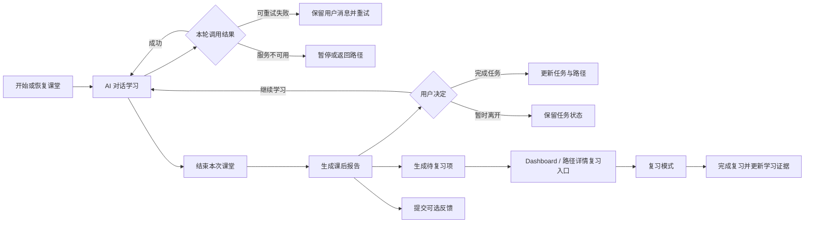
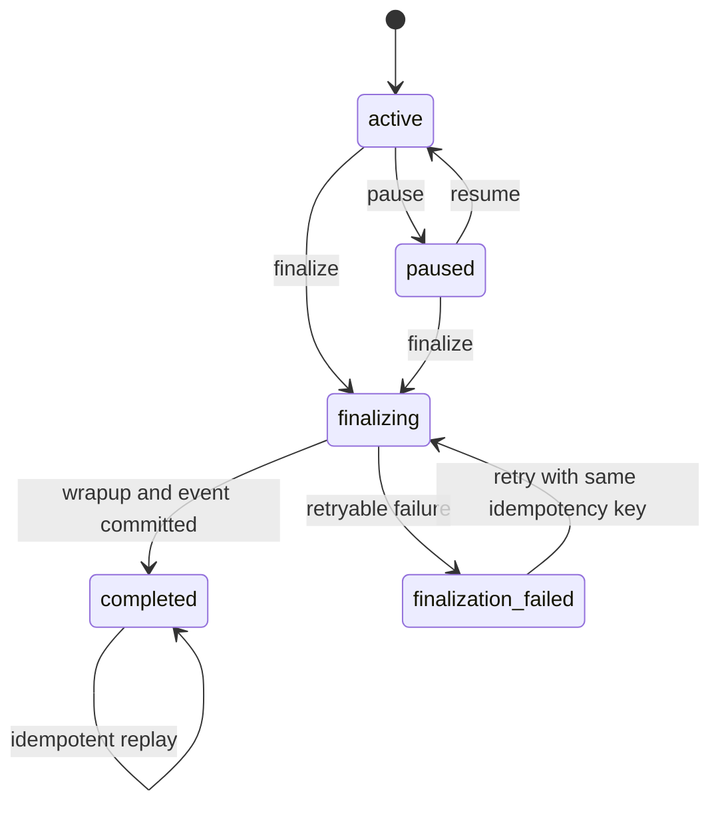
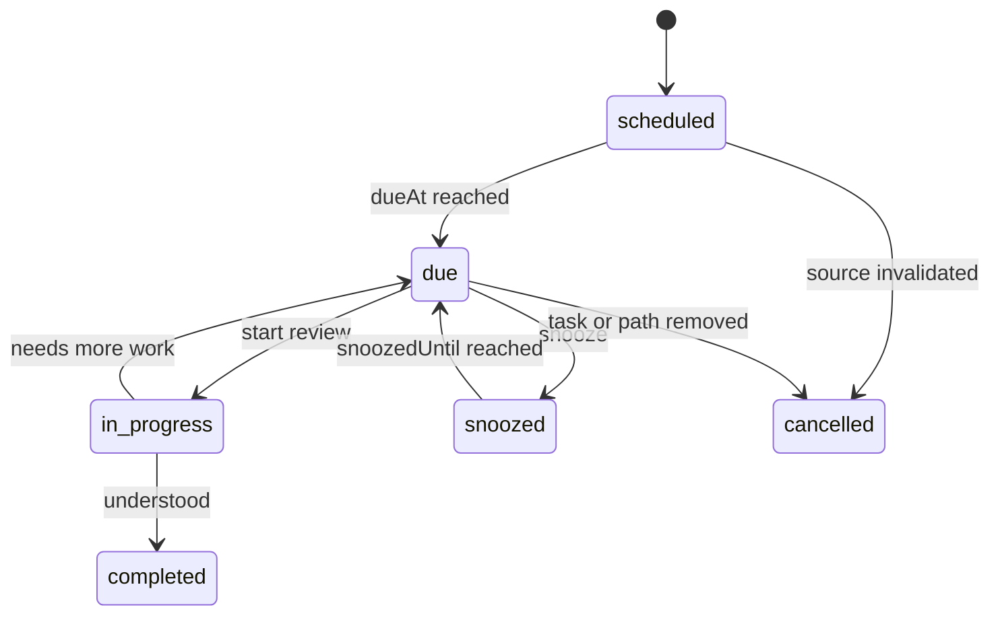

# WenFlow 可靠学习闭环 V1 产品与交互设计

> 设计日期：2026-07-19  
> 状态：可进入技术拆分  
> 适用范围：普通用户学习主链、课后反馈、复习入口、核心 AI 可用性、最小运营处置闭环

## 1. 设计判断

本方案将 WenFlow 理解为一款面向普通学习者的任务型 AI 学习产品，而不是 Agent 配置工具或数据分析看板。

设计语言延续现有蓝色、克制、可信的产品基调，不进行全站换肤。

```text
设计差异度：4 / 10
动效强度：3 / 10
信息密度：6 / 10
```

本次设计只解决一条核心问题：

```text
用户能否在 AI 状态透明、失败可恢复的前提下，
顺利结束一次学习，理解自己学到了什么，
决定是否完成任务，并知道下一次该复习什么。
```

## 2. 设计结论

V1 采用一条统一闭环：



首期关键决策如下：

1. 不新增“复习 Agent”，复习继续使用现有 `teaching-turn` 和 `session-wrapup` Skill。
2. 不自动把“结束课堂”解释为“完成任务”，两者必须保持独立语义。
3. 不让用户等待所有后台投影完成后才能看报告，报告使用 finalization 直接结果，投影异步同步。
4. 不使用弹窗承载完整课后反馈，反馈改为报告内的渐进式面板。
5. 不把一次 Provider 探测结果直接等同于全站状态，按 Goal、Path、Teaching、Wrapup 分能力展示。
6. 不在 AI 故障时隐藏已有学习内容，用户仍可查看对话、暂停课堂、返回路径和提交问题反馈。
7. 不继续扩展无运行时效果的 Agent 配置页面，本设计不涉及这些配置面的视觉优化。

## 3. 目标与非目标

### 3.1 V1 目标

| 目标 | 用户结果 | 平台结果 |
| --- | --- | --- |
| 核心 AI 状态透明 | 开始前知道是否可用，失败时知道能做什么 | 不再出现“系统 ready 但核心学习不可用” |
| AI 回合失败可恢复 | 已输入内容不会丢失或重复生成 | 每个回合具备幂等键和错误分类 |
| 课堂结束可靠 | 刷新、重试或并发操作不会重复总结 | Finalization、指标和事件具备幂等性 |
| 完成任务语义明确 | 用户清楚任务是否已完成 | Session 和 Task 状态不再被混淆 |
| 复习可执行 | 已完成任务仍可重新进入，薄弱点有入口 | 建立持久的 review item 和完成证据 |
| 反馈可提交、可处置 | 用户可低成本评价和纠错 | 低分反馈进入标准管理员工作台 |

### 3.2 V1 非目标

- 不实现完整 SuperMemo 或 SM-2 间隔重复算法。
- 不建设笔记、收藏、资料库或全局搜索。
- 不建设完整客服 CRM。
- 不解决账号找回、数据导出和注销。
- 不建设完整 RBAC，仅复用现有管理员认证边界。
- 不重做所有用户端 Header 和全局设计系统。
- 不引入流式输出。流式响应可作为后续独立项目。
- 不自动在主模型失败后使用用户未授权的其他 Provider。

## 4. 当前基线与约束

### 4.1 可复用能力

- 已有 `LearningPage.vue` 承载任务内对话、理解检查、暂停、恢复和离开保护。
- 已有 `LearningEvaluationPage.vue` 承载课后报告、对话回看、导出和路径调整。
- 已有 `CompletionCard.vue` 承载总结、知识点、指标和下一步建议。
- 已有 `teaching_sessions` 存储消息、知识状态、Wrapup、Advisory 和操作租约字段。
- 已有 `completeTask()` 的任务完成事务和幂等返回。
- 已有 Durable Outbox / Inbox 支撑 `lesson:completed` 后续投影。
- 已有 `content_feedback`、反馈 API 和未接入的反馈组件。
- 已有 Dashboard 今日建议和路径详情中的最近学习反馈入口。

### 4.2 必须先修正的约束

- `/readyz` 当前不验证真实可调用的默认模型和关键能力。
- 用户消息在 AI 成功后才整体持久化，失败时可能丢失本轮输入。
- `endSession()` 在并发和部分失败时可能重复写指标或事件。
- `evaluationSource: failed` 仍可能写入长期学习指标。
- Feedback DTO 使用 `taskId`，Prisma 字段使用 `subtaskId`。
- `content_feedback.agentId` 默认值与低分查询使用的 ID 不一致。
- 已完成任务进入 `LearningPage` 后会被立即跳回路径，无法复习。
- `CompletionCard` 的“继续练习”在已完成任务场景形成死路。

## 5. 产品原则

### 5.1 状态先于操作

任何关键按钮出现前，用户应能判断：

- 当前服务是否可用。
- 当前课堂是否已保存。
- 当前任务是否已完成。
- 当前报告是否完整或处于降级状态。
- 当前复习项是否到期。

### 5.2 失败不清空上下文

网络失败、限流、模型超时和结构化输出失败不得清空：

- 用户刚提交的消息。
- 已有课堂对话。
- 当前知识点状态。
- 用户选择的课后反馈草稿。

### 5.3 核心动作不依赖可选反馈

用户可以在不评分、不写备注的情况下：

- 结束课堂。
- 完成任务。
- 返回路径。
- 开始复习。

### 5.4 降级结果必须标明来源

当 Wrapup 使用 fallback 或 evaluation 失败时，页面必须显示用户可理解的状态，例如：

```text
课堂总结已生成，详细表现分析暂不可用。
这不会影响你保存进度或完成任务。
```

不得用低置信度保守值伪装成正常精确评估。

### 5.5 运营看到的是可处置事项

管理后台不再只显示“失败率”，而应提供：

- 哪个能力不可用。
- 从什么时候开始。
- 影响哪些用户动作。
- 最近一次成功时间。
- 可进入哪个配置、日志或反馈详情处置。

## 6. 成功指标

### 6.1 上线门槛

| 指标 | V1 门槛 |
| --- | --- |
| 核心 AI 完全不可用但状态仍显示正常 | 0 次 |
| 同一 session 并发结束产生重复 lesson event | 0 次 |
| 同一 session 重试产生重复长期指标 | 0 次 |
| AI 回合失败后用户消息丢失 | 0 次 |
| 已完成任务进入复习的死路 | 0 处 |
| 正常反馈提交因字段错配失败 | 0 次 |
| 390px 页面横向溢出 | 0 个目标页面 |

### 6.2 观察指标

- `lesson_finalize_success_rate`
- `lesson_finalize_p95_duration_ms`
- `teaching_turn_retry_success_rate`
- `evaluation_fallback_rate`
- `review_item_start_rate`
- `review_completion_rate`
- `feedback_submission_rate`
- `low_rating_feedback_resolution_time`
- 注册到首次成功 Goal 对话的转化率

## 7. 能力状态模型

### 7.1 三层健康语义

平台保留三个不同层次，不再用一个布尔值表达全部含义。

| 层次 | 入口 | 含义 |
| --- | --- | --- |
| 进程存活 | `/livez` | Node.js 进程能响应 |
| 实例就绪 | `/readyz` | 数据库、Prompt、Registry、平台默认路由配置可接受流量 |
| 产品能力 | `/api/system/capabilities` | 用户此刻能否执行 Goal、Path、Teaching、Wrapup 等动作 |

`/readyz` 不因 Provider 的瞬时故障直接变为 false，否则 AI 故障会连带阻断历史路径、课堂记录和报告的只读访问。它必须校验：

- 平台默认路由能形成结构有效的 endpoint、可解密 key 和 model 组合。
- 所有关键 Skill 都存在 ACTIVE Prompt。
- 关键路由不是空模型或不可解密密钥。
- 双数据库、字段路由和 Gateway Registry 可读。

Provider 的实时可达性、延迟和模型响应由 `/api/system/capabilities` 使用 Cached Canary 表达。发布门禁、注册门禁和新 AI 动作使用产品能力状态，而不是只读取 `/readyz`。

### 7.2 产品能力状态

```ts
type CapabilityStatus =
  | 'operational'
  | 'degraded'
  | 'unavailable'
  | 'unknown'
```

| 状态 | 含义 | 用户端行为 |
| --- | --- | --- |
| operational | 最近探测成功且配置有效 | 正常操作 |
| degraded | fallback 可用、延迟升高或部分能力失败 | 允许操作并显示轻提示 |
| unavailable | 关键调用不可执行 | 禁用对应新动作，保留已有内容和离开能力 |
| unknown | 探测过期或尚未完成 | 不阻断已有会话，开始新动作前重新检查 |

### 7.3 能力粒度

V1 至少区分：

| Capability ID | 影响动作 | 是否允许 fallback |
| --- | --- | --- |
| `goal-conversation` | 创建或继续目标澄清 | 否 |
| `path-planning` | 生成路径主结构 | 否 |
| `stage-designer` | 生成阶段任务 | 否 |
| `teaching-turn` | 课堂内发送新消息 | 否 |
| `session-wrapup` | 结束课堂并生成报告 | 是，可降级为 summary-only |
| `review-turn` | 开始 AI 复习 | 否，底层可复用 teaching-turn |

`review-turn` 是产品能力别名，不注册新的 Skill。它用于表达“当前有效路由能否支持复习”，底层仍执行 `teaching-turn`。

### 7.4 Canary 策略

- 平台配置保存后立即执行一次相关能力探测。
- 平台默认路由每 120 秒执行低成本探测。
- 连续 2 次失败后标为 `unavailable`。
- 连续 2 次成功后从 `unavailable` 恢复为 `operational`。
- 超过 5 分钟未探测标为 `unknown`。
- 单次延迟超过阈值或 fallback 生效时标为 `degraded`。
- Canary 使用固定的安全测试输入，标记 `sourceEntry=system-canary`，不计入用户活跃、学习漏斗和普通成功率。
- 用户自带 Provider 不执行后台定时 Canary，避免在用户不知情时消耗额度。其状态只在用户保存并主动测试、或真实调用时更新。
- 用户端响应不暴露 Provider、模型名称、Key、内部 Prompt 或原始错误。

### 7.5 请求上下文中的有效状态

`/api/system/capabilities` 必须按当前用户的实际路由计算，不能把平台 Provider 的状态直接套用给所有用户。

```text
未启用用户路由
  -> 关键 Prompt / Registry 状态
  + 平台默认路由 Cached Canary

启用用户路由
  -> 关键 Prompt / Registry 状态
  + 用户路由结构校验
  + 最近一次主动测试或真实调用结果
```

响应增加来源：

```ts
type CapabilityHealthSource =
  | 'platform-canary'
  | 'user-explicit-test'
  | 'user-recent-call'
  | 'configuration-only'
```

用户路由从未测试且没有真实调用记录时返回 `unknown`，在开始新 AI 动作前触发一次显式检查。系统不得在用户 Provider 失败后静默改用平台凭证。

### 7.6 注册门禁

管理员保存的是人工意图：

```ts
registrationEnabledByAdmin: boolean
```

用户实际看到的是有效状态：

```ts
effectiveRegistrationEnabled =
  registrationEnabledByAdmin && onboardingCapabilitiesAvailable
```

AI 故障时不修改管理员原设置，只临时阻断注册，并显示：

```text
新账号注册暂时不可用
核心学习服务正在恢复，请稍后再试。
```

`registrationEnabledByAdmin` 必须迁移到 System DB 的平台设置，不再以本地 JSON 作为多实例事实源。设置读取失败时注册接口返回 503，不再默认开放注册。

## 8. 教学回合状态与错误设计

### 8.1 回合状态

```ts
type TeachingTurnStatus =
  | 'draft'
  | 'persisted'
  | 'processing'
  | 'completed'
  | 'failed_retryable'
  | 'failed_terminal'
```

发送消息时先持久化用户输入，再调用模型：

```text
用户点击发送
  -> 生成 clientTurnId
  -> 持久化用户消息与 processing 状态
  -> 调用 teaching-turn
  -> 成功后写 AI 消息并标记 completed
  -> 失败后保留用户消息并写失败分类
```

### 8.2 统一错误分类

```ts
type AiErrorCode =
  | 'CONFIG_MISSING'
  | 'PROMPT_MISSING'
  | 'AUTH_INVALID'
  | 'QUOTA_EXHAUSTED'
  | 'RATE_LIMITED'
  | 'UPSTREAM_TIMEOUT'
  | 'UPSTREAM_UNAVAILABLE'
  | 'OUTPUT_INVALID'
  | 'INTERNAL_ERROR'
```

### 8.3 前端映射

| 错误 | 用户文案 | 操作 |
| --- | --- | --- |
| RATE_LIMITED | 请求较多，请稍候再试 | 倒计时后重试 |
| UPSTREAM_TIMEOUT | AI 本次响应超时，你的问题已保存 | 重试本轮 / 稍后继续 |
| UPSTREAM_UNAVAILABLE | AI 学习服务暂时不可用 | 重试连接 / 暂停并返回 |
| OUTPUT_INVALID | 回复整理失败，你的问题已保存 | 重新生成 |
| CONFIG_MISSING / AUTH_INVALID / QUOTA_EXHAUSTED | 当前学习服务暂不可用 | 返回路径；普通用户不显示技术细节 |
| INTERNAL_ERROR | 本轮处理失败，你的问题已保存 | 重试；展示 trace ID 的短码 |

### 8.4 LearningPage 状态设计

正常状态不增加任何提示。

降级状态在消息区顶部显示一条非阻断 Notice：

```text
AI 响应可能比平时更慢
你的课堂记录会持续保存，失败后可以直接重试。
```

不可用状态保留完整对话，但禁用 Composer：

```text
AI 学习服务暂时不可用
本次课堂和已输入内容都已保存。你可以重试连接，或先暂停并返回学习路径。

[重试连接] [暂停并返回]
```

单轮失败附着在对应用户消息下方，不使用只出现数秒的 Toast：

```text
发送失败，你的问题已保存
[重试本轮]
```

超过 12 秒仍在处理时，Loading 文案变为：

```text
这次回复需要更久，请勿重复发送。失败后可以直接重试。
```

## 9. 课堂结束与任务完成

### 9.1 语义定义

| 动作 | Session | Task | 用户结果 |
| --- | --- | --- | --- |
| 暂停并离开 | paused | 不变 | 下次恢复同一课堂 |
| 结束本次课堂 | completed | 不变 | 生成报告，可继续同一任务 |
| 完成任务 | completed | completed | 推进路径，仍可复习 |
| 完成复习 | completed，mode=review | 不变 | 更新 review item 和学习证据 |

### 9.2 结束确认

课堂内完成候选提示改为：

```text
本节目标已基本覆盖
结束后会生成学习反馈，任务不会自动完成。你可以看完反馈后再决定。

[继续学习] [结束课堂并查看反馈]
```

菜单中的“结束本次学习”使用同一确认语义：

```text
结束本次课堂？
课堂对话会保存并生成学习反馈，当前任务仍会保留为进行中。

[取消] [结束并查看反馈]
```

### 9.3 Finalization 状态机



约束：

- `active/paused -> finalizing` 必须通过原子 claim 完成。
- 同一 `sessionId + idempotencyKey` 只允许一个 Finalization。
- `lesson:completed` 使用确定性事件 ID，例如 `lesson:completed:{sessionId}`。
- 长期指标按 `sessionId` 去重。
- `evaluationSource === 'failed'` 时不写长期指标。
- `completeWithEvent()` 必须合并原有 `teachingState`，不能覆盖课堂历史。
- 完成任务失败时，已生成的 Wrapup 不重跑，只重试任务完成步骤。

### 9.4 统一 Finalize 操作

同一接口支持三个动作：

```ts
type FinalizeAction =
  | 'end_only'
  | 'complete_task'
  | 'complete_review'
```

- `end_only`：课堂页结束时调用。
- `complete_task`：报告页点击完成任务时调用，复用已保存 Wrapup。
- `complete_review`：复习报告页调用，更新 review item，不修改 task 状态。

同一 session 可以先执行 `end_only`，之后再执行 `complete_task`。这不是重复结束，而是两个可独立重试的步骤：

```text
sessionClosure     每个 session 最多成功一次
taskCompletion     每个 tutor session 最多成功一次
reviewCompletion   每个 review session 最多成功一次
```

`operationId` 只表示当前正在执行的操作租约，不作为 session 的永久唯一 Finalization ID。前一个操作完成并释放租约后，可以使用新的 operationId 执行后续步骤。

## 10. 课后报告信息架构

### 10.1 页面目标

课后报告首先回答三个问题：

1. 我这次学到了什么？
2. 我现在应该做什么？
3. 哪些内容需要复习？

长期指标、对话全文和导出属于次级信息，不应抢占首屏。

### 10.2 桌面线框

```text
┌──────────────────────────────────────────────────────────────────────┐
│ 返回路径                  学习反馈已生成                 更多 / 导出 │
├──────────────────────────────────────────────────────────────────────┤
│ 当前任务学习反馈                                                   │
│ 主题名称 · 24 分钟 · 3/4 个知识点掌握                              │
│ [完整评估] 或 [总结已生成，详细分析暂不可用]                        │
├───────────────────────────────────┬──────────────────────────────────┤
│ 下一步                            │ 需要回看                         │
│ 已覆盖主要目标                    │ 2 个知识点 · 约 8 分钟           │
│ [完成任务] [继续学习]             │ [开始复习]                       │
├───────────────────────────────────┴──────────────────────────────────┤
│ 本次收获                                                           │
│ 主题总结 + 新掌握 + 仍在学习                                       │
├──────────────────────────────────────────────────────────────────────┤
│ 建议回看                                                           │
│ 01 概念 A  因为课堂中仍有困惑                      [复习这个知识点] │
│ 02 概念 B  理解检查未通过                          [复习这个知识点] │
├──────────────────────────────────────────────────────────────────────┤
│ 你的感受                                                           │
│ 这次学习有帮助吗？ ☆ ☆ ☆ ☆ ☆                                     │
│ 难度感受 [偏简单] [合适] [偏难]                                    │
│ 低分时展开原因和可选备注                               [提交反馈] │
├──────────────────────────────────────────────────────────────────────┤
│ [展开详细表现] [展开知识点证据] [回看当堂对话]                      │
└──────────────────────────────────────────────────────────────────────┘
```

### 10.3 移动端线框

```text
┌──────────────────────────┐
│ ← 学习反馈          ···  │
├──────────────────────────┤
│ 主题名称                 │
│ 24 分钟 · 3/4 已掌握     │
│ [完整评估]               │
├──────────────────────────┤
│ 下一步                   │
│ 已覆盖主要目标           │
│ [继续学习]               │
├──────────────────────────┤
│ 需要回看 2 个知识点      │
│ [开始复习]               │
├──────────────────────────┤
│ 本次收获                 │
├──────────────────────────┤
│ 建议回看列表             │
├──────────────────────────┤
│ 你的感受                 │
├──────────────────────────┤
│ 折叠的详细内容           │
├──────────────────────────┤
│ [完成任务]               │  固定底部，保留 safe-area
└──────────────────────────┘
```

移动端底部只固定当前唯一主动作。返回路径、导出和其他操作放入顶部更多菜单，避免三按钮拥挤。

### 10.4 页面状态

| 状态 | 页面表现 | 是否允许完成任务 |
| --- | --- | --- |
| finalizing | 骨架与“正在整理反馈”步骤 | 否，保留返回路径 |
| complete | 展示完整报告 | 是 |
| summary-only | 显示总结和降级 Notice，隐藏精确指标 | 是 |
| finalization_failed | 显示已保存课堂记录和重试 | 否，重试完成后恢复 |
| projection_pending | 报告可用，长期状态旁显示“正在同步” | 是 |
| task_completed | 主动作改为返回路径或开始复习 | 不重复显示完成任务 |

### 10.5 CompletionCard 重构边界

`CompletionCard.vue` 保留数据解释职责，但重排为：

1. `ReportHero`：主题、用时、掌握概览、报告完整度。
2. `NextActionPanel`：完成任务、继续学习、开始复习。
3. `LearningSummary`：主题总结和关键收获。
4. `ReviewItemList`：需要回看的概念。
5. `SessionFeedbackPanel`：用户主观反馈。
6. `ReportDetails`：指标、知识证据、对话和路径调整，默认折叠。

不再使用整张绿色完成卡。成功色只用于状态 Chip 和小范围反馈，页面主体使用中性表面与蓝色主动作。

## 11. 用户反馈设计

### 11.1 交互原则

- 反馈可选，不阻断完成任务。
- 默认只显示两个低成本问题。
- 只有低分或难度不合适时展开原因和备注。
- 同一 session 重复提交采用 upsert，允许用户修改。
- 提交后原地显示已保存，不关闭报告、不跳转页面。

### 11.2 默认状态

```text
你的感受

这次学习对你有帮助吗？
[1] [2] [3] [4] [5]

难度感受
[偏简单] [合适] [偏难]

[提交反馈]
```

### 11.3 渐进展开

当 rating <= 3 或难度不是“合适”时显示：

```text
主要问题，可多选
[内容不准确] [解释不清] [节奏不合适]
[难度不合适] [理解检查有问题] [其他]

补充说明，可选
[                                                     ]
```

### 11.4 数据映射

| UI | API 字段 |
| --- | --- |
| 1-5 评分 | `rating` |
| 偏简单 / 合适 / 偏难 | `difficultyFit: too_easy / appropriate / too_hard` |
| 原因 Chip | `reasonCodes[]` |
| 补充说明 | `comment` |
| 当前教学策略 | `strategy`，由服务端从 session 获取，不信任客户端 |
| UI 类型 | 固定 `session-report-v1` |

当用户随后完成任务时，前端可以把 `difficultyFit` 映射为现有 1-10 量表的 `subjectiveDifficulty`：偏简单为 2、合适为 5、偏难为 8。反馈接口本身不再把“难度是否合适”和“1-10 主观难度”混成同一个字段。

### 11.5 反馈状态

```ts
type FeedbackSubmitState =
  | 'idle'
  | 'dirty'
  | 'submitting'
  | 'submitted'
  | 'failed'
```

提交失败时保留所有输入，并显示行内“提交失败，重试”。

## 12. 复习闭环设计

### 12.1 Review Item 定义

Review Item 是一个“需要再次学习的概念”，不是新的路径任务，也不是 Agent。

每个 Review Item 必须回答：

- 复习什么。
- 为什么需要复习。
- 来源于哪次课堂和哪个任务。
- 什么时候建议复习。
- 当前是否已完成。

### 12.2 V1 生成规则

V1 使用确定性规则，不增加新的 LLM 调用。

| 证据 | dueAt | 优先级 | 原因 |
| --- | --- | --- | --- |
| `stillLearning` | 立即 | high | 本节仍未稳定掌握 |
| `movedToReview` | 次日 | normal | 需要再次回看 |
| `topConfusionPoints` 且重复出现 | 次日 | high | 多轮对话仍存在困惑 |
| Checkpoint 最终未通过 | 立即 | high | 理解检查未通过 |

`newlyMastered` 的保持性复习延后到间隔重复版本，不在 V1 自动创建，避免队列快速膨胀。

### 12.3 去重规则

```text
reviewKey = userId + taskId + normalizedConceptKey
```

- 同一概念存在 open item 时更新证据和更早的 dueAt，不新增重复行。
- 已完成 item 出现新的薄弱证据时重新标为 due，并增加 `cycle`。
- 复习完成但结果为 `needs_more_work` 时次日再次到期。

### 12.4 Review Item 状态



### 12.5 Dashboard 入口

当存在 due item 时，在 Hero 与日历之间增加一段无多余装饰的分隔列表：

```text
今天需要回看                         3 项 · 约 15 分钟

理解闭包的捕获规则       来自：JavaScript 基础       [开始复习]
区分进程与线程           来自：操作系统入门           [开始复习]
HTTP 缓存协商            来自：Web 性能               [开始复习]

[查看全部复习]
```

Dashboard 今日建议排序调整为：

1. 已到期高优先级复习。
2. 进行中的当前任务。
3. 可开始的新任务。
4. 创建新目标。

### 12.6 路径详情入口

已完成任务不再显示禁用主按钮。

| 场景 | 主按钮 | 次按钮 |
| --- | --- | --- |
| 有到期 Review Item | `复习 2 个知识点` | `查看学习反馈` |
| 无到期项但有 Wrapup | `复习本任务` | `查看学习反馈` |
| 无 Wrapup | `复习本任务` | 无 |

进行中任务仍显示“继续学习”，最近一次报告作为次按钮。

### 12.7 复习模式

复用 `LearningPage.vue`，通过路由 meta 和 session mode 区分：

```text
/review/task/:taskId
```

复习模式变化：

- Header Pill 从“当前任务”改为“知识复习”。
- 只加载选中的 Review Item 或该任务当前到期概念。
- 已完成 task 允许进入，不触发原有完成任务跳转。
- Opening 直接说明复习目标，不重新讲完整任务背景。
- Checkpoint 优先验证薄弱概念。
- 结束动作改为“完成本次复习”。
- 报告主动作改为“完成复习并返回”。
- 不修改原任务完成状态，不重复发放任务完成 XP。

### 12.8 全部复习页

新增轻量路由：

```text
/reviews
```

页面只包含：

- 今日到期。
- 即将到期。
- 已完成的最近复习。
- 按路径筛选。
- `稍后一天` 操作。

不在 V1 顶部主导航增加新栏目，入口来自 Dashboard、路径详情和课后报告。

## 13. 管理端设计

### 13.1 平台总览中的产品可用性

`/admin/dashboard` 顶部首要内容改为“核心学习可用性”，不再只由历史调用成功率推断健康。

```text
核心学习可用性                                      [刷新探测]

目标澄清      正常      62 ms      最近成功 1 分钟前
路径规划      正常      1.8 s      最近成功 2 分钟前
AI 授课       不可用    timeout    最近成功 18 分钟前   [排查]
课后总结      降级      fallback   最近成功 4 分钟前    [查看]

影响：用户暂时无法发送新的课堂消息，已有课堂和报告仍可查看。
```

状态行提供明确跳转：

- 连接与安全。
- 对应 Skill 配置。
- 最近失败执行日志。
- Prompt 调用日志。

“0 调用”显示为“无数据”，不得显示 100% 健康。

### 13.2 注册有效状态

总览显示两行：

```text
管理员设置：允许注册
当前有效状态：临时暂停，目标澄清能力不可用
```

避免运营误以为配置被系统擅自修改。

### 13.3 反馈工作台

新增标准管理路由：

```text
/admin/feedback
```

侧栏放在“学习”分组，名称为“用户反馈”。

列表默认展示待处理低分反馈：

| 字段 | 说明 |
| --- | --- |
| 状态 | new / triaged / resolved / dismissed |
| 评分 | 1-5 |
| 原因 | reasonCodes 中文标签 |
| 用户 | 姓名、账号标识 |
| 任务 | 任务标题、路径标题 |
| 能力 | teaching-turn / session-wrapup |
| 提交时间 | 相对时间与完整时间 |
| 负责人 | 当前管理员或未分派 |

详情抽屉显示：

- 用户反馈正文。
- 本次报告完整度和 evaluation source。
- 相关 session、task、path。
- 最近 8 条用户与 AI 对话摘要。
- Trace ID 和执行日志入口。
- 内部备注。

处置动作：

- 分派给我。
- 标记已处理。
- 标记无需处理。
- 跳转日志。

V1 不在后台直接联系用户，也不做批量工单操作。

### 13.4 健康与反馈待办

平台总览“待处理事项”增加：

- 核心能力 unavailable 超过 5 分钟。
- Canary 超过 5 分钟未更新。
- Finalization failed 数量大于 0。
- Outbox dead event 数量大于 0。
- 未处理 1-2 星反馈。
- 24 小时内 feedback rating 明显下降。

## 14. 视觉与组件规范

### 14.1 色彩

延续现有语义色，不引入新的品牌色：

| 用途 | Token |
| --- | --- |
| 主动作 | `--color-primary` |
| 成功 | `--color-success` |
| 警告 / 降级 | `--color-warning` |
| 错误 / 不可用 | `--color-danger` |
| 页面背景 | `--bg-body` |
| 表面 | `--bg-surface` |
| 主文本 | `--text-primary` |
| 次文本 | `--text-secondary` |

触及的学习页面必须从硬编码白色和固定亮色迁移到语义 token，补齐暗色模式。

### 14.2 形状规则

- 页面级 Card：16px。
- 内部信息块：12px。
- 输入框：10-12px，遵循 Element Plus 当前主题。
- 用户端按钮：继续沿用现有 Pill 体系。
- 状态 Chip：Pill。
- 不再混用 8px、12px、16px、24px 和 34px 作为同一层级 Card。

### 14.3 阴影与层级

- 普通报告区块使用边框和留白，不给每个小块加阴影。
- 只有页面 Header、主行动面板和移动端 Action Dock 使用轻阴影。
- 错误和降级使用左边框或状态条，不使用大面积红色背景。

### 14.4 排版

V1 不新增字体依赖，继续使用现有中文系统字体栈。

- 页面标题：24-30px。
- 模块标题：16-18px。
- 正文：14-16px，行高不低于 1.6。
- 辅助信息：12-13px。
- 指标缩写 KTL、LSS、LF、LSB 默认放入“详细表现”，并同时提供中文解释。

### 14.5 动效

- 状态切换只使用 160-220ms 的 opacity 和 translate。
- Finalization 步骤可以逐项点亮，但不得伪造具体模型处理阶段。
- 禁止无限 Shimmer 和持续旋转装饰。
- `prefers-reduced-motion: reduce` 下取消位移动效。

## 15. 响应式与可访问性

### 15.1 断点

- `> 1100px`：报告的下一步和复习摘要双列。
- `768-1100px`：单列，操作按钮保持行内。
- `< 768px`：所有报告区块单列。
- `< 640px`：启用底部主动作 Dock。

### 15.2 键盘与语义

- Quick Reply 必须使用 `<button>`，不能继续使用只有 `@click` 的 `div`。
- Checkpoint 原生 input 不能 `display: none`；使用 visually-hidden，保留焦点和读屏。
- 评分使用 `radiogroup` 和带文本的 radio，不只显示星形图标。
- Notice 使用 `role="status"`，错误使用 `role="alert"`。
- Finalization 更新使用 `aria-live="polite"`。
- Drawer 和 Dialog 打开时正确管理焦点，关闭后恢复触发点。

### 15.3 对比度

- 正文和辅助文本达到 WCAG AA。
- Warning 不使用浅黄字配白底。
- Ghost Button 必须有可见边框或足够文本对比。
- 暗色模式下状态背景与文字分别验收。

## 16. API 契约

### 16.1 用户安全的能力状态

```http
GET /api/system/capabilities?scope=learning
```

```json
{
  "success": true,
  "data": {
    "overall": "degraded",
    "checkedAt": "2026-07-19T10:00:00.000Z",
    "stale": false,
    "capabilities": [
      {
        "id": "teaching-turn",
        "status": "unavailable",
        "retryable": true,
        "retryAfterSeconds": 30,
        "message": "AI 学习服务暂时不可用"
      },
      {
        "id": "session-wrapup",
        "status": "degraded",
        "retryable": true,
        "message": "课堂总结可用，详细表现分析可能延迟"
      }
    ]
  }
}
```

用户接口不返回 Provider、模型和内部错误正文。

当当前用户启用自带 Provider 时，响应中的状态使用该用户最近一次主动测试或真实调用结果；平台 Canary 只用于平台默认路由和新用户注册门禁。

### 16.2 管理员能力状态

```http
GET /api/admin/system/capabilities
POST /api/admin/system/capabilities/:capabilityId/probe
```

管理员响应额外包含：

- route source。
- provider fingerprint。
- model。
- latency。
- failureCode。
- lastSuccessAt。
- consecutiveFailures。
- 相关日志查询条件。

### 16.3 发送教学消息

```http
POST /api/ai-teaching/sessions/:sessionId/messages
Idempotency-Key: turn_01J...
```

```json
{
  "message": "我还是不理解闭包为什么能记住变量",
  "clientTurnId": "turn_01J..."
}
```

失败响应统一为：

```json
{
  "success": false,
  "error": {
    "code": "UPSTREAM_TIMEOUT",
    "message": "AI 本次响应超时，你的问题已保存",
    "retryable": true,
    "traceId": "tr_8f2a1c"
  }
}
```

相同 `clientTurnId` 重试不得生成第二条用户消息或第二个 AI 回合。

### 16.4 Finalize Session

```http
POST /api/ai-teaching/sessions/:sessionId/finalize
Idempotency-Key: finalize_01J...
```

```json
{
  "action": "end_only",
  "actualMinutes": 24,
  "subjectiveDifficulty": 5
}
```

用户在报告页点击“完成任务”时再次调用同一接口，但只执行尚未完成的任务步骤：

```json
{
  "action": "complete_task",
  "actualMinutes": 24,
  "subjectiveDifficulty": 8
}
```

完成响应：

```json
{
  "success": true,
  "data": {
    "operationId": "finalize_01J...",
    "status": "completed",
    "session": {
      "id": "session-id",
      "status": "completed",
      "mode": "tutor"
    },
    "taskCompletion": {
      "status": "skipped",
      "alreadyCompleted": false
    },
    "wrapup": {},
    "advisory": {},
    "reviewItems": [],
    "projectionStatus": "pending"
  }
}
```

已有操作仍在执行时返回：

```http
HTTP 202
```

```json
{
  "success": true,
  "data": {
    "operationId": "finalize_01J...",
    "status": "processing",
    "pollAfterMs": 1500
  }
}
```

查询操作：

```http
GET /api/ai-teaching/sessions/:sessionId/finalization
```

### 16.5 Review API

```http
GET /api/reviews/summary
GET /api/reviews?status=due&pathId=...
POST /api/reviews/:reviewItemId/snooze
POST /api/reviews/start
```

开始复习：

```json
{
  "taskId": "task-id",
  "reviewItemIds": ["review-id-1", "review-id-2"]
}
```

响应：

```json
{
  "success": true,
  "data": {
    "sessionId": "review-session-id",
    "mode": "review",
    "taskId": "task-id",
    "reviewItems": [
      {
        "id": "review-id-1",
        "conceptName": "闭包捕获",
        "reason": "still_learning"
      }
    ]
  }
}
```

复习完成通过 Finalize API 的 `complete_review` action 处理。

### 16.6 Feedback API

```http
PUT /api/feedback/sessions/:sessionId
```

```json
{
  "taskId": "task-id",
  "rating": 2,
  "difficultyFit": "too_hard",
  "reasonCodes": ["UNCLEAR_EXPLANATION", "TOO_DIFFICULT"],
  "comment": "第二个例子跳得太快"
}
```

服务端必须：

- 验证 session 属于当前用户。
- 验证 taskId 与 session.taskId 一致。
- 显式映射 `taskId -> subtaskId`。
- 从 session 和日志补充 agentId、strategy、uiType。
- 使用 `feedbackKey = userId + sessionId` upsert。

### 16.7 Admin Feedback API

```http
GET /api/admin/feedback
GET /api/admin/feedback/:feedbackId
PATCH /api/admin/feedback/:feedbackId
```

PATCH 支持：

```json
{
  "status": "resolved",
  "assigneeAdminId": "admin-id",
  "internalNote": "已定位为某版本 Prompt 输出问题"
}
```

所有管理员反馈接口必须进入标准 `adminRouteMiddleware`，不再挂在普通用户认证域。

## 17. 数据模型

### 17.1 System DB: Platform Settings

```prisma
model platform_settings {
  key       String   @id
  value     String
  createdAt DateTime @default(now())
  updatedAt DateTime @updatedAt
}
```

V1 至少迁移 `registrationEnabledByAdmin`。读取失败时不得回退为 true。

### 17.2 System DB: Platform AI Capability Health

```prisma
model platform_ai_capability_health {
  capabilityId       String   @id
  status             String
  checkedAt          DateTime
  lastSuccessAt      DateTime?
  latencyMs          Int?
  failureCode        String?
  failureSummary     String?
  routeFingerprint   String?
  model              String?
  consecutiveFailures Int     @default(0)
  consecutiveSuccesses Int    @default(0)
  createdAt          DateTime @default(now())
  updatedAt          DateTime @updatedAt

  @@index([status, checkedAt])
}
```

`failureSummary` 只能保存脱敏摘要，禁止保存 API Key 或完整上游响应。

### 17.3 Main DB: User AI Route Health

```prisma
model user_ai_route_health {
  id               String   @id
  routeHealthKey   String   @unique
  userId           String
  routeFingerprint String
  status           String
  source           String
  checkedAt        DateTime
  lastSuccessAt    DateTime?
  failureCode      String?
  latencyMs        Int?
  capabilityIds    String?
  createdAt        DateTime @default(now())
  updatedAt        DateTime @updatedAt
  users            users    @relation(fields: [userId], references: [id], onDelete: Cascade)

  @@index([userId, checkedAt])
  @@index([status, checkedAt])
}
```

`routeFingerprint` 由配置记录 ID、更新时间、endpoint、model 和 tier 生成，不包含明文或可逆 API Key。记录只由用户主动连接测试和真实调用更新，不由后台定时任务调用用户 Provider。

### 17.4 Main DB: Review Item

```prisma
model review_items {
  id               String   @id
  reviewKey        String   @unique
  userId           String
  pathId           String?
  milestoneId      String?
  taskId           String
  sourceSessionId  String?
  conceptKey       String
  conceptName      String
  reason           String
  status           String   @default("scheduled")
  priority         String   @default("normal")
  dueAt            DateTime
  snoozedUntil     DateTime?
  cycle            Int      @default(1)
  reviewCount      Int      @default(0)
  lastEvidenceAt   DateTime
  lastReviewedAt   DateTime?
  lastResult       String?
  evidence         String?
  createdAt        DateTime @default(now())
  updatedAt        DateTime @updatedAt
  users            users    @relation(fields: [userId], references: [id], onDelete: Cascade)

  @@index([userId, status, dueAt])
  @@index([taskId, status])
  @@index([sourceSessionId])
}
```

### 17.5 Main DB: Review Attempt

```prisma
model review_attempts {
  id                String   @id
  reviewItemId      String
  userId            String
  teachingSessionId String
  result            String
  confidence        Float?
  evidence          String?
  completedAt       DateTime @default(now())
  createdAt         DateTime @default(now())
  reviewItem        review_items @relation(fields: [reviewItemId], references: [id], onDelete: Cascade)
  users             users    @relation(fields: [userId], references: [id], onDelete: Cascade)

  @@unique([reviewItemId, teachingSessionId])
  @@index([userId, completedAt])
  @@index([teachingSessionId])
}
```

### 17.6 Main DB: Content Feedback 调整

保留数据库字段 `subtaskId`，避免无必要迁移命名，但修正服务契约。

建议增加：

```prisma
feedbackKey     String?   @unique
reasonCodes     String?
difficultyFit   String?
status          String    @default("new")
assigneeAdminId String?
internalNote    String?
resolvedAt      DateTime?
```

同时：

- `agentId` 默认值改为 canonical `teaching-agent`。
- `@@index([status, createdAt])`。
- `@@index([rating, createdAt])`。
- 已有历史 `ai-teaching-agent` 数据在迁移中归一化。
- 现有数值 `difficulty` 暂时保留用于旧客户端兼容，新报告使用 `difficultyFit`。
- `updatedAt` 改为 `@updatedAt`，不再依赖每个调用方手动赋值。

### 17.7 Teaching Session 调整

复用现有字段：

- `mode`：支持 `tutor | review`。
- `operationId`：保存当前正在执行的操作租约键，完成后释放或允许被后续操作替换。
- `operationKind`：保存当前 `finalize:end_only | finalize:complete_task | finalize:complete_review`。
- `operationLeaseExpiresAt`：处理并发和崩溃恢复。

`teachingState` 中增加稳定子结构：

```ts
type FinalizationStepStatus =
  | 'not_started'
  | 'processing'
  | 'completed'
  | 'failed'
  | 'skipped'

interface SessionFinalizationState {
  sessionClosure: FinalizationStepStatus
  taskCompletion: FinalizationStepStatus
  reviewCompletion: FinalizationStepStatus
  lastAction: 'end_only' | 'complete_task' | 'complete_review'
  lastOperationId: string
  lastRequestedAt: string
  lastCompletedAt?: string
  lastErrorCode?: string
}
```

## 18. 后端编排

### 18.1 Finalization Saga

```text
1. 验证 session ownership 和 action 是否适用于当前 mode
2. 用 operationId 对当前 action 原子 claim session
3. action 需要 sessionClosure 且该步骤未完成时，执行 session-wrapup
4. evaluationSource=failed 时跳过长期指标提交
5. 生成或更新 review_items
6. 合并 teachingState 并完成 session
7. 事务内写确定性 lesson:completed event
8. action=complete_task 且 taskCompletion 未完成时调用 completeTask()
9. action=complete_review 且 reviewCompletion 未完成时写 review_attempts 并更新 review_items
10. 保存各步骤状态并释放当前 operation lease
11. 返回 wrapup、task 状态、review items 和 projectionStatus
```

任务或复习完成步骤失败时：

- Session 仍保持 completed。
- Finalization 标记部分失败。
- 重试只执行失败步骤，不重新调用 Wrapup Skill。

### 18.2 Review Item 生成位置

Review Item 在 Finalization 编排内、Session 完成事务前计算，并在同一事务中 upsert。

这样可以保证：

- 报告响应立即拿到 Review Item。
- Dashboard 不依赖异步 learner projection 才能出现复习入口。
- 重试通过 reviewKey 保持幂等。

### 18.3 Durable Event

保留 `lesson:completed`，并新增：

```text
review:completed
feedback:submitted
```

`review:completed` 进入现有 learner evidence / snapshot 链。

`feedback:submitted` 首期只用于运营统计和提醒，不自动修改 Prompt 或模型配置。

## 19. 埋点设计

### 19.1 用户端事件

| 事件 | 关键属性 |
| --- | --- |
| `capability_notice_viewed` | capabilityId, status, page |
| `teaching_turn_submitted` | sessionId, clientTurnId |
| `teaching_turn_failed` | errorCode, retryable, latencyBucket |
| `teaching_turn_retried` | errorCode, retryCount |
| `session_finalize_started` | action, sessionMode |
| `session_finalize_completed` | action, durationBucket, evaluationSource |
| `session_finalize_failed` | failedStep, errorCode |
| `review_item_viewed` | reason, overdueDays |
| `review_started` | itemCount, sourcePage |
| `review_completed` | result, durationBucket |
| `feedback_submitted` | rating, reasonCodes, difficultyBucket |

### 19.2 管理端事件

| 事件 | 关键属性 |
| --- | --- |
| `capability_probe_triggered` | capabilityId, source |
| `feedback_assigned` | feedbackId, adminId |
| `feedback_resolved` | feedbackId, resolutionTimeBucket |
| `feedback_dismissed` | feedbackId |

### 19.3 隐私约束

- 埋点不发送完整用户消息和完整反馈正文。
- Trace ID 可以记录，但不得包含 JWT 或 API Key。
- Provider 错误正文只进入受控日志并脱敏。

## 20. 验收标准

### 20.1 AI 可用性

- 默认模型不可调用时，`/api/system/capabilities` 不返回 operational。
- Provider 瞬时不可用时 `/readyz` 仍可保持 ready，以便继续服务历史内容和降级页面。
- 注册页使用 effective registration status。
- Admin 可以看到失败能力、最近成功时间、错误分类和排查入口。
- 普通用户看不到 Provider、模型、Key 和内部堆栈。
- 启用用户 Provider 时，普通用户状态不错误继承平台 Provider 的 operational 结论。

### 20.2 教学回合

- 用户消息在模型调用前持久化。
- 同一 `clientTurnId` 重试不产生重复消息。
- 超时、限流和 Provider 不可用分别显示正确文案。
- 刷新页面后失败消息和重试入口仍存在。

### 20.3 Finalization

- 两个并发 finalize 请求只生成一个 Wrapup、一个指标提交和一个 lesson event。
- 第一次请求超时后重试可返回已完成结果。
- `evaluationSource=failed` 时报告显示降级，长期指标不更新。
- Task completion 失败后重试不重新生成 Wrapup。
- Projection 尚未完成时报告仍可展示，并显示同步状态。

### 20.4 复习

- 已完成任务可以进入复习模式。
- Review Item 重复证据不会产生重复 open item。
- 完成复习不改变原任务 completed 状态。
- `needs_more_work` 会重新到期。
- Dashboard、路径详情和报告中的数量一致。

### 20.5 反馈

- 正常反馈提交不会因 `taskId/subtaskId` 失败。
- 用户不能给其他用户的 session 提交反馈。
- 同一 session 再次提交会更新原反馈。
- `difficultyFit` 与任务 `subjectiveDifficulty` 的量表映射正确。
- 1-2 星反馈出现在 `/admin/feedback` 待处理队列。
- 管理员操作写入状态、负责人和内部备注。

### 20.6 前端质量

- 桌面 1440px、平板 768px、移动 390px 均无横向溢出。
- 目标页面亮色和暗色模式均通过对比度检查。
- 所有核心动作可用键盘完成。
- `prefers-reduced-motion` 下没有非必要动画。
- Report 主动作在移动端不换行、不被安全区遮挡。

## 21. 测试矩阵

### 21.1 后端单元与集成测试

- Readiness 缺少平台配置。
- Readiness 缺少任一关键 Prompt。
- Provider 故障不会让只读历史页面因 `/readyz` 被摘流量。
- Canary 连续失败和恢复的迟滞逻辑。
- 用户 Provider 不会被后台 Canary 消耗额度。
- 用户路由状态按主动测试或真实调用更新，不继承错误的平台状态。
- 用户 Provider 与用户模型覆盖的正确继承。
- 回合消息先持久化、后调用 AI。
- `clientTurnId` 幂等。
- 两个并发 Finalization。
- Finalization 部分失败后恢复。
- `evaluationSource=failed` 跳过长期指标。
- Review Item upsert、reopen、snooze、complete。
- Feedback ownership、upsert、分页和 Admin Auth。

### 21.2 前端组件测试

- ServiceStatusNotice 四种状态。
- 失败消息重试不重复插入。
- Evaluation summary-only 状态。
- Task completed 后动作切换。
- SessionFeedbackPanel 渐进展开和失败保留。
- ReviewQueue 空、到期、过期和 loading 状态。

### 21.3 E2E

1. AI 正常：学习、结束、完成任务、复习、提交反馈。
2. Teaching timeout：用户消息保留，重试成功。
3. Wrapup 失败：summary-only 报告仍可完成任务。
4. Finalize 请求中断：刷新后恢复到已完成报告。
5. 已完成任务：从路径详情进入复习并完成。
6. 低分反馈：管理员队列出现并可标记解决。
7. AI 全部不可用：注册被临时阻断，已有用户仍可查看历史。

## 22. 实施切片

### Slice 0：契约与可靠性基线

目标：先消除会产生错误数据或假健康的基础问题。

- 修复 Feedback `taskId -> subtaskId` 映射和 canonical agentId。
- 增加 `difficultyFit`，保留旧数值 difficulty 的兼容读取。
- 增加 Feedback ownership 和 upsert。
- 扩展 Readiness 配置、关键 Prompt 和 Cached Canary 检查。
- 将注册开关迁移到 System DB，读取失败不默认开放。
- 统一 AI 错误 DTO。
- `evaluationSource=failed` 不写长期指标。

### Slice 1：可靠 Finalization

目标：结束课堂可以安全重试。

- 增加 `/finalize` 接口。
- 使用现有 operation lease 字段完成原子 claim。
- 确定性 lesson event。
- Session 指标幂等。
- 前端替换“结束当前任务并评估”文案和动作。
- 报告支持 processing、summary-only、failed 和 projection pending。

### Slice 2：报告与用户反馈

目标：用户看得懂报告并能提交纠错。

- 重构 CompletionCard 信息顺序。
- 新增 NextActionPanel。
- 将反馈改为报告内面板。
- 完成任务时提交可选 subjectiveDifficulty。
- 触及页面补齐暗色和移动端 Action Dock。

### Slice 3：Review MVP

目标：已完成任务可复习，薄弱点有持久入口。

- 新增 review_items / review_attempts。
- Finalization 确定性生成 Review Item。
- Dashboard 增加到期复习。
- 路径详情启用已完成任务复习按钮。
- LearningPage 支持 review mode。
- 新增 `/reviews`。

### Slice 4：运营处置

目标：平台可以发现并处理能力故障和低分反馈。

- Admin Overview 增加能力状态。
- 新增 `/admin/feedback`。
- 反馈状态、分派和备注。
- 待处理事项接入 unavailable capability、failed finalization、dead outbox 和低分反馈。

## 23. 建议文件影响范围

### 23.1 Frontend

现有文件：

- `frontend/src/views/LearningPage.vue`
- `frontend/src/views/LearningEvaluationPage.vue`
- `frontend/src/views/LearningPathDetail.vue`
- `frontend/src/views/Dashboard.vue`
- `frontend/src/components/CompletionCard.vue`
- `frontend/src/api/aiTeaching.ts`
- `frontend/src/api/feedback.ts`
- `frontend/src/api/learning.ts`
- `frontend/src/router/index.ts`
- `frontend/src/views/admin/Overview.vue`
- `frontend/src/views/admin/Dashboard.vue`

建议新增：

- `frontend/src/api/reviews.ts`
- `frontend/src/api/systemStatus.ts`
- `frontend/src/components/learning/ServiceStatusNotice.vue`
- `frontend/src/components/learning/NextActionPanel.vue`
- `frontend/src/components/learning/ReviewItemList.vue`
- `frontend/src/components/learning/SessionFeedbackPanel.vue`
- `frontend/src/components/learning/ReviewQueue.vue`
- `frontend/src/views/Reviews.vue`
- `frontend/src/views/admin/FeedbackWorkbench.vue`

`FeedbackDialog.vue` 和 `LearningRatingDialog.vue` 当前无调用方。V1 完成后应删除或归并，不保留两套重复反馈 UI。

### 23.2 Backend

现有文件：

- `backend/src/services/readiness.service.ts`
- `backend/src/gateway/api-gateway/router.ts`
- `backend/src/gateway/api-gateway/executor.ts`
- `backend/src/routes/ai-teaching.routes.ts`
- `backend/src/services/ai-teaching/AITeachingCoordinator.ts`
- `backend/src/services/ai-teaching/TeachingSessionRepository.ts`
- `backend/src/routes/learning.ts`
- `backend/src/routes/feedback.ts`
- `backend/src/services/feedback/feedback-collection.service.ts`
- `backend/src/routes/admin/platform.ts`
- `backend/prisma/schema.prisma`
- `backend/prisma/system/schema.prisma`

建议新增：

- `backend/src/routes/system-status.ts`
- `backend/src/routes/reviews.ts`
- `backend/src/routes/admin/feedback.ts`
- `backend/src/services/ai-capability-health.service.ts`
- `backend/src/services/ai-teaching/SessionFinalizationService.ts`
- `backend/src/services/review/review.service.ts`
- 对应 migration 和测试文件

## 24. 发布顺序与开关

建议增加三个独立 Feature Flag：

```text
RELIABLE_SESSION_FINALIZATION_V1
SESSION_REPORT_FEEDBACK_V1
REVIEW_QUEUE_V1
```

发布顺序：

1. 先部署 Schema 和后端兼容接口。
2. 开启 AI capability 只读观测，不立即阻断用户。
3. 验证一周 Canary 与真实调用一致性。
4. 开启注册和新课堂门禁。
5. 开启 Finalization V1。
6. 开启报告反馈。
7. 小流量开启 Review Queue。
8. 最后开放 Admin Feedback Workbench。

回滚要求：

- 关闭 Review Queue 不删除 review 数据。
- 关闭新报告时仍可读取旧 Wrapup。
- 关闭 Finalization V1 时，旧 `/end` 入口继续兼容一段发布窗口。
- 不允许回滚 Schema 时丢失 Feedback 或 Review 历史。

## 25. 最终验收场景

一名普通学习者进入任务，发送问题时 Provider 超时。页面保留了问题，并在同一消息下提供“重试本轮”。重试成功后，用户继续学习并结束课堂。结束请求在浏览器侧超时，但服务端完成了 Finalization；用户刷新后直接看到已保存的课后报告，没有生成第二份总结。

报告首屏告诉用户本次已掌握 3 个知识点，还有 2 个知识点建议回看。用户可以选择继续学习、完成任务或返回路径。用户完成任务后，路径状态更新，同时 Dashboard 出现两项到期复习。用户第二天从 Dashboard 进入复习模式，完成针对薄弱概念的短课堂，原任务保持 completed，Review Item 被标记完成。

用户给本次学习 2 星并选择“解释不清”。反馈被保存到同一 session 的唯一记录中。运营人员在 `/admin/feedback` 看到待处理项，查看相关报告来源、对话摘要和 Trace，分派给自己并标记解决。

与此同时，如果核心 Teaching 能力不可用，用户在进入或发送前会看到明确状态，已有课堂和历史报告仍然可访问；管理员总览显示故障能力、最近成功时间和排查入口。平台不再出现“基础设施显示 ready，但用户核心学习完全不可用”的产品状态。
